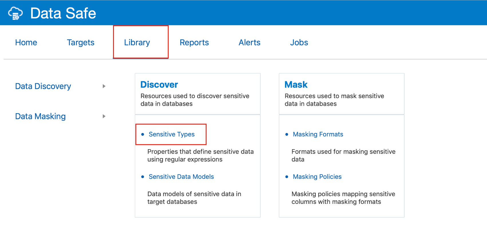
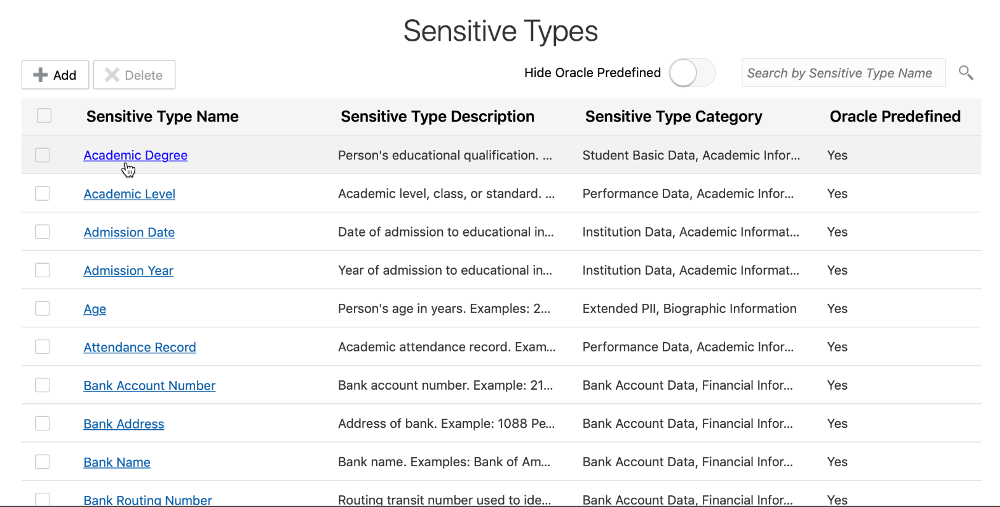
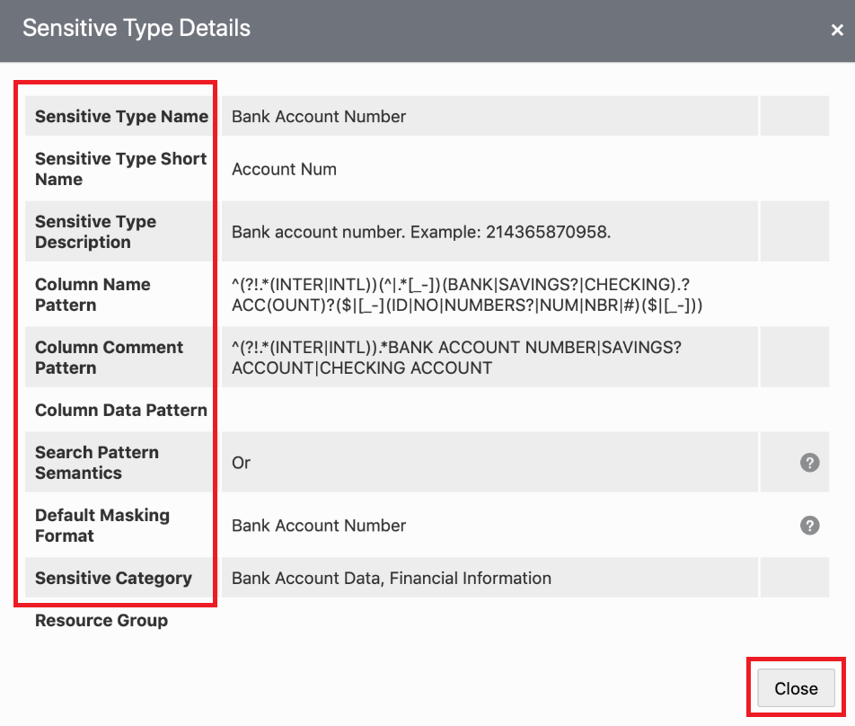
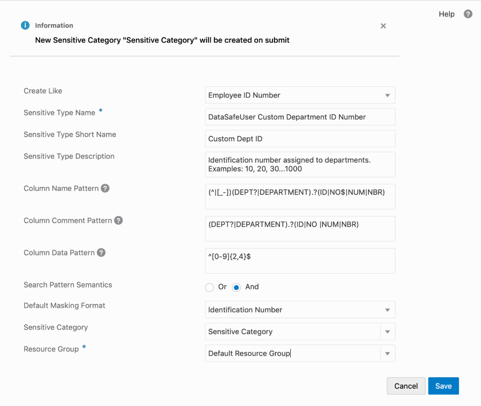

# Create a Sensitive Type and Sensitive Category with Oracle Data Safe
## Introduction
Using Oracle Data Safe, create your own sensitive type and sensitive category.

### Objectives
In this lab, you learn how to do the following:
  - Create your own sensitive type in Oracle Data Safe
  - Create your own sensitive category in Oracle Data Safe

### Challenge
In this lab, you create a sensitive type that discovers department IDs in your ATP-D database. Before you create the sensitive type, investigate the `DEPARTMENT_ID` column in your database.

Follow these general steps:
1. Sign in to the Oracle Data Safe Console in your region.
2. Review the predefined sensitive types in the Oracle Data Safe Library. Check if there is a sensitive type that discovers department IDs.
3. Connect to your ATP-D database as the ADMIN user with SQL Developer Web.
4. In SQL Developer Web, inspect the `HCM1.DEPARTMENTS.DEPARTMENT_ID` column. Inspect its type, size, and data. Analyzing the data helps you to define patterns for your sensitive type.
5. In the Oracle Data Safe Console, create a sensitive type by using the **Create Like** option to model your sensitive type after **Employee ID Number**. Save your sensitive type as **Custom Department ID Number** in a custom sensitive category named **Sensitive Category**.

## STEP 1: Review the predefined Sensitive Types

Sign in to the Oracle Data Safe Console in your region

Refer [Lab - Register a Target Database (ATP-D) with Oracle Data Safe](https://github.com/labmaterial/adbguides-dev/blob/master/adb-datasafe/Register%20a%20Target%20Database.md)

Review the predefined sensitive types in the Oracle Data Safe Library

- In the Oracle Data Safe Console, click the **Library** tab, and then click **Sensitive Types**. The **Sensitive Types** page is displayed. On this page you can view predefined sensitive types and manage your own sensitive types.

   

- Scroll through the list and become familiar with the different sensitive types available. The list contains `predefined` sensitive types only.

   

- Move the **Hide Oracle Predefined** slider to the right. The list removes the Oracle defined sensitive types, showing only the ones that you have defined.

   

- Move the slider back to the left.
- To find out how many sensitive types exist in the Library, scroll to the bottom of the page. The list contains 128 items.
- To sort the list by sensitive category, position your cursor over the **Sensitive Type Category** header, and then click the arrow.
- To sort the list by sensitive types, position your cursor over the **Sensitive Type Name** header, and then click the arrow.
- To view the definition for a sensitive type, click directly on any one of the sensitive types. The **Sensitive Type Details** dialog box is displayed.

   
   
- View the sensitive type's short name, description, column name pattern (regular expression), column comment pattern (regular expression), column data pattern (regular expression), the search pattern semantic (And or Or), the default masking format associated with the sensitive type, and the sensitive category and resource group to which the sensitive type belongs.
- Click **Close** to close the dialog box.
- To check if there is a sensitive type that discovers department IDs, in the search field, enter **Department**. The search finds **Department Name**, but nothing for department IDs.

   

- Clear the search field, and then press **Enter** to restore the list.
- Keep this page open because you return to it later in the lab.

## STEP 2: Create a Data Safe Sensitive Type and Category

Connect to ATP-D DB using SQL Developer Web

Refer Step 5 from [Lab - Assess Users with Oracle Data Safe](https://github.com/labmaterial/adbguides-dev/blob/master/adb-datasafe/Assessment%20Lab%202.md)

In SQL Developer Web, analyze the HCM1.DEPARTMENTS.DEPARTMENT_ID column in your ATP-D database to help you figure out how to create a sensitive type for it.

- On the SQL Worksheet, run the following script:

```
<copy>SELECT * FROM HCM1.DEPARTMENTS;</copy>
```
- Notice that the department ID values are 10, 20, 30, up to 270.

In the Oracle Data Safe Console, create a sensitive type and sensitive category

- Return to the **Sensitive Types** page in the Oracle Data Safe Console.
- Click **Add**.<br>
The **Create Sensitive Type** dialog box is displayed.

   

- From the **Create Like** drop-down list, select **Employee ID Number**.
- In the **Sensitive Type Name** field, enter **<username> Custom Department ID Number**.
- In the **Sensitive Type Short Name** field, enter **Custom Dept ID**. It is helpful to use a word like "Custom" when naming your own sensitive types to make them easier to search for and identify.
- In the **Sensitive Type Description** field, enter **Identification number assigned to departments. Examples: 10, 20, 30...1000**.
- In the **Column Name Pattern** field, enter:

```
<copy>(^|[_-])(DEPT?|DEPARTMENT).?(ID|NO$|NUM|NBR)</copy>
```
- In the **Column Comment Pattern** field, enter:

```
<copy>(DEPT?|DEPARTMENT).?(ID|NO |NUM|NBR)</copy>
```
- In the **Column Data Pattern** field, enter:

```
<copy>^[0-9]{2,4}$</copy>
```
- For **Search Pattern Semantic**, select **And**.
- In the **Default Masking Format** field, enter **Identification Number**.
- In the **Sensitive Category** field, enter **<username> Sensitive Category**. If you do not specify a sensitive category, the category is automatically named "Uncategorized."
- Select your resource group.
- Click **Save**.<br>
Your sensitive type is included in the list and is available in the Data Discovery wizard.

   

- Move the **Hide Oracle Predefined** slider to the right to view your custom sensitive type in the list.

## Acknowledgements

*Great Work! You successfully completed the Data Safe Discovery Lab 4*

- **Author** - Jayshree Chatterjee
- **Last Updated By/Date** - Kris Bhanushali, September 2020


