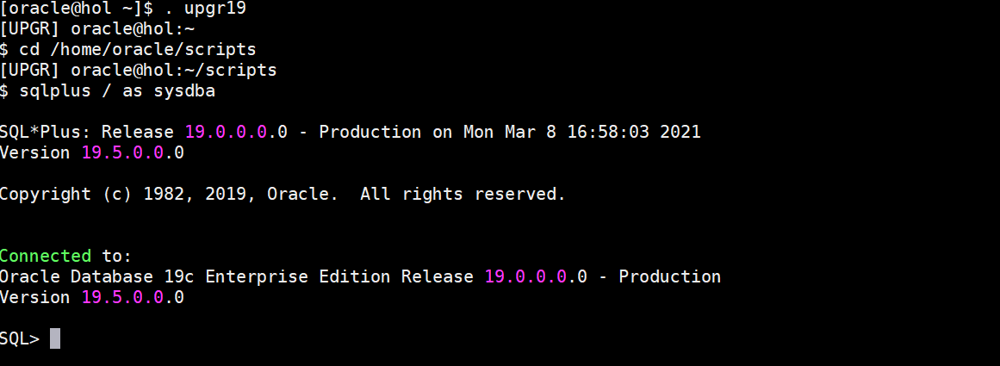
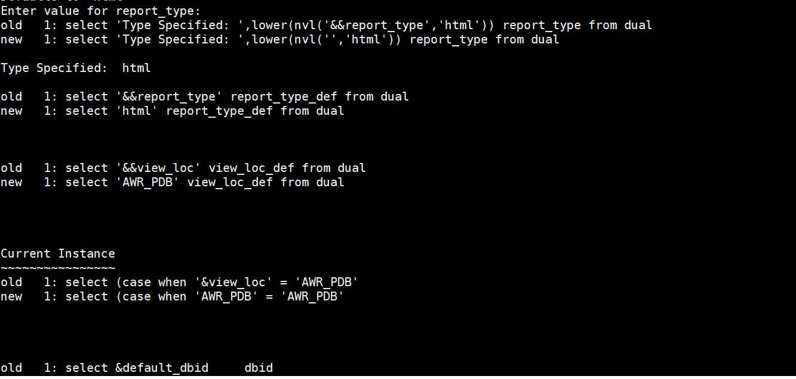
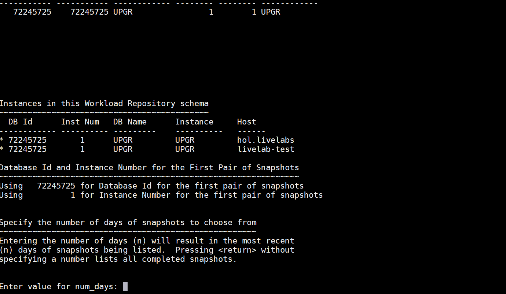
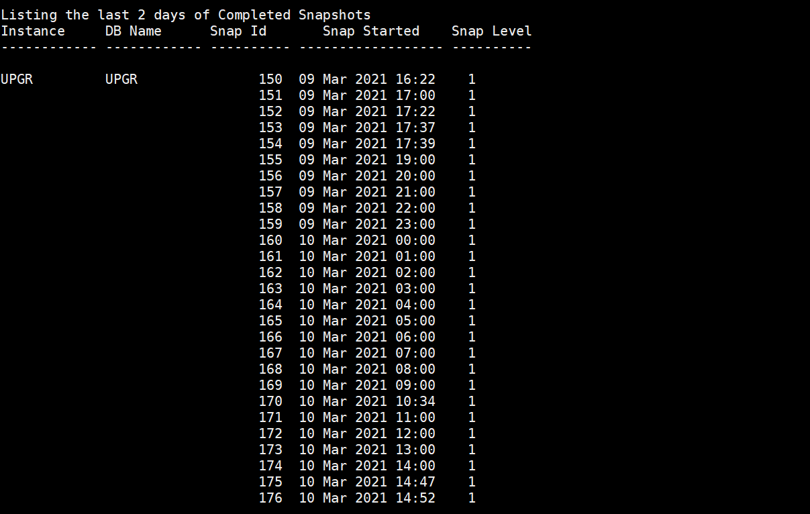
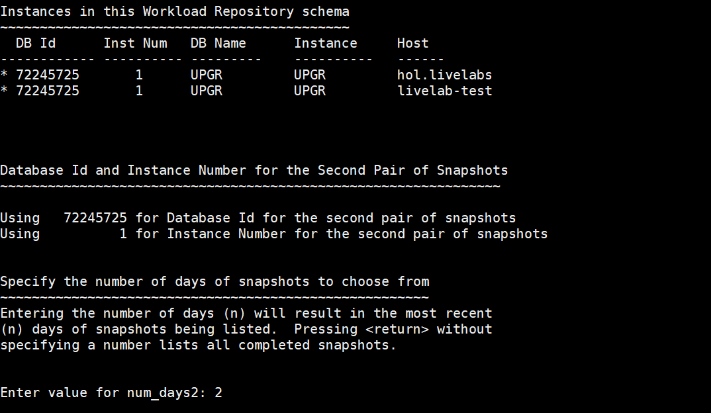
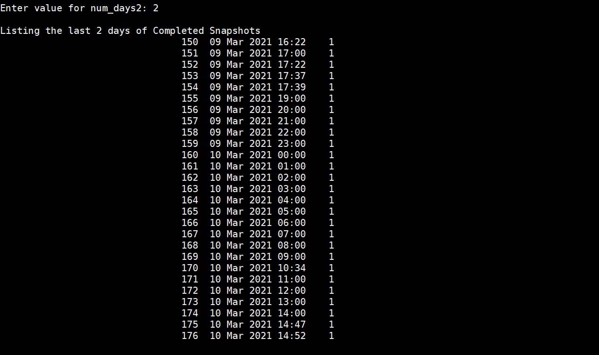
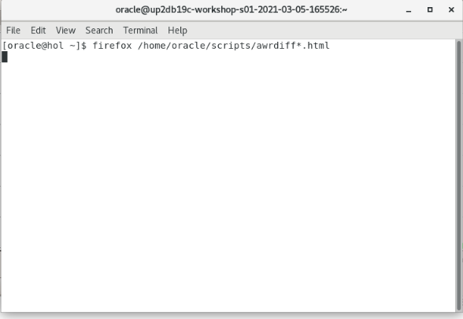
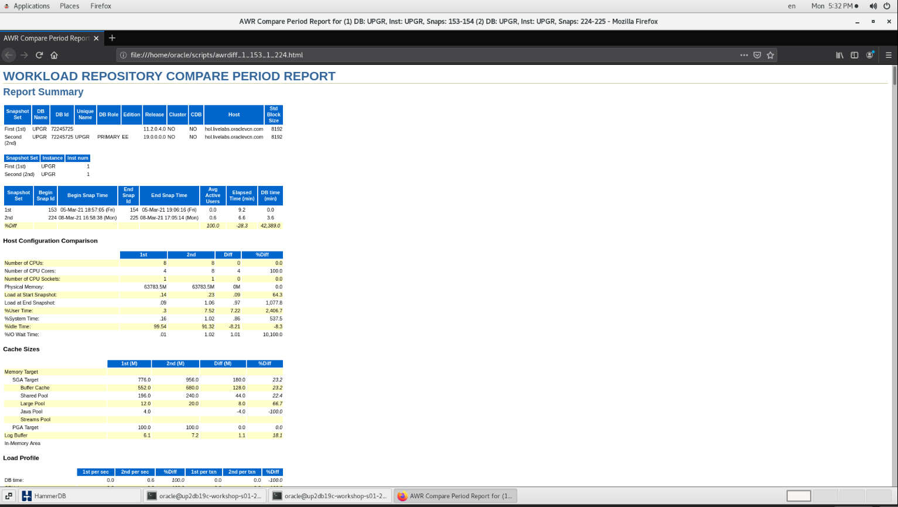

# AWR Compare Periods Report

## Introduction

In this lab, you will create AWR diff reports. Those reports give you a first indication about issues you may see (or performance improvements). It is important to compare periods which have roughly the same load and duration.


*Estimated Lab Time*: 30 minutes

### Comparing Database Performance Over Time
Performance degradation of the database occurs when your database was performing optimally in the past, but over time has gradually degraded to a point where it becomes noticeable to the users. AWR Compare Periods report enables you to compare database performance over time.

An AWR Compare Periods report, shows the difference between two periods in time (or two AWR reports, which equates to four snapshots). Using AWR Compare Periods reports helps you to identify detailed performance attributes and configuration settings that differ between two time periods:  before upgrade and after upgrade.

### Objectives

In this lab, you will:
* Generate Load
* Create an AWR Diff report

### Prerequisites
This lab assumes you have:
- A Free Tier, Paid or LiveLabs Oracle Cloud account
- SSH Private Key to access the host via SSH
- You have completed:
    - Lab: Generate SSH Keys (*Free-tier* and *Paid Tenants* only)
    - Lab: Prepare Setup (*Free-tier* and *Paid Tenants* only)
    - Lab: Environment Setup
		- Lab: Initialize Environment

## **STEP 1**: Generate Load

1.  Login to Oracle Cloud.  Run the command below.
	````
	<copy>
	sudo su - oracle
    . upgr19
    cd /home/oracle/scripts
    sqlplus / as sysdba
	</copy>
	````
   

2. At first, create an AWR snapshot BEFORE load, then AFTER load. Note down the snapshot numbers again.
   
	````
	<copy>
	@/home/oracle/scripts/snap.sql
	</copy>
	````

3.  NOTE down the snapshot number.
   

4. Now run the HammerDB load again as you did in the Generate Load lab
   

5. Once finished, create another AWR snapshot.

	````
	<copy>
	@/home/oracle/scripts/snap.sql
	</copy>
	````

6. Please NOTE down the snapshot number.
   
   
## **STEP 2**: AWR Diff Report

In the AWR Diff Report you will compare a snapshot period BEFORE upgrade to a snapshot period AFTER upgrade.

1. Call the AWR Diff script

	````
	<copy>
	@?/rdbms/admin/awrddrpt.sql
	</copy>
	````
	

	<!-- ````
	Specify the Report Type
	~~~~~~~~~~~~~~~~~~~~~~~
	Would you like an HTML report, or a plain text report?
	Enter 'html' for an HTML report, or 'text' for plain text
	Defaults to 'html'
	Enter value for report_type:
	```` -->

2. Click **RETURN**
   
   

 
	<!--````
	Instances in this Workload Repository schema
	~~~~~~~~~~~~~~~~~~~~~~~~~~~~~~~~~~~~~~~~~~~~
	DB Id      Inst Num	DB Name      Instance	  Host
	------------ ---------- ---------    ----------   ------
	* 72245725	 1	UPGR	     UPGR	  localhost.lo

	Database Id and Instance Number for the First Pair of Snapshots
	~~~~~~~~~~~~~~~~~~~~~~~~~~~~~~~~~~~~~~~~~~~~~~~~~~~~~~~~~~~~~~~
	Using	72245725 for Database Id for the first pair of snapshots
	Using	       1 for Instance Number for the first pair of snapshots


	Specify the number of days of snapshots to choose from
	~~~~~~~~~~~~~~~~~~~~~~~~~~~~~~~~~~~~~~~~~~~~~~~~~~~~~~
	Entering the number of days (n) will result in the most recent
	(n) days of snapshots being listed.  Pressing  without
	specifying a number lists all completed snapshots.


	Enter value for num_days:
	```` -->

3.  Type: **2** and click **RETURN**
   

4. Now you need to define the first snapshot interval – therefore, fill in the snapshot ID's you noted down during the first HammerDB run.
	<!-- ````
	Enter value for num_days: 2

	Listing the last 2 days of Completed Snapshots
	Instance     DB Name	  Snap Id	Snap Started	Snap Level
	------------ ------------ ---------- ------------------ ----------

	UPGR	     UPGR		110  20 Feb 2020 22:12	  1
					111  20 Feb 2020 22:39	  1
					112  20 Feb 2020 22:40	  1
					113  21 Feb 2020 00:05	  1
					114  21 Feb 2020 00:15	  1


	Specify the First Pair of Begin and End Snapshot Ids
	~~~~~~~~~~~~~~~~~~~~~~~~~~~~~~~~~~~~~~~~~~~~~~~~~~~~
	Enter value for begin_snap:
	```` -->

5. Type: 150. (Your actual snapshot ID may be different – please check your notes!) Hit RETURN.
   
   


6. Type: **2** and hit **RETURN**
   

    Type: 175 (Your actual snapshot ID may be different – please check your notes!)
	

7. Hit **RETURN**
   

8.  Enter awrdiff and hit RETURN. Wait until the HTML output has been generated

	````
	<copy>
	exit
	</copy>
	````

9. In your remote desktop(Guacamole) start Mozilla Firefox with the awr diff report.
    

	````
	<copy>
	firefox /home/oracle/scripts/awrdiff*.html &
	</copy>
	````
	
	

10. Compare things such as Wait Events etc. Watch out for significant divergence between the two runs, for instance the different redo sizes per run. Also, browse through the SQL statistics and see if you find remarkable differences between the two runs.  Overall, you will not see any significant differences. The purpose of this lab exercise is for you to simply recognize and remember how easy AWR Diff Reports can be generated when you have comparable workloads in your testing environments.

You may now [proceed to the next lab](#next).

## Learn More

* [Comparing Database Performance Over Time](https://docs.oracle.com/en/database/oracle/oracle-database/19/tgdba/comparing-database-performance-over-time.html#GUID-BEDBF986-1A69-459A-90F5-350B8A407516)

## Acknowledgements
* **Author** - Mike Dietrich, Database Product Management
* **Contributors** -  Roy Swonger, Sanjay Rupprel, Cristian Speranta
* **Last Updated By/Date** - Kay Malcolm, February 2021
