## Introduction

Oracle's Exadata Cloud Service (ExaCS) is deployed in a private VCN in the Oracle Cloud Infrastructure with no public IP address assigned. Thus, to gain connectivity to the databases, the best practice is to use a VPN connection. 

This lab walks you through the steps to deploy a VPN server in OCI and create an SSL VPN connection between a client machine (your desktop) and the ExaCS infrastructure. Once configured, a single VPN server can be shared among multiple users.

### Need Help?
Please submit feedback or ask for help using our [LiveLabs Support Forum](https://community.oracle.com/tech/developers/categories/livelabsdiscussions). Please click the **Log In** button and login using your Oracle Account. Click the **Ask A Question** button to the left to start a *New Discussion* or *Ask a Question*.  Please include your workshop name and lab name.  You can also include screenshots and attach files.  Engage directly with the author of the workshop.

If you do not have an Oracle Account, click [here](https://profile.oracle.com/myprofile/account/create-account.jspx) to create one.

Watch the video below for an overview on how to setup VPN Connectivity to your Exadata Cloud Service Infrastructure

<div style="max-width:768px"><div style="position:relative;padding-bottom:56.25%"><iframe id="kaltura_player" src="https://cdnapisec.kaltura.com/p/2171811/sp/217181100/embedIframeJs/uiconf_id/35965902/partner_id/2171811?iframeembed=true&playerId=kaltura_player&entry_id=1_nv8bf2lo&flashvars[streamerType]=auto&amp;flashvars[localizationCode]=en&amp;flashvars[leadWithHTML5]=true&amp;flashvars[sideBarContainer.plugin]=true&amp;flashvars[sideBarContainer.position]=left&amp;flashvars[sideBarContainer.clickToClose]=true&amp;flashvars[chapters.plugin]=true&amp;flashvars[chapters.layout]=vertical&amp;flashvars[chapters.thumbnailRotator]=false&amp;flashvars[streamSelector.plugin]=true&amp;flashvars[EmbedPlayer.SpinnerTarget]=videoHolder&amp;flashvars[dualScreen.plugin]=true&amp;flashvars[hotspots.plugin]=1&amp;flashvars[Kaltura.addCrossoriginToIframe]=true&amp;&wid=1_f6vcp771" width="768" height="432" allowfullscreen webkitallowfullscreen mozAllowFullScreen allow="autoplay *; fullscreen *; encrypted-media *" sandbox="allow-forms allow-same-origin allow-scripts allow-top-navigation allow-pointer-lock allow-popups allow-modals allow-orientation-lock allow-popups-to-escape-sandbox allow-presentation allow-top-navigation-by-user-activation" frameborder="0" title="Kaltura Player" style="position:absolute;top:0;left:0;width:100%;height:100%"></iframe></div></div>

## Objectives
As a network admin,

- Configure a VPN server in OCI based on OpenVPN software
- Configure your VPN client and connect to a VPN Server
- Launch SQL Developer on a client and connect to an ExaCS database node

## Required Artifacts

- An Oracle Cloud Infrastructure account with privileges to create a compute instance and network resources
- A pre-provisioned ExaCS instance in a private network
- A pre-provisioned Virtual Cloud Network with public and private subnets set up with appropriate security lists. Refer to [Lab 1](?lab=lab-1-preparing-private-data-center-o).


The following illustration shows a network topology that can be used to provide secure access to your EXACS infrastructure.


- As shown above, your OCI Virtual Cloud Network (VCN) has two subnets. There is a private subnet with CIDR 10.0.0.0/24 (for example that hosts your exadata infrastructure) and a public subnet with CIDR 10.0.1.0/24 that has public facing web and application servers, as well as the VPN Server. 

- An internet gateway is attached to the public subnet to allow all resources within that subnet to be accessible over the internet.

- Security lists have been setup such that tcp traffic into the private exadata subnet is allowed only through hosts in the public subnet. This can be further tightened by allowing traffic from specific hosts and ports. 

- For detailed instructions on network setup for your ExaCS infrastructure, refer to [Lab 1](?lab=lab-1-preparing-private-data-center-o)


## Steps


### **STEP 1:   OS VM for the OpenVPN server**

- Login to the Oracle Cloud Infrastructure using your tenancy, userId and password. 

    Refer to [Lab 1](?lab=lab-1-preparing-private-data-center-o) for detailed instructions on logging into your OCI account.

- Once logged in, Click on **Menu**, **Compute**, **Instances**, and **Create Instance**

    

- Name your instance and click on **Change Image** to select a new image.
    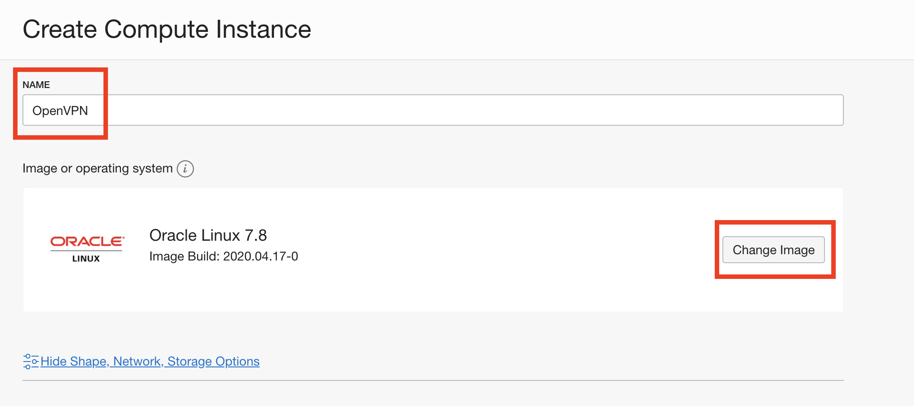

- Select **CentOS7** as your image source and scroll down to click on **Select Image**.
    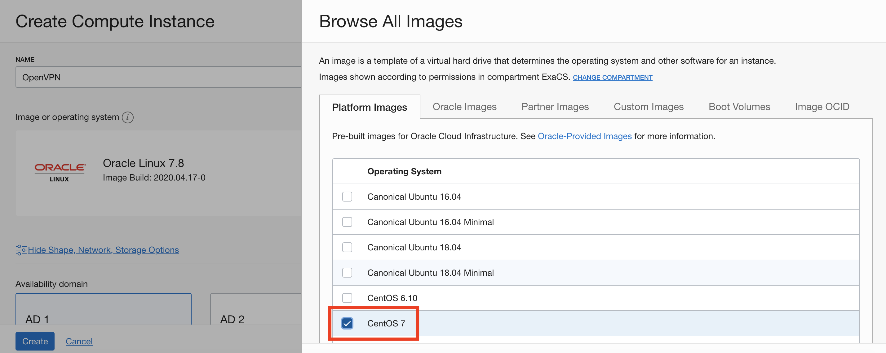
    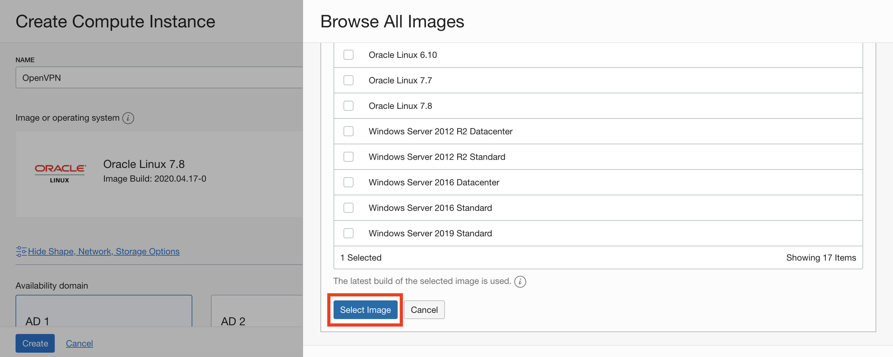

- Select any Availability Domain and make sure you select **VM.Standard2.1** as your shape for the compute instance. If not, click on **Change Chape** and select the appropriate shape.
    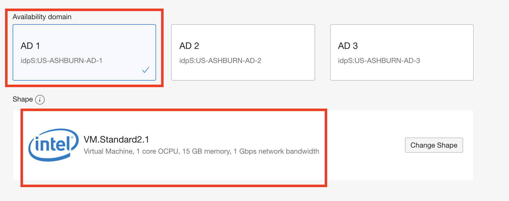

-  Next, select the network for your VPN Server
    - Select the compartment and VCN where your exadata infrastructure is provisioned
    - Select the compartment where your public subnet is provisioned
    - Pick public subnet from the drop down
    - Select **Assign a public IP address**
    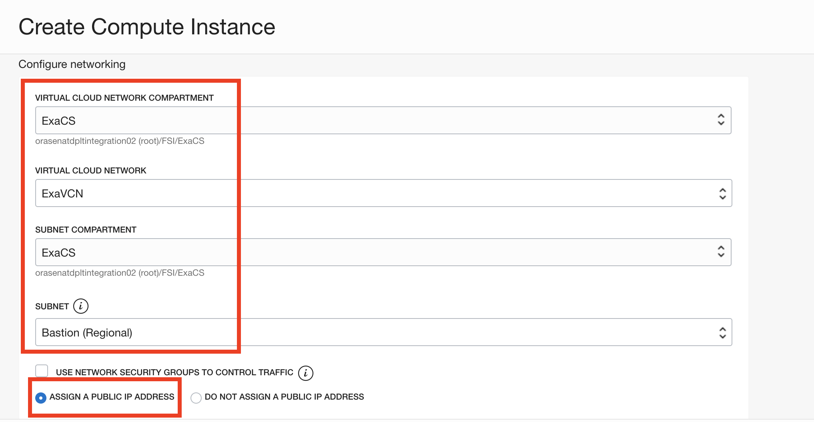

- Add your ssh public key.
    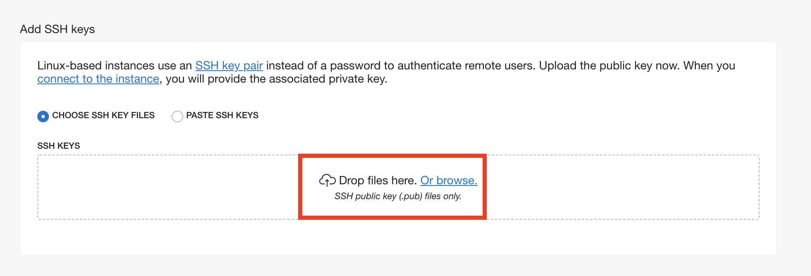

- Click on **Create** and within a few minutes your CentOS server will be ready with a public IP for ssh access.
    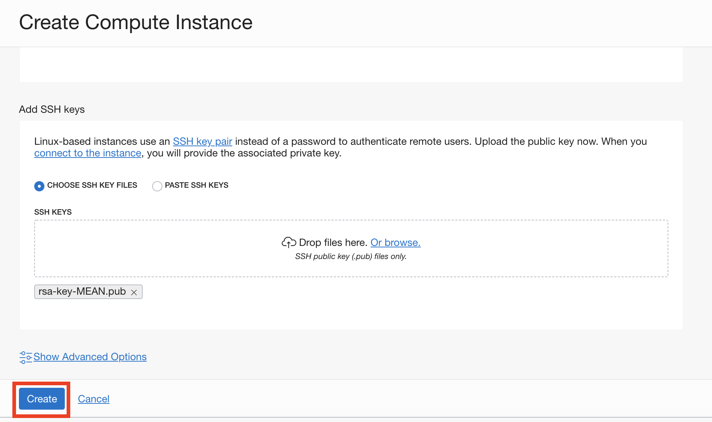

- To find out the public IP address of the compute instance, go to your cloud console and navigate to the web page in which you have the information about the compute instance. On the right side as shown in the picture below, you will find the public IP address of your compute machine.
    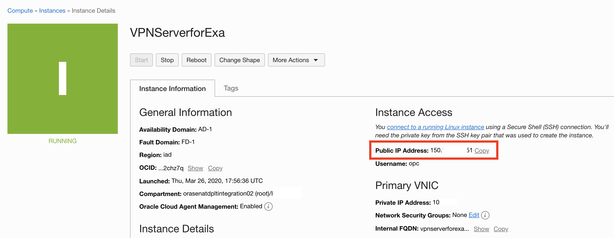


#### Note that while your ExaCS infrastructure and VPN server are in the same VCN, the ExaCS is in a private subnet while the VPN server is deployed in a public subnet for access over the internet. 


### **STEP 2: Install and Configure OpenVPN Server**

-   Use the following to ssh into centOS vm and download the openVPN rpm package

    ```
    <copy>ssh opc@public_ipAddress_of_your_centOS_VM</copy>;
    ```

    ```
    <copy>wget http://swupdate.openvpn.org/as/openvpn-as-2.5.2-CentOS7.x86_64.rpm</copy>
    ```
   
    

-   Use the RPM command to install the package

    ```
    <copy>sudo rpm -ivh openvpn-as-2.5.2-CentOS7.x86_64.rpm</copy>
    ```

    

-   Change the password of OpenVPN Server

    ```
    <copy>sudo passwd openvpn</copy>
    ```

-    From your local browser, access the admin UI console of your VPN Server (**https://<*public_ipAddress_of_your_centOS_VM*>:943/admin**), using the username 'openvpn' and the password for OpenVPN server.
    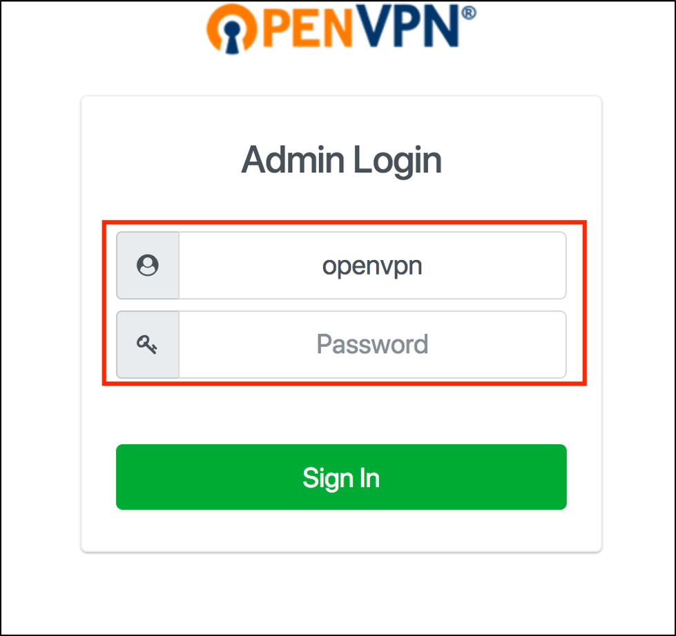

-   Once you are logged in, click **Network Settings** and replace the **Hostname or IP address** with the public IP of the OpenVPN Server Instance

    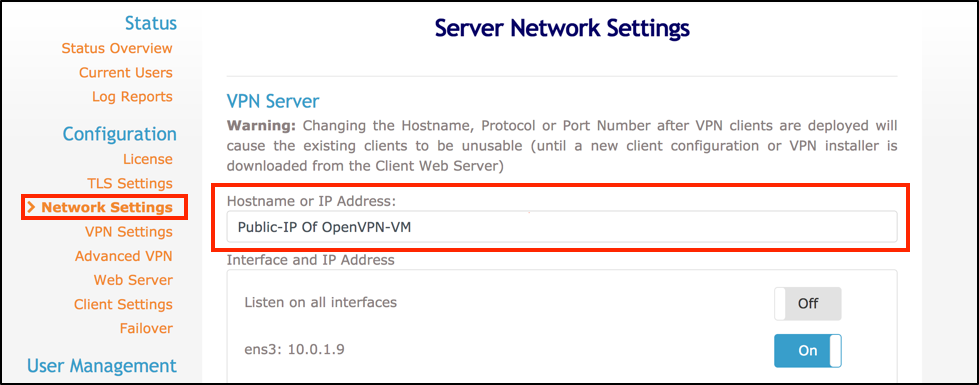

    ****Save your settings before advancing to the VPN settings page**

- Click **VPN settings** and scroll down to the section labeled **Routing**. Here we configure how traffic from your VPN client (for example, your personal laptop) shoud be NATed and how DNS resolution should occur.

- Configure this section as shown in the screenshot below. 
    - Choose **Yes using NAT**
    - Provide CIDR ranges for your application and exadata subnets. For this lab, give 10.0.2.0/24 for your client subnet.
    - Choose **No** for the question: **Should client internet traffic be routed through the VPN?**

    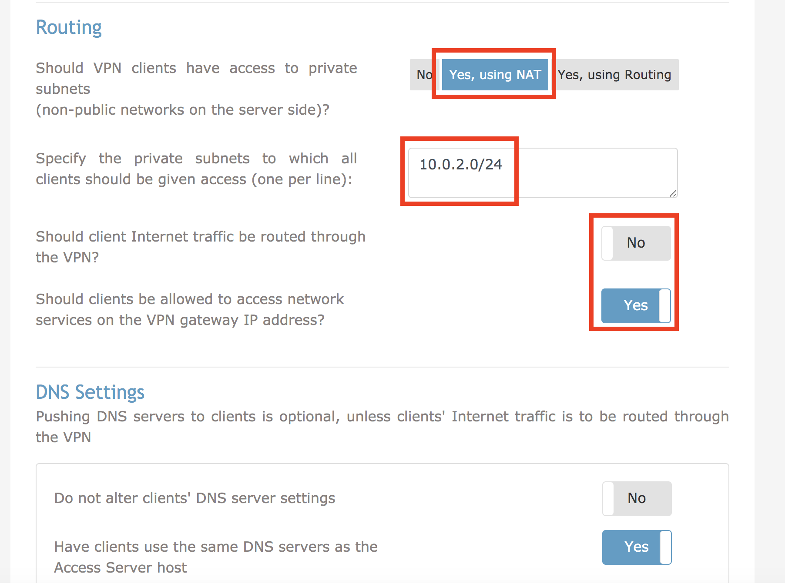


- Scroll down and configure the DNS settings as shown below.

    

    **Save your setting before advancing to the VPN settings page**

- In the **Advanced VPN** section, ensure that the option **Should clients be able to communicate with each other on the VPN IP Network?** is set to **Yes**

    


    Note: Once you have applied your changes, click **Save Settings** once again. Then click **Update Running Server** to push your new configuration to the OpenVPN server.

    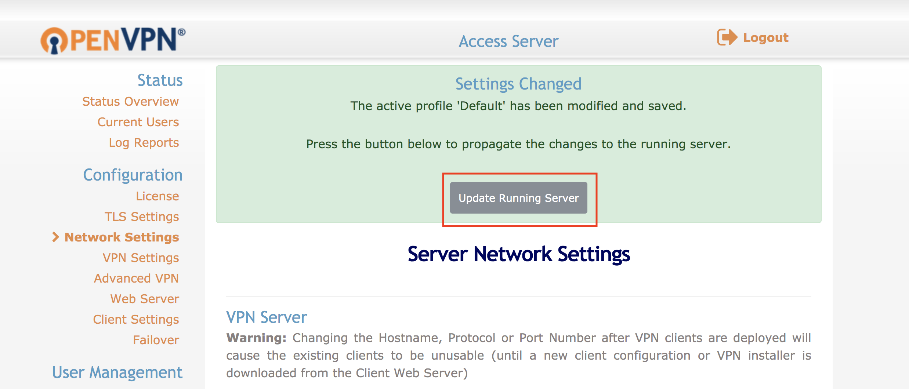


### **STEP 3: Install OpenVPN Client**

- Launch your OpenVPN Access Server Client UI at **https://*<Your_VPN_Server_Public_IP>*:943** and download the OpenVPN client for your platforms.
    
    

    

- Once the installation process is complete, you will see an OpenVPN icon in your OS taskbar. Right-Click this icon to bring up the context menu to start your OpenVPN connection.

    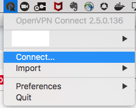

    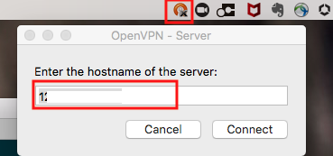
    
    ##### Note: IP should be Public IP for OpenVPN Compute Instance

- Clicking **Connect** brings up a window asking for the OpenVPN username and password. Enter the credentials for your **openvpn** user and click **Connect** to establish a VPN tunnel.

    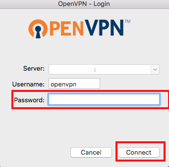

    You may also setup your VPN server with multiple users. Follow the OpenVPN configuration guide to setup additional users.

### **STEP 4: Connect SQL Developer to your ExaCS database**
- One of the pieces of information we need to connect to your ExaCS database is its service name. Follow below steps to construct the service name.
- Service name is database-unique-name.host-domain-name. To find out database-unique-name, go to your cloud console and navigate to the web page where you find information about your ExaCS instance.
- Find host-domain-name as shown in the picture below.
    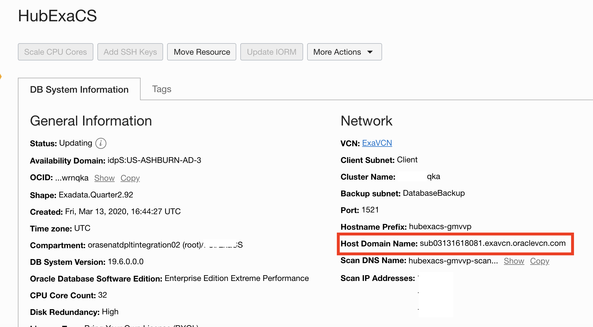

- Scroll down and find your database's database-unique-name under **Database Unique Name** column as shown in the picture below.
    


- Now that we have all the information, launch SQL Developer and connect as shown below:
    - **Name**: Enter a name for your ExaCS connection
    - **Database Type**: Select **Oracle**
    - **Authentication Type**: Select **Default**
    - **Username**: Enter **sys**
    - **Role**: Select **SYSDBA**
    - **Password**: Enter the password for one of the databases in the ExaCS
    - **Connection Type**: Select **Basic**
    - **Hostname**: Enter the private IP of any of the nodes of your ExaCS instance
    - **Service name**: Construct the service name as *database-unique-name.Host_Domain_Name*


    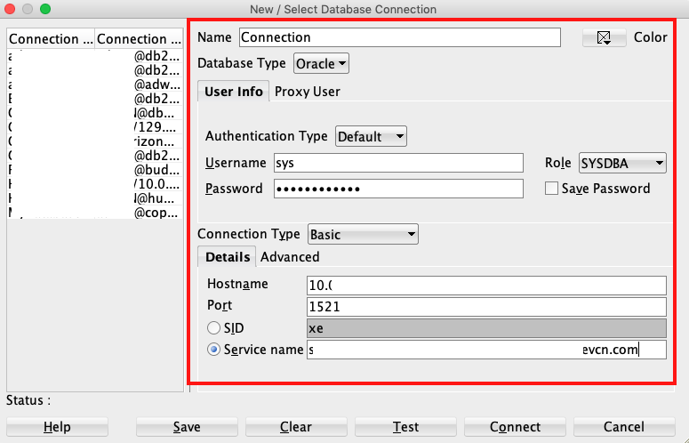


- Once you test, you should see "Success" in Status.

    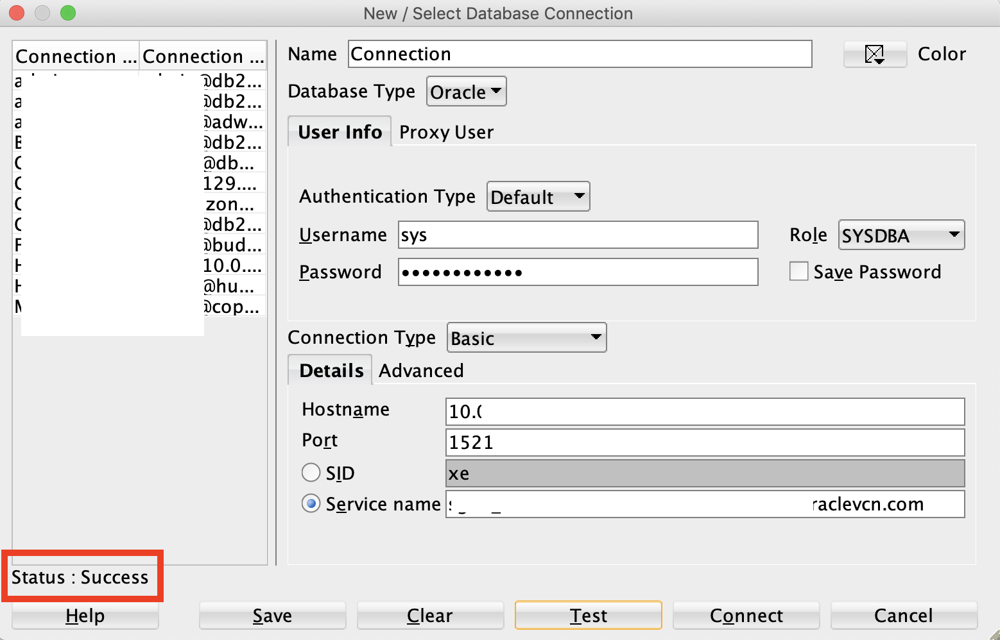

Congratulations! You just configured a secure VPN connection into your private Exadata Cloud Service infrastructure.
