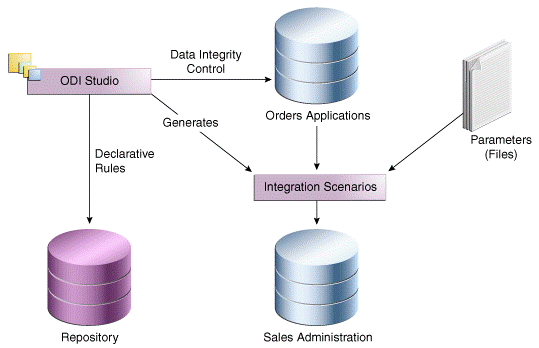
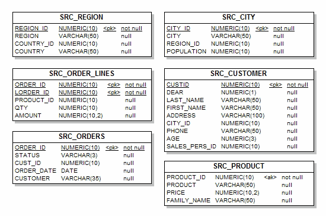
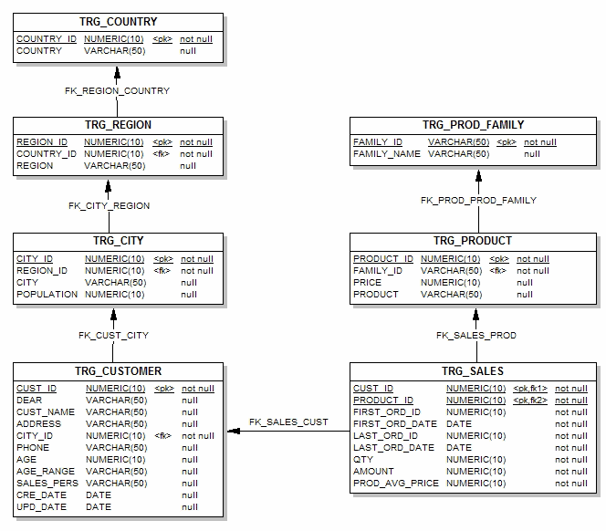
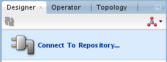
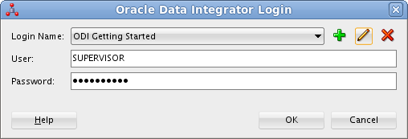
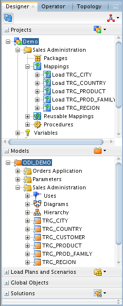

# Getting Started

## Understanding the Environment  

### The Example Environment
The *Demo* project is an example to help you understand how to transform and check the integrity of the data in your information systems.

The examples in this getting started tutorial track sales from various heterogeneous data sources issued from the production systems.
This diagram illustrates the sample environment:
   

The example environment uses the following elements:

  * *The Repository:* The Repository contains all of the metadata required for the getting started demo examples.

  * *Orders Application:* An application for tracking customer orders, hosted in the Oracle database (the *srcdemo* sample).

  * *Parameters:* Flat files (ASCII) issued from the production system containing a list of sales representatives and the segmentation of ages into age ranges.

  * *Sales Administration:* The administration or tracking of sales, hosted in another Oracle database (the *trgdemo* sample). This data warehouse is populated with our transformations.

#### The Data Models

The demonstration environment includes three ODI data models:
  * Orders Application
  * Parameters
  * Sales Administration

This section provides the schema diagrams for these data models.

### Orders Application

The *Orders Application* data model is based on the Oracle RDBMS
technology and includes six datastores:

  * SRC\_CITY
  * SRC\_CUSTOMER
  * SRC\_ORDERS
  * SRC\_ORDER\_LINES
  * SRC\_PRODUCT
  * SRC\_REGION

A schema diagram of this data model:

   

Note that this data model does not enforce any foreign key constraints,
even if some functional relations exist between the data.

### Parameters

The *Parameters* data model is based on the File technology and includes
two datastores:
  * SRC\_SALES \_PERSON
  * SRC\_AGE\_GROUP

   

### Sales Administration -- Oracle

The *Sales Administration* data model is based on the Oracle RDBMS technology and includes seven datastores:
  * TRG\_CITY
  * TRG\_COUNTRY
  * TRG\_CUSTOMER
  * TRG\_PRODUCT
  * TRG\_PROD\_FAMILY
  * TRG\_REGION
  * TRG\_SALES

   

### Integration Challenges

The challenges common to all data integration and transformation
projects are:

-   Accurately and easily exchanging data between your applications
    while respecting the business rules of your information system

-   Automate end to end process flows

-   Visibility over the entire set of data integration processes

The examples used in this tutorial illustrate how to address these issues.
During this getting started tutorial, you will learn how to:

  * Create mappings to move and transform data
    Two simple examples will show you how to improve productivity by loading the data from Orders Application and Parameters into the Sales Administration data warehouse.
  * Automate the execution of these mappings into packages
    This part of the Getting Started tutorial will show you how to automate your Oracle Data Integrator processes. The aim of this exercise is to load the entire *Sales Administration* data warehouse with a single click.
  * Execute the package and review the execution results
    You will learn how to execute the Load Sales Administration package and the mappings Load TRG\_CUSTOMER and Load TRG\_SALES you have created and how to review the results of these executions.
  * Prepare the developed components for deployment
    You will learn how to run the Load Sales Administration package automatically in a production environment.
  * Implement Data Quality Control to check data in a database
    By implementing two examples, you will learn how Oracle Data Integrator enables you to ensure the quality of the data in your applications while segregating invalid rows. The *Orders Application* tables contain a number of data inconsistencies that you will detect.

**Note:** In this tutorial, we will be looking at processes that focus on ETL. While it is beyond the scope of this workshop, implementing different integration patterns (real-time, for example) can be carried out in the same fashion. For more information on this, see the Oracle Data Integrator documentation after completing this tutorial.

Now that you have been introduced to the concepts of the Demo Project and its components, you can move on to *Introduction to using ODI Studio*.

## **Step 1:** Introduction to Using Oracle Data Integrator Studio
This step describes the first steps towards using Oracle Data Integrator Studio.

1.  Using the ODI Studio Navigators

ODI Studio provides four Navigators for managing the different aspects
and steps of an ODI integration project:

  * Designer Navigator
  * Operator Navigator
  * Topology Navigator
  * Security Navigator

The tasks performed in this getting started tutorial take place in *Designer Navigator* (to create and execute your developments) and in *Operator Navigator* (to monitor the execution of your developments). This section only describes the Navigators that are used in this getting started tutorial. See the *Oracle Fusion Middleware Developer's Guide for Oracle Data Integrator* for information about the Topology and Security Navigators.

2. Starting Oracle Data Integrator Studio
**This section describes how to start Oracle Data Integrator Studio. You can skip to Step 2.2 if you have already started ODI Studio.**
**Note: In ODI Marketplace instance use the ODI Studio icon in desktop to launch.**

To launch ODI Studio do one of the following:

  * From the Applications menu, navigate to **Programming -> ODI Studio**
  * Double click the short icon for **ODI Studio** present in your Desktop
  * Navigate to the location **$MW_HOME/oracle/odi/studio/bin/odi** in the VNC

**Note:** On Windows, you can launch ODI Studio from the **Start** menu:
On the **Start** menu, select **All Programs** \> **Oracle** \> **Oracle Data Integrator** \> **ODI Studio**.

Upon launching Studio the first time, you will be prompted with an Import Preferences screen. Proceed to click **No**.
The ODI Studio client will continue to load. Click on Connect to Repository then ensure the Login Name is set to ODI Getting Started and click OK.

   

3. When prompted for a wallet password enter *welcome1*
   

## **Step 2:** Designer Navigator

Designer Navigator is used to manage metadata, to design data integrity checks, and to build transformations.
The main objects you handle through Designer Navigator are *models* and *projects*.
  * The data models for your applications contain all of the metadata in your data servers (tables, columns, constraints, descriptions, cross-references, etc.)
  * The projects contain all of the loading and transformation rules for your data servers (mappings, procedures, variables, etc.)

The Designer Navigator appears as:
   

**The Designer Navigator has the following accordions:**

|                                 |                                                           |
|---------------------------------|-----------------------------------------------------------|
| Projects                        | The Projects accordion contains the developments made with Designer Navigator |
| Models                          | The Models accordion contains the descriptions of the data and applications structures |
| Load Plans and Scenarios        | The Load Plan and Scenarios accordion contains generated code and executable objects   |
| Global Objects                  | The Global Objects accordion contains the Global User Functions, Variables, Markers, and Sequences |
| Solutions                       | The Solutions accordion contains the Solutions that have been created when working with version management |

The demonstration environment provides the objects you will need in this
Getting Started tutorial:
  * In the Models accordion, you will find all the data models
    corresponding to the *Orders Application*, *Parameters* and *Sales Administration* applications.

  * In the Projects accordion, you will find the *Demo* project and the *Sales Administration* folder which already contains several mappings. You will develop your new mappings in this folder.
The necessary Knowledge Modules (KM) are already imported in the Demo Project:
In addition, there are many more in Global KM folder.

## **Step 3:** Operator Navigator
Operator Navigator is the management and monitoring tool. It is designed for IT operators and can be used by developers to check code execution and perform debugging operations. Through Operator Navigator, you can manage your development executions in the sessions, as well as the scenarios.
The Operator Navigator has the following accordions:

|                          |                                                                          |
|:-------------------------|--------------------------------------------------------------------------|
| Session List             | The Session List accordian displays all sessions organized per date, physical agent, status, keywords, and so forth.|
| Hierarchical Sessions    | The Hierarchical Sessions accordion displays the execution sessions organized in a hierarchy with their child sessions. |                                 
| Load Plan Executions     | The Load Plan Executions displays the Load Plan Runs of the Load Plan Instances. |
| Scheduling               | The Scheduling accordian displays the list of physical agents and schedules.  |
| Load Plans and Scenarios | The Scenarios accordion displays the list of scenarios available. |
| Solutions                | The Solutions accordion contains the Solutions that have been created when working with version management. |

## Acknowledgements

 - **Author** - Jayant Mahto, July 2020
 - **Contributors** - Troy Anthony
 - **Last Updated By/Date** - Jayant Mahto, September 2020

