# Using Prediction in an Application

## Introduction

Now that you created a model using Zeppelin Notebooks, you can integrate that model with existing applications and processes. It’s worth repeating that this is a critical step. Machine learning models aren’t delivering value until they are being actively used by the company in existing applications and processes.

We will start this lab with some more setup, loading both data and an APEX application, the Suspicious Claims application.

Estimated time: 20 - 30 minutes

### Objectives

In this lab, you will:
- Import an APEX application.
- Review the application to see how you can make predictions on the fly.

### Prerequisites

This lab assumes you have completed the following labs:
- Login to Oracle Cloud/Sign Up for Free Tier Account
- Connect and Provision ADB
- Create a Machine Learning Model

## **Step 1:** Run the APEX Application

<if type="freetier">
1. Download the pre-built APEX application from [here](files/f100.sql).
</if>

2. On the browser tab with your ADW instance, click on the Tools tab and select **Open APEX**.

    

<if type="freetier">
3. Enter the admin password you created for the database.

    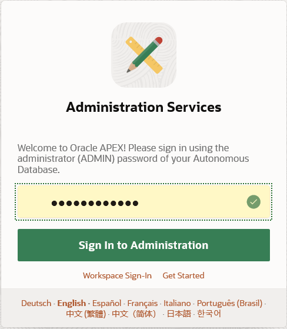

4. On the Welcome screen click **Create Workspace**.

    

5. Select your **OMLUSER** using the drop down, enter **OMLAPP** as the workspace name, then click **Create Workspace**.

    

6. Sign out of the admin view and into your workspace by clicking on **OMLAPP**.

    
</if>

7. Sign into the **OMLAPP** workspace <if type="livelabs">using the password `AAbbcc123456`</if>. Click the **Remember workspace name and username** checkbox to save yourself time in the future.

    

<if type="freetier">
8. On the Welcome Screen, click **Set APEX Account Password**, enter an e-mail address, scroll down and enter a password you'll remember, then click **Apply Changes**.

    

    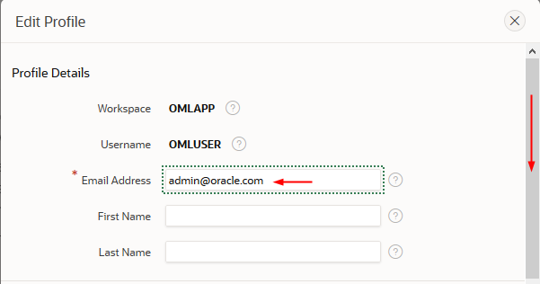

    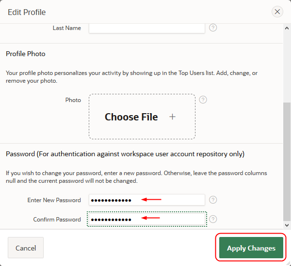

</if>

9. Click **App Builder**.

    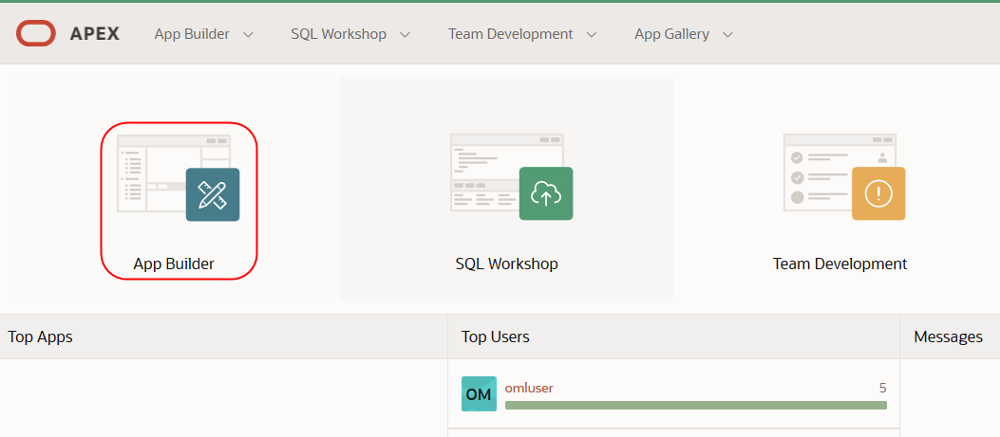

<if type="freetier">
10. Click **Import**.

    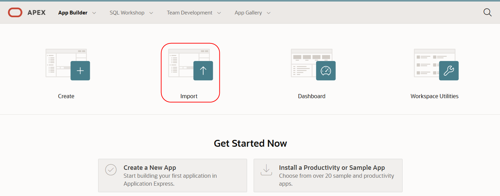

11. Select the file `f100.sql` or drag it from where you downloaded it to the drop target and click **Next** twice.

    

12. Click **Install Application**.

    

13. On the Install Application screen, click **Next** and then **Install**.

    

14. On the success screen, click **Run Application**.

    

</if>
<if type="livelabs">
1. Hover over Suspicious Claim and click the Run button.

    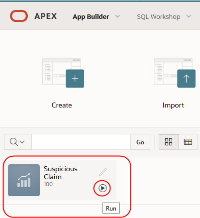

</if>

15. Sign in using your password for OMLUSER<if type="livelabs"> (`AAbbcc123456`)</if>.

    

    

## **Step 2:** Use the APEX application to make decisions

In this step, the experienced Claims Adjuster will focus on the most suspicious claims using their expertise and knowledge.

1. Click on Suspicious Claim, then open the faceted charts.

    

  These charts graph the typical age range, vehicle type, policy holder, and past number of claims.

2. In the Percent Fraud facet, click on 60-80 to narrow to that range.

    

    Note that the claim from policy number 14485 illustrates that this claim seems unusual and could be suspicious, because it is a Honda that is 5 years old, and yet the claimed worth is more than $69,000.

3. Using the application, the claims adjuster can use their judgement to flag a claim. For example, by selecting the record and editing the Fraud Found value, the adjuster can flag the claim. Click the **Auto Claim Report** tab, then select the **Edit icon** for the claim from Policy number 1.

    

    

4. You may see that the table automatically resorted. Click the Policy Number column and select Sort Ascending.

    

5. The claim from policy number 1 is now set to **Fraudfound = Yes**.

    

6. Keep this browser tab open, as we'll use again.

## **Step 3:** Build a supervised learning classification model

Finally, we'll build a new model using this "supervised" data to improve the model.

1. On the browser tab for the Notebooks, click on the menu icon in the upper left corner and select Notebooks.

    

    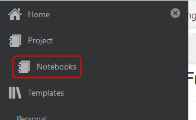

2. Click **Auto Insurance Claims - Supervised Learning** to open the notebook, and set the bindings the same way you set them for the unsupervised notebook and run the notebook.

    

3. Note: if you see a **Error** in one of the Notebook sections, rerun the Notebook until the errors are cleared.

    

3. This Notebook uses labeled data to build models that better target known insurance claims fraud.

    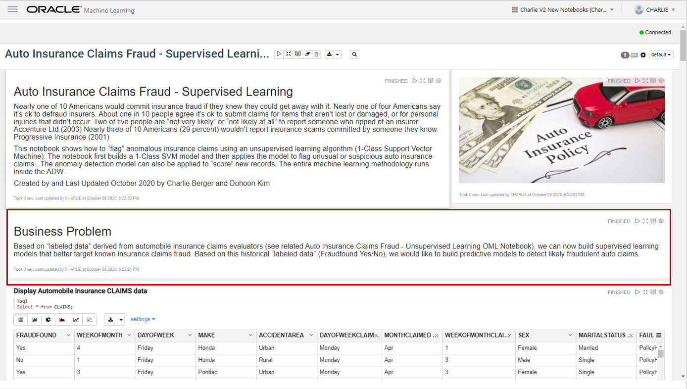

4. As with the unsupervised model, we graph our data understanding, split the model, identify influential attributes, and build supervised classification models.

    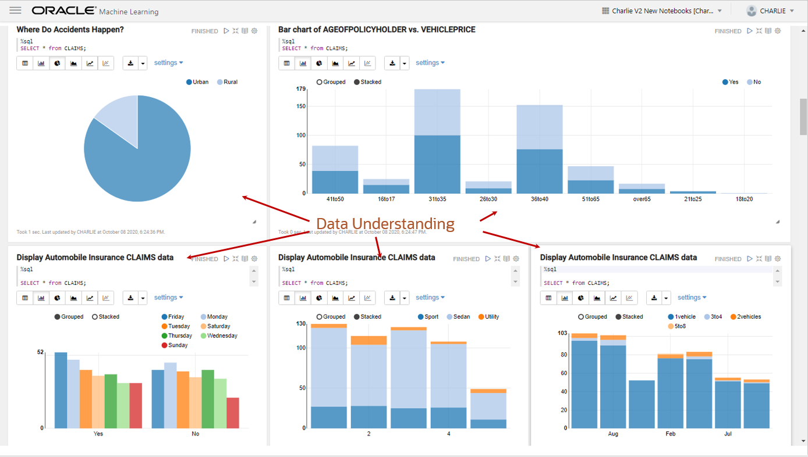

    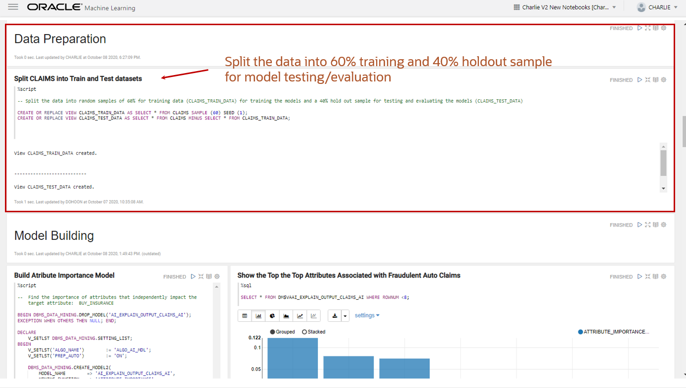

    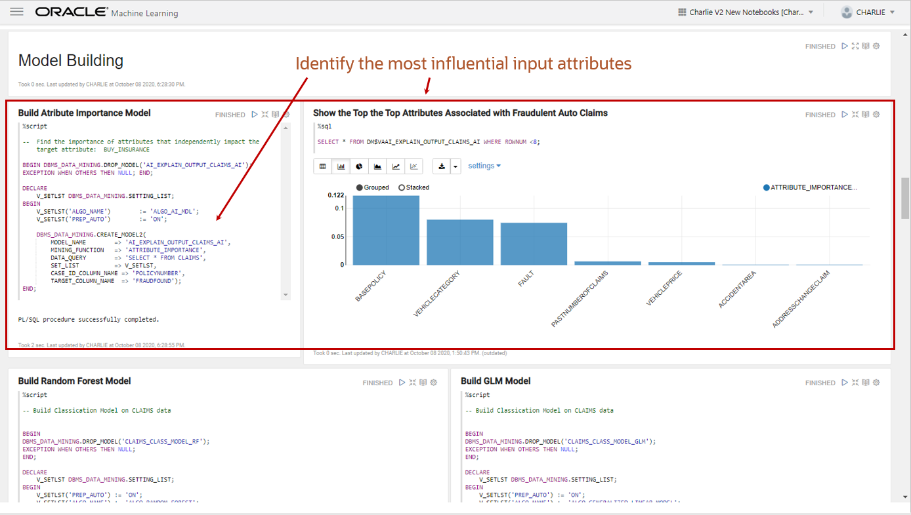

    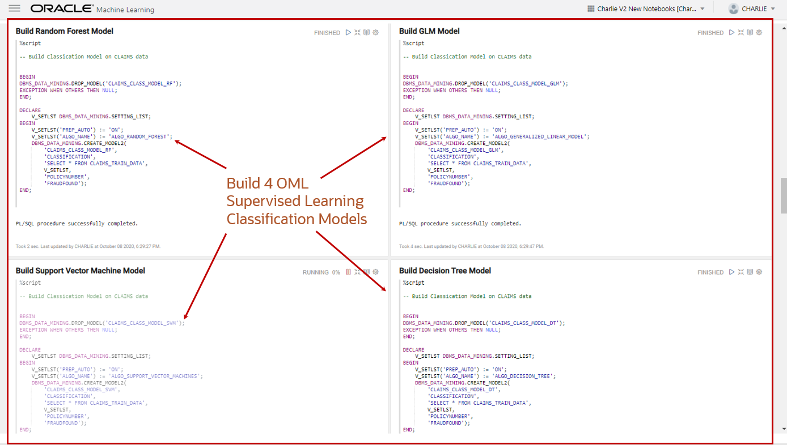

## **Step 4:** Analyze key factors of the supervised model

1. On the browser tab with the APEX application, click **Key Factors** from the left to show graphs of the key factors used to predict fraud from this data.

    

This concludes this lab and this workshop.

## Acknowledgements

- **Author** - Charlie Berger, Senior Director of Product Management, Machine Learning, Cognitive Analytics and AI
- **Last Updated By/Date** - Tom McGinn, Product Manager, DB Product Management, March 2021

