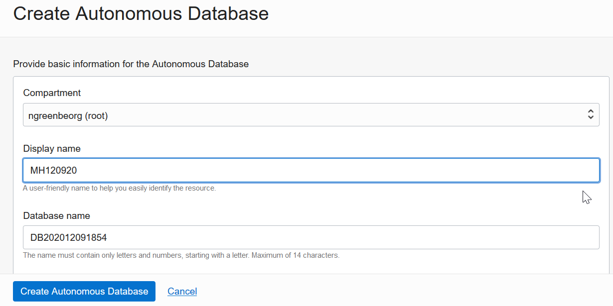
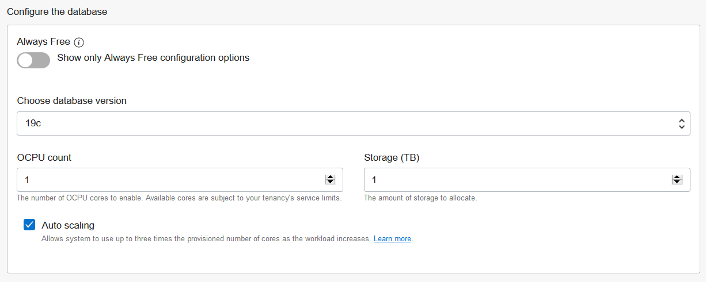

# Get Started with LiveLabs

## Introduction
This lab walks you through the steps to create an Oracle Machine Learning notebook and connect to the Python interpreter.

Estimated Lab Time: 15 minutes

### Objectives

In this lab, you will learn how to provision an Oracle Autonomous Database.

### Prerequisites
* Sign up for a free tier Oracle Cloud account.

> **Note:** You may see differences in account details (eg: Compartment Name is different in different places) as you work through the labs. This is because the workshop was developed using different accounts over time.

<if type="livelabs">## **Step 1:** Launch the workshop

> Note: it takes approximately 20 minutes to create your workshop environment.*

1. Click the **Navigation Menu** in the upper left, navigate to **Oracle Database**, and select **Autonomous Data Warehouse**.

	

2. Select the compartment assigned to you from the **List Scope menu** and then click the ADW instance.

    

    

</if>

## **Step 1:** Provision an Oracle Autonomous Database

To provision an Oracle Autonomous Database:

1. Click the **Navigation Menu** in the upper left, navigate to **Oracle Database**, and select **Autonomous Data Warehouse**.

	

2. From the Oracle Cloud Infrastructure Console, on the Oracle Autonomous Database page choose your region and select a compartment.

3. Click **Create Autonomous Database**.

    

4. Provide basic information for the Oracle Autonomous Database.

    Enter a user-friendly display name for the ADB instance to easily identify the resource. The display name does not have to be unique.

    

5. For Workload Type, click **Data Warehouse**.

6. For Deployment, select **Shared Infrastructure**.

7. For Database configuration, select the following:

    - **Choose database version:** Select the database version. The available database version is **19c**.
    - **OCPU Count:** Enter 1. This is number of CPU cores for your database.
    - **Storage (TB):** Specify the storage you wish to make available to your database, in terabytes. Enter 1 TB.
    - **Auto Scaling:** By default auto scaling is enabled to allow the system to automatically use up to three times more CPU and IO resources to meet workload demand.

    

8. For Administrator credentials, enter and re-confirm a password.

9. For Network Access, select Allow Secure access from everywhere.

    

10. For License, select **License Included**.

    

11. Click **Create Autonomous Database**. The Oracle Autonomous Data Warehouse instance starts provisioning. Click **Autonomous Data Warehouse** again from the hamburger menu to see a list of Oracle Autonomous Database instances in your console.

12. Click the Autonomous Data Warehouse instance you just created.

    

## Learn More

* [Get Started with Oracle Machine Learning for Python](https://docs.oracle.com/en/database/oracle/machine-learning/oml4py/1/mlpug/get-started-with-oml4py.html#GUID-B45A76E6-CE48-4E49-B803-D25CA44B09ED)
* [Oracle Machine Learning Notebooks](https://docs.oracle.com/en/database/oracle/machine-learning/oml-notebooks/)

## Acknowledgements
* **Author** - Moitreyee Hazarika, Principal User Assistance Developer
* **Contributors** -  Mark Hornick, Senior Director, Data Science and Machine Learning; Marcos Arancibia Coddou, Product Manager, Oracle Data Science; Sherry LaMonica, Principal Member of Tech Staff, Advanced Analytics, Machine Learning
* **Last Updated By/Date** - Moitreyee Hazarika, July 2021
