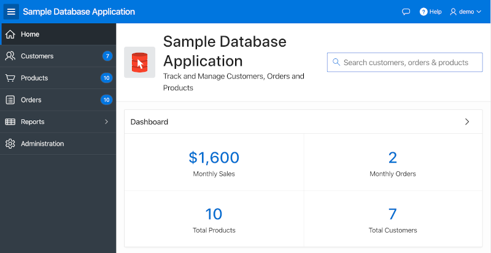

# Working with the DOM and jQuery

## Introduction

JavaScript would be useless in a web browser without the ability to manipulate the DOM and work with events. In this lab, you will practice using jQuery to select elements and manipulate them. In addition, you will practice adding event handlers via code to get a better understanding of how they work.

All the work in this lab will be done via the browser's console. However, once understood, the code could easily be added to the APEX application using the techniques from the previous lab.

Play the video below to learn about this lab.

[](youtube:uK7vCqfXxNs)

 <a href="https://www.slideshare.net/DanielMcGhan/module-3-working-with-the-dom-and-jquery" target="\_blank">Click here</a> to view the slides.

## **Step 1:** Basic selection, traversal, and manipulation in the DOM

jQuery makes it easy to select elements, traverse the DOM tree, and make changes to the DOM as needed. In this step, you will practice using a few of the jQuery methods that make it possible.

1.  Log in to your APEX Workspace and navigate to **App Builder > Sample Database Application** (installed in the previous lab), then run the application and log in. You should see the home page.

    

2.  Open your browser's developer tools and use them to identify the id of the text element used to search the application in the upper right-hand corner.

    

    As you can see, the **Name** of an APEX item becomes its id when the page is rendered. With more complex items that are made up of multiple elements (checkboxes, radio groups, shuttles, etc.), the **Name** is mapped to a container element a little higher in the DOM.

    Next, use the console to enter and execute the following code, which will disable the item.

    ```
    <copy>
    $('#P1_SEARCH').attr('disabled', 'disabled');
    </copy>
    ```

    Verify the code is working by trying to run a search. You should not be able to work with the item.

    Next, return the item to its original state by executing the following code.

    ```
    <copy>
    $('#P1_SEARCH').removeAttr('disabled');
    </copy>
    ```

3.  Use your browsers developer tools to identify the id of the Dashboard region.

    

    Region ids are randomly generated by default, so you should see something like **R2177368582615194411**. These ids will typically change when deploying to production, so they shouldn't be used in JavaScript code.

    Navigate to the Page Designer for page 1, the Home page, and select the Dashboard region in the Rendering pane on the left. In the properties pane on the right, set **Static ID** (under Advanced) to: **dashboard-reg**

    Rerun the page and verify that the region is now using the new static id. Execute the following code to select and hide the region.

    ```
    <copy>
    $('#dashboard-reg').hide();
    </copy>
    ```

    Next, return the region to its original state by executing the following code.

    ```
    <copy>
    $('#dashboard-reg').show();
    </copy>
    ```

    You can also try swapping out the methods `hide` and `show` for `fadeOut` and `fadeIn` respectively.

4.  Use your browser's developer tools to inspect the navigation bar in the upper right-hand corner.

    

    As you will see, the navigation bar is made up of a `ul` element that has multiple `li` elements with links.

    Execute the following code to add a class to the second `li` in the `ul`.

    ```
    <copy>
    $('.t-NavigationBar').children().eq(1).addClass('icon-only');
    </copy>
    ```

    Next, return the list item to its orginal state by executing the following code:

    ```
    <copy>
    $('.t-NavigationBar').children().eq(1).removeClass('icon-only');
    </copy>
    ```

## **Step 2:** Working with events and event delegation

In this step, you will create basic regular event listeners and then learn why sometimes event delegation is needed in APEX.

1.  Navigate to the Products page in the Sample Database Application. Execute the following code to add event handlers to the click events of the images in the report.

    ```
    <copy>
    $('img').on('click', function() {
      console.log('You clicked an image!');
    });
    </copy>
    ```

    After running the code, try clicking the images. You should see the 'You clicked an image!' message in the console.

    Next, click the `Go` button in the search bar of the report, then try clicking the images again. The message does not appear anymore because the rows have been replaced with new elements that do not have the event bindings from before. In the next step, you will use event delegation to fix this issue.

2.  Execute the following code to add a single event handler to the report. This event handler will listen for click events on images further down in the DOM tree.

    ```
    <copy>
    $('#productsIRR').on('click', 'img', function() {
      console.log('You clicked an image!');
    });
    </copy>
    ```

    After running the code, click some images to make sure it's working. Then, click the `Go` button again and click some more images. This time, the message should continue to be logged in the console.

3.  For a more complete example that uses event delegation, DOM traversal, and DOM manipulation, execute the following code and then click some images.

    ```
    <copy>
    $('#productsIRR').on('click', 'img', function() {
      $img = $(this);

      // Walk the DOM to get the product name
      productName = $img.parent('td').next('td').children('a').text();

      // Change the breadcrumb to include the product name of the image clicked
      $('.t-Breadcrumb-label').text('You clicked the ' + productName);
    });
    </copy>
    ```

    Although this isn't the most practical example, hopefully, you're starting to see how powerful a good understanding of the DOM and jQuery can be.

## **Summary**

This completes Lab 3. At this point, you should have a good idea of how to use jQuery to select, traverse, and manipulate DOM elements. In addition, you should have a basic understanding of how events work and how event delegation can be used in APEX.

## **Acknowledgements**
 - **Author** -  Dan McGhan, Database Product Management
 - **Contributors** - Arabella Yao, Jeffrey Malcolm Jr, Robert Ruppel, LiveLabs QA
 - **Last Updated By/Date** - Jeffrey Malcolm, LiveLabs QA, June 2020

