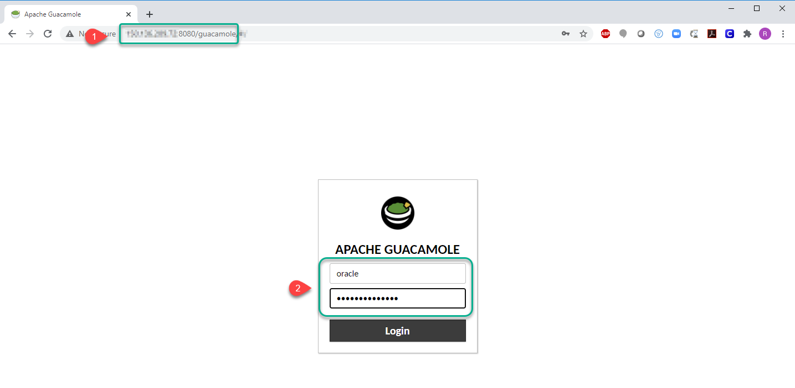
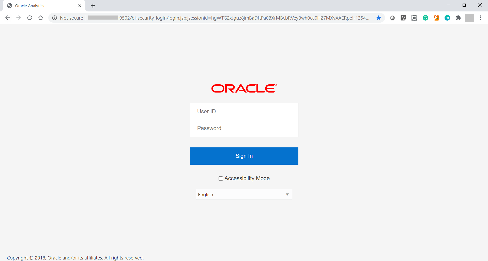

# Initialize Environment

## Introduction

In this lab we will review and startup all components required to successfully run this workshop.

*Estimated Lab Time:* 10 Minutes.

### Objectives
- Initialize the workshop environment.

### Prerequisites
This lab assumes you have:
- A Free Tier, Paid or LiveLabs Oracle Cloud account
- SSH Private Key to access the host via SSH
- You have completed:
    - Lab: Generate SSH Keys (*Free-tier* and *Paid Tenants* only)
    - Lab: Prepare Setup (*Free-tier* and *Paid Tenants* only)
    - Lab: Environment Setup

## **STEP 0**: Running your Lab
### Access the graphical desktop
For ease of execution of this workshop, your instance has been pre-configured for remote graphical desktop accessible using any modern browser on your laptop or workstation. Proceed as detailed below to login.

1. Launch your browser to the following URL

    ```
    URL: <copy>http://[your instance public-ip address]:8080/guacamole</copy>
    ```

2. Provide login credentials

    ```
    Username: <copy>oracle</copy>
    ```
    ```
    Password: <copy>Guac.LiveLabs_</copy>
    ```

    

    *Note*: There is an underscore `_` character at the end of the password.

3. To launch *Firefox* browser or a *Terminal* client, click on respective icon on the desktop

    

### Login to Host using SSH Key based authentication
While all command line tasks included in this workshop can be performed from a terminal session from the remote desktop session as shown above, you can optionally use your preferred SSH client.

Refer to *Lab Environment Setup* for detailed instructions relevant to your SSH client type (e.g. Putty on Windows or Native such as terminal on Mac OS):
  - Authentication OS User - “*opc*”
  - Authentication method - *SSH RSA Key*
  - OS User – “*oracle*”.

1. First login as “*opc*” using your SSH Private Key

2. Then sudo to “*oracle*”. E.g.

    ```
    <copy>sudo su - oracle</copy>
    ```

## **STEP 1**: Starting Database And OAS Services
1. From any of the terminal session started above, proceed as shown below as “*oracle*” user

2. Go to folder /u01/script

    ```
    <copy>
    cd /u01/script
    </copy>
    ```
3. Run the script file to start the services. All the required services of converged database and OAS will start in 5-6 minutes.

    

    ```
    <copy>
    ./env_setup_oas-workshop.sh
    </copy>
    ```

    
Check for the "Finished starting servers" status before proceeding next.

4. Run "status.sh" file to get the status of all the services required for OAS. The command shows all the service names and their status.

    
    ```
    <copy>
    /u01/oas/Oracle/middleware/Oracle_Home/user_projects/domains/bi/bitools/bin/status.sh
    </copy>
    ```

    
Check for the success status as shown above, before login to OAS screen.

## **STEP 2**: Login To Oracle Analytics Server

1. Open web browser (preferably Chrome) and access the OAS Data Visualization service by the below URL structure.  

    ```
    <copy>
    http://[Instance-public-ip]:9502/dv/ui
    </copy>
    ```
    

2. Login with the below credentials;

    ```
    Username	: <copy>Weblogic</copy>
    ```

    ```
    Password	: <copy>Oracle_4U</copy>
    ```

## **STEP 3**: Create A Connection To Database

1. From Home screen, click on **Create** button and select **Connection**.

    

2. Select **Oracle Database** for connecting to database and provide required connection details.  

    
    

    **Connection Details:**

    | Argument  | Description   |
    | ------------- | ------------- |
    | Connection Name | ConvergedDB_Retail |
    | Connection Type | Basic  |
    | Host | localhost  |
    | Port | 1521  |
    | Service Name | apppdb  |
    | Username | oaslabs  |
    | Password | Oracle_4U  |

3. Once connection details are provided click **Save** to save the connection.

You may now *proceed to the next lab*.

## Acknowledgements

- **Authors** - Balasubramanian Ramamoorthy, Sudip Bandyopadhyay, Vishwanath Venkatachalaiah
- **Contributors** - Jyotsana Rawat, Satya Pranavi Manthena, Kowshik Nittala, Rene Fontcha
- **Last Updated By/Date** - Rene Fontcha, LiveLabs Platform Lead, NA Technology, December 2020
