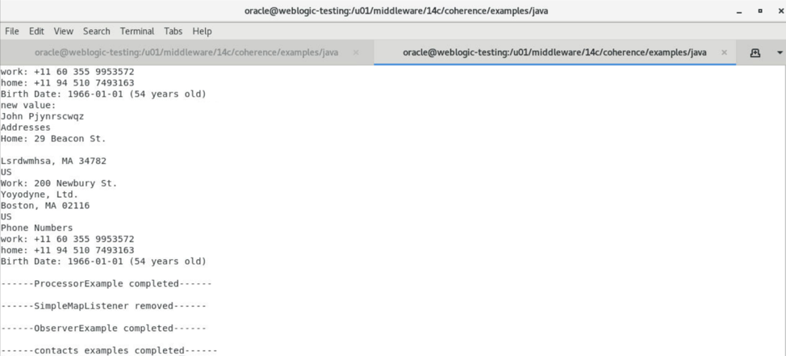
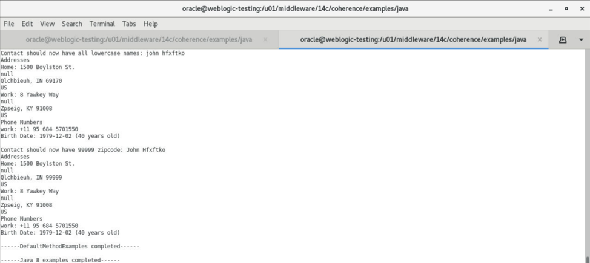
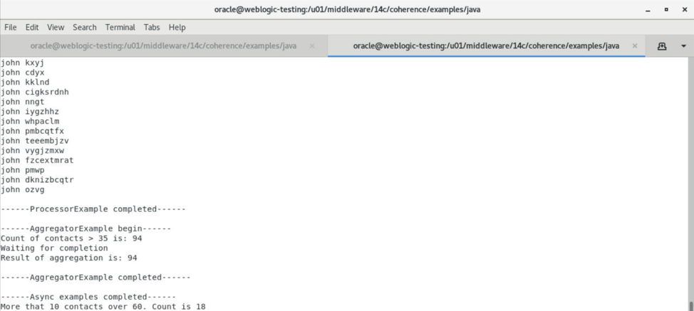

# Using Coherence Cache with WebLogic

## Introduction
The Coherence Lab is an exercise to visualize the different features of Coherence as a distributed in-memory data-grid.

*Estimated Lab Time:* 70 minutes

### Objectives
In this workshop, you will:
* Learn to setup and Configure Coherence
* Learn to build the Coherence Tests
* Execute the steps to test the Coherence Features

### Prerequisites
This lab assumes you have:
* A Free Tier, Paid or LiveLabs Oracle Cloud account
* SSH Private Key to access the host via SSH
* You have completed:
    - Lab: Generate SSH Keys (*Free-tier* and *Paid Tenants* only)
    - Lab: Prepare Setup (*Free-tier* and *Paid Tenants* only)
    - Lab: Environment Setup   
* Java Setup
    * Make sure that the `$COHERENCE_HOME` environment variable points to the location of the unpacked Coherence directory.
    * Make sure that the `$JAVA_HOME` environment variable points to the location of a supported JDK before building the examples.

### Directory Structure for Java

`java/bin`	Scripts for building and executing examples. There are two sets of scripts. Scripts with no file extension are bash scripts. Scripts with a .cmd file extension are Windows command scripts. The following description refers to the script names without specifying any file extension.
- run  
  Runs an example collection
- run-cache-server
  Runs the cache server used for the examples. The command is also used to start a proxy service that is required for extend clients.

- `java/classes`
  The class files output from a build. This directory will not exist until the build script is executed.
- `java/resource/config`
  The common Coherence configuration files required by the examples.
- `java/resource/<example name>`
  If an example has configuration that is required instead of the common configuration, it will have its own directory. The security example uses configuration files from `java/resource/security`.

- `$COHERENCE_HOME/lib`
  Coherence libraries used for compiling and running the examples.
- resource
  The data file used for the contacts Loader Example: contacts.csv.

### Lab Details

| **Step No.** | **Feature**                            | **Approx. Time** | **Details**                                                                                                      | **Value proposition**                                                                                                          |
| ------------ | -------------------------------------- | ---------------- | ---------------------------------------------------------------------------------------------------------------- | ------------------------------------------------------------------------------------------------------------------------------ |
| 1            | Setup and Verify Environment Variables | 5min             | Set and verify the `JAVA_HOME` and `COHERENCE_HOME` for both terminal windows                                        | Environment setup                                                                                                              |
| 2            | Build JAVA Labs                        | 10min            | Build all the java Labs as needed and execute the build script with the name of the example collection           | All the Examples are ready to be Run and Folder is current                                                                     |
| 3            | Test Cache with Contacts Get & Put     | 5min             | Data access features of Coherence including getting, putting and removing data from a provided contacts.csv file | Test data access in Cache                                                                                                      |
| 4            | Test Cache Security Features           | 10min            | Security feature of accessing Cache securely using role and password                                             | Test cache reference that requires a password an attempts cache and invocation service operations that require different roles |
| 5            | Test Live events in Cache              | 10min            | Shows the Events feature of inserting into Cache                                                                 | How to measure the elapsed time between pre- and post-events which are inserted into a results Cache                           |
| 6            | Test Java 8 features                   | 10min            | Illustrates how to use the Java streams when querying and processing cache entries                               | How Lambda features can be used in a Cache to simplify common Coherence tasks and how to query and process cache entries       |
| 7            | Test Asynchronous features             | 10min            | Illustrates how to asynchronously get and put data in a cache                                                    | How to asynchronously process cache entries in Coherence and  how to asynchronously aggregate cache entries                    |

## **STEP 0**: Running your Lab
### Access the graphical desktop
For ease of execution of this workshop, your instance has been pre-configured for remote graphical desktop accessible using any modern browser on your laptop or workstation. Proceed as detailed below to login.

1. Launch your browser to the following URL

    ```
    URL: <copy>http://[your instance public-ip address]:8080/guacamole</copy>
    ```

2. Provide login credentials

    ```
    Username: <copy>oracle</copy>
    ```
    ```
    Password: <copy>Guac.LiveLabs_</copy>
    ```

    

    *Note*: There is an underscore `_` character at the end of the password.

3. Click on *Terminal* icon on the desktop to start a terminal

    

### Login to Host using SSH Key based authentication
While all command line tasks included in this workshop can be performed from a terminal session from the remote desktop session as shown above, you can optionally use your preferred SSH client.

Refer to *Lab Environment Setup* for detailed instructions relevant to your SSH client type (e.g. Putty on Windows or Native such as terminal on Mac OS):
  - Authentication OS User - “*opc*”
  - Authentication method - *SSH RSA Key*
  - OS User – “*oracle*”.

1. First login as “*opc*” using your SSH Private Key

2. Then sudo to “*oracle*”. E.g.

    ```
    <copy>sudo su - oracle</copy>
    ```

## **STEP 1**: Verify Environment
1. Open Two Terminal windows
2. Set and verify the `JAVA_HOME` for both terminal windows by typing the commands below

    ```
    <copy>
    export JAVA_HOME="/u01/oas/javaln/jdk1.8.0_261"
    export PATH=$JAVA_HOME/bin:$PATH
    echo $JAVA_HOME
   </copy>
    ```

      

3. Set and verify COHERENCE_HOME for both terminal windows

    ```
    <copy>
    export COHERENCE_HOME="/u01/middleware/14c/coherence"
    export PATH=$COHERENCE_HOME/bin:$PATH
    echo $COHERENCE_HOME
    </copy>
    ```

     

## **STEP 2**: Build JAVA Labs
1. Change Directory to Java Samples in both Terminal Windows (`/u01/middleware/14c/coherence/examples/java`)

    ```
    <copy>cd $COHERENCE_HOME/examples/java</copy>
    ```

2. Build all the java Labs as needed and execute the build script with the name of the example collection:

    ```
    <copy>bin/build contacts
    bin/build security
    bin/build events
    bin/build java8
    bin/build async</copy>
    ```

3. Now Run the following Labs from the following folder in both Terminal Windows

    ```
    <copy>cd $COHERENCE_HOME/examples/java</copy>
    ```

## **STEP 3**: Test Cache with Contacts get & Put
This step shows the most basic data access features of Coherence including getting, putting and removing data from a provided contacts.csv file. To start a Coherence Cache and then put and get Contacts to/from the Cache.

### Start Cache Server:

1. Start a cache server
2. Type the following command in the first Terminal window

    ```
    <copy>bin/run-cache-server</copy>
    ```

3. Wait for the Cache Server to start in a few seconds as each execution starts a cache server cluster node.

    

### Run the Example Client:      
1. Open a second terminal window:
2. Run the terminal with the name of the example:

    ```
    <copy>bin/run contacts</copy>
    ```

    The Driver.main method runs through the features of the example with output going to the command window (stdout)

      

## **STEP 4**: Test Cache Security Features
This step shows the security feature of accessing Cache securely using role and password. The Coherence security set receives a cache reference that requires a password and attempts cache and invocation service operations that require different roles.

### Start Cache Server:
1. On the First Terminal window run the following command:

    ```
    <copy>bin/run-cache-server security</copy>
    ```

2. The cache server also runs a proxy service which allows connections from Coherence*Extend clients.
3. Wait for the Cache Server to start in a few seconds

    

### Run the Example Client:
1. On the Second Terminal window run the following command:

    ```
    <copy>bin/run security</copy>
    ```

2. The Driver.main method runs through the features of the example with output going to the command window (stdout)

      

## **STEP 5**:  Test Live events in Cache
This step shows the Events feature of inserting into Cache

How to measure the elapsed time between pre- and post-events which are inserted into a results cache; the semantics of throwing exceptions in pre- and post-commit events, and how partition redistribution events can be logged.

### Start Cache Server:
1. First Terminal window:

    ```
    <copy>bin/run-cache-server events</copy>
    ```

2. Each execution starts a cache server cluster node. Wait for the Cache Server to start in a few seconds

    

### Run the Example Client:
1. On the Second Terminal Window run the following command:

    ```
    <copy> bin/run events</copy>
    ```

2. The Driver.main method runs through the features of the example with output going to the command window (`stdout`).

    

## **STEP 6**: Test Java 8 features
The Coherence Java 8 features step illustrates how to use the Java streams when querying and processing cache entries. how Lambda features can be used to simplify common Coherence tasks and how to query and process cache entries

The process of adding Lambda features in a Cache to simplify common Coherence tasks and how to query and process cache entries

### Start Cache Server:
1. On the First Terminal Window run the following command:

    ```
    <copy>bin/run-cache-server</copy>
    ```

2. Wait for the Cache Server to start in a few seconds

    

### Run the Example Client:
1. On the Second Terminal Window run the following command:

    ```
    <copy>bin/run java8</copy>
    ```

2. The Driver.main method runs through the features of the example with output going to the command window (stdout). Inspect the output and refer to the code at `src/com/tangosol/examples/java8`.

    

## **STEP 7**: Test Asynchronous features
The Coherence asynchronous features step illustrates how to asynchronously get and put data in a cache.

How to asynchronously process cache entries in Coherence and to asynchronously aggregate cache entries.

### Start Cache Server:
1. On the First terminal Window run the following command:

    ```
    <copy>bin/run-cache-server</copy>
    ```

2. Wait for the Cache Server to start in a few seconds

                

### Run the Example Client:
1. On the Second terminal Window run the following command:

    ```
    <copy> bin/run async</copy>
    ```

2. The Driver.main method runs through the features of the example with output going to the command window (stdout). Inspect the output and refer to the code at `src/com/tangosol/examples/async`

    

*End of Lab*

## Acknowledgements
* **Author** - Srinivas Pothukuchi, Pradeep Chandramouli, Chethan BR, AppDev & Integration Team, Oracle, October 2020
* **Contributors** - Meghana Banka, Rene Fontcha
* **Last Updated By/Date** - Rene Fontcha, LiveLabs Platform Lead, NA Technology, December 2020
