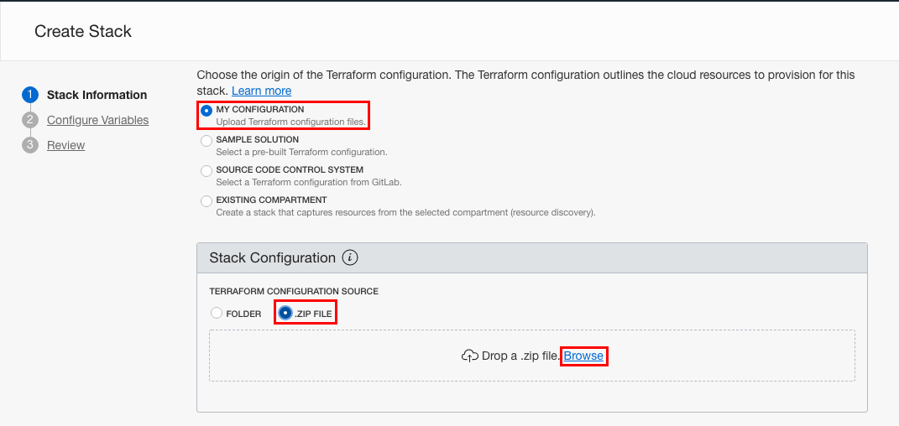

# Provision Cloud Resources

## Introduction

You may use one of the following methods to deploy the cloud resources for this scenario.

## Option 1 : Provision Cloud Resources Using Resource Manager

**Resource Manager** is an Oracle Cloud Infrastructure service that allows you to automate the process of provisioning your Oracle Cloud Infrastructure resources. In this section you will use **Resource Manager** to provision the resources required for this solution.

> **Resource Manager** uses Terraform to help install, configure, and manage cloud resources through the "infrastructure-as-code" model. Click [here](https://docs.cloud.oracle.com/en-us/iaas/Content/ResourceManager/Concepts/resourcemanager.htm) to learn more about Resource Manager.

### **Step 1:** Sign In to Oracle Cloud Infrastructure Console

Sign in to your **Cloud Account** from Oracle Cloud website. You will be prompted to enter your cloud tenant, user name, and password.

> For detailed sign in instructions, refer to the documentation on [*Getting Started with Oracle Cloud*](https://docs.oracle.com/en/cloud/get-started/subscriptions-cloud/csgsg/sign-your-account-oracle-cloud-website.html).

### **Step 2:** Create the Stack

Creating a **Stack** involves uploading the Terraform configuration file, providing identifying information for the new stack, and (optionally) setting the variables.

> A **Stack** is a collection of Oracle Cloud Infrastructure resources corresponding to a given Terraform configuration. Each stack resides in the **Compartment** you specify, in a single **Region**. However, resources in a given stack can be deployed across multiple regions.

1. Open the **Navigation Menu** on the top-left. Under **Solutions and Platform**, locate **Resource Manager** and click **Stacks**.

2. Choose a **Compartment** that you have permission to work in (towards the left of the page), and ensure you are in the correct **Region** (towards the top of the page). Click **Create Stack**.

3. In the **Create Stack** dialog, enter the following :

	* Select **My Configuration**, choose the **.ZIP FILE** button, click the **Browse** link and select the terraform configuration zip file that you downloaded earlier. Click **Select**.

		

	* Enter a **Name** for the new stack (or accept the default name provided).

	* Optionally, enter a **Description**.

	* From the **Create in Compartment** drop-down, select the **Compartment** where you want to create the stack.

	* Select the **Terraform Version** obtained from [**Before You Begin** -> **Required Parameters**](?lab=about-this#RequiredParameters) section.
		>The Terraform version is not backwards compatible so ensure you select the correct version.

	* Optionally, you can apply tags.
		>Refer to the documentation section [*Tagging Overview*](https://docs.cloud.oracle.com/en-us/iaas/Content/Tagging/Concepts/taggingoverview.htm) for details on OCI Tagging.

	* Click **Next**.

4. Configure the variables the cloud resources will require when creating the Stack, and also when you run the Apply job (next Step).

	Enter the values from [**Before You Begin** -> **Required Parameters**](?lab=about-this#RequiredParameters) section.

	* Click **Next**.

5. In the **Review** panel, verify your stack configuration.
Click **Create** to create the Stack.

6. Verify the Stack creation on the **Stack Details** page.

### **Step 3:** Run a Plan Job

Running a plan job parses the Terraform configuration (.zip) file and converts it into an execution plan listing resources and actions that will result when an apply job is run. We recommend generating the execution plan before running an apply job.

1. On the previous **Stack Details** page, click on **Terraform Actions** -> **Plan**.

2. Review the plan job **Name** and update if needed. Click **Plan**.

3. The new plan job is listed under **Jobs**, with an initial state of **Accepted**. Soon the status changes to **In Progress**.

4. When the plan job is successful, the status will change to **Succeeded**.

5. Scroll to the bottom of the plan log and verify there are no errors, and the plan indicates the resources will be added.

### **Step 4:** Run an Apply Job

When you run an apply job for a Stack, Terraform creates the resources and executes the actions defined in the Terraform configuration (.zip) file. The time required to complete an apply job depends on the number and type of cloud resources to be created.

1. Browse to the **Stack Details** page by clicking the link from the breadcrumbs as follows :

2. Go to **Terraform Actions** and select **Apply**.

3. In the **Apply** dialog, review the apply job **Name** and ensure the **Apply Job Plan Resolution** is set to **Automatically Approve**.

	> You may optionally add **Tag** information. Refer to the documentation section [*Tagging Overview*](https://docs.cloud.oracle.com/en-us/iaas/Content/Tagging/Concepts/taggingoverview.htm) for details on OCI Tagging.

4. Click **Apply**.

5. The new apply job gets **Accepted** status.

6. The apply job status will quickly change to **In Progress**.

7. The job will take a few minutes to complete and will change status to **Succeeded** when successfully completed.

8. Verify the apply log by scrolling down to the **log** section and validate the resource creation was successful.

## Option 2: Provision using Terraform CLI

Coming soon ..

## Summary

You have successfully created the resources required for this solution.
