# Set Up the Virtual Network

## Introduction:

This lab with guide you through how to set up a Compartment and a Virtual Cloud Network (VCN) with the required policies for the SOA cloud environment.

Estimated Lab Time: 20 minutes.

### Requirements

If you are not an administrator in your tenancy, you will need the administrator to create the compartment and set the following policies:

```
<copy>
allow group soa-migration to manage instance-family in compartment SOAMP1Compartment
allow group soa-migration to manage virtual-network-family in compartment SOAMP1Compartment
allow group soa-migration to manage volume-family in compartment SOAMP1Compartment
allow group soa-migration to use database-family in compartment SOAMP1Compartment
allow group soa-migration to use autonomous-database-family in compartment SOAMP1Compartment
</copy>
```

### Objectives

In this lab you will:

- Create a Compartment.
- Create a VCN with private and public subnets.


## **STEP 1:** Create the Compartment

Before we can provision the Application Database (SOADB), we need to provision a **Compartment** where we can set up the network layer, or you can get the details of an already created **Compartment** from your network administrator.

1. Go to the menu button on the top left and select **Identity -> Compartment** .

   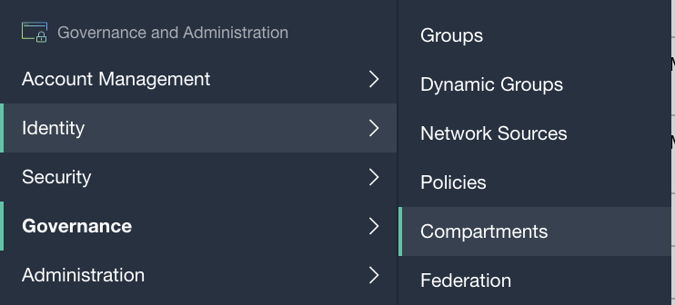

2. Click on **Create Compartment**

   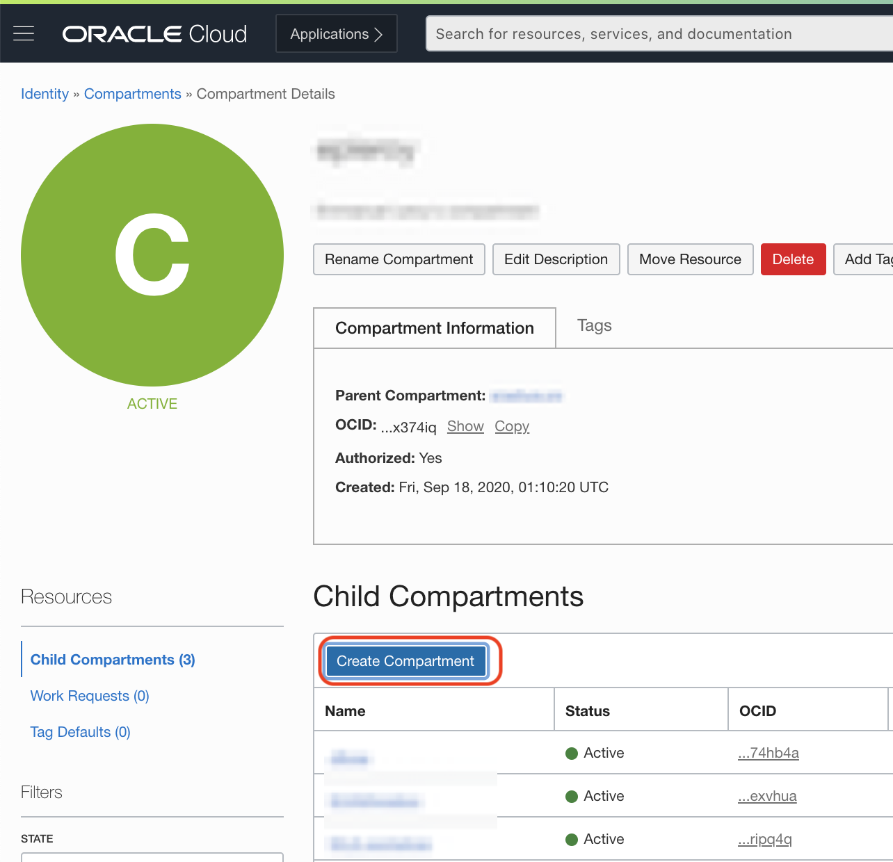

3. Provide all the required details and make sure you have relevant permissions from your OCI Administrator to create the **Compartment**.

   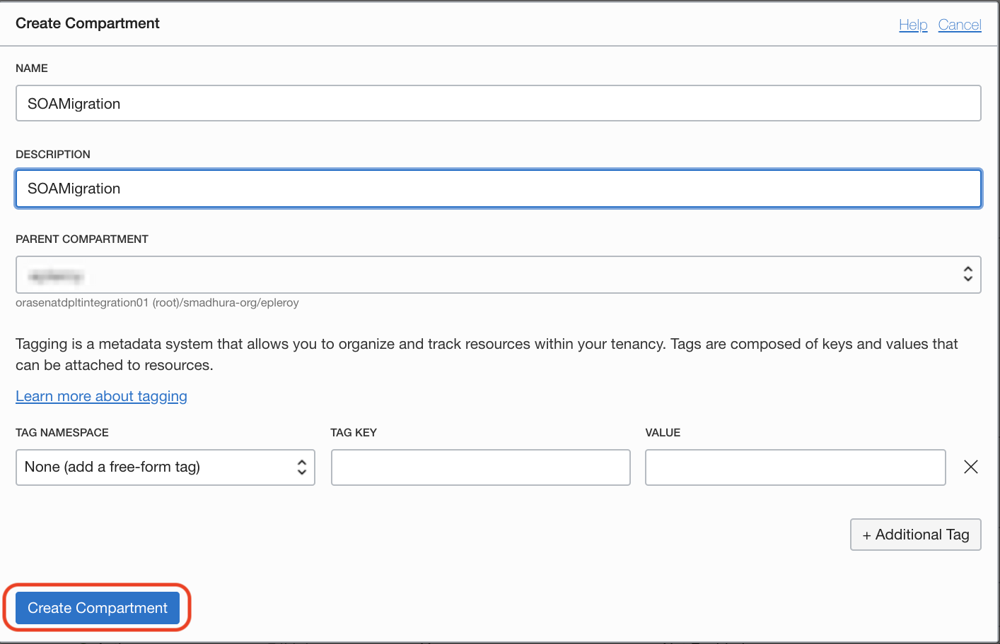

## **STEP 2:** Create the VCN

We need to provision a **VCN** by choosing **Start VCN Wizard** with preconfigured **public subnet**, and **private subnet** with appropriate **Security Lists** to open up the required ports:

1. Go to **Networking -> Virtual Cloud Networks**.

    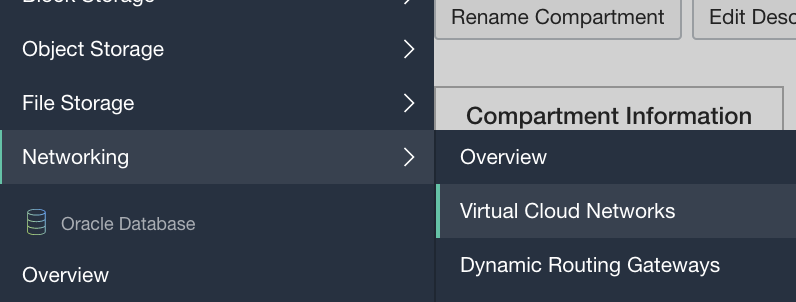

2. Click **Create VCN**, select **VCN with Internet Connectivity** and click **Start VCN Wizard** button.

    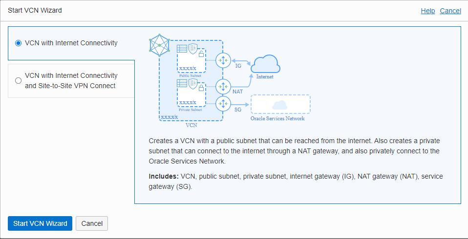

3. Provide the VCN NAME (we'll use `SOAMP1VCN`) and select the Compartment that you created earlier.

    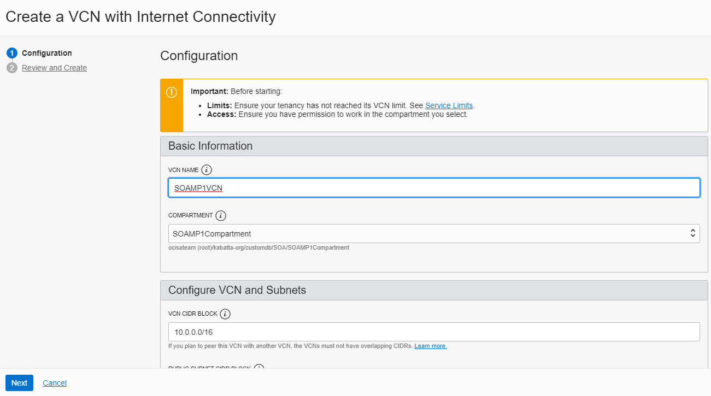

4. Select the default values for **Configure VCN and Subnets** unless you have been provided with a specific CIDR range by your Network Administrator, then click **Next**.

    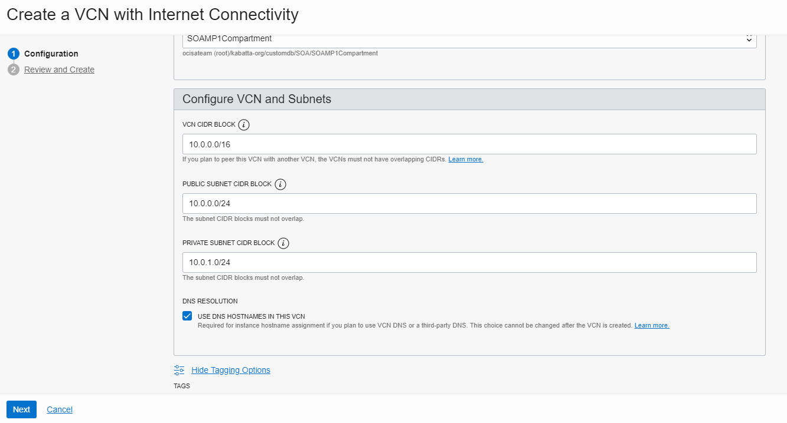

5. Review all the **VCN** ,**Subnet** ,**Gateway**, **Security List** and **Route Table** details and click  **Create**.

    You can see the stack has created two subnets which we will use later for creating database and SOA instance:
    - A **Private Subnet** with a security list **Security List For Private Subnet-SOAMP1VCN**.
    - A **Public Subnet** with a security list **Default Security List for SOAMP1VCN**.

6. Click **Create**.

    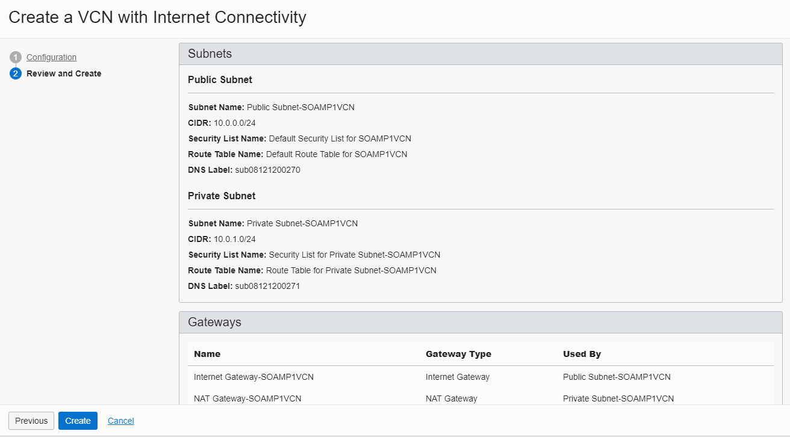

7. *If you see any provisioning errors, make sure to click* **Retry Provision** *before continuing*

    

8. When all is clear, click **View Virtual Network**

## **STEP 3:** Create the Required Security Lists

Before we can provision the SOAMP Instance, we need to provision a security list so the database subnet can be reached from the SOA instances. We need to open the following ports: 

  - port 1521 for the database.
  - port 22 for SSH.
  - 7001-7004 for SOA weblogic.
  - 9001-9004 for weblogic internal ports.

In this section, we will create a security list for the SOA subnet to reach the database subnet on port 1521 (the Oracle database default port), SSH port 22 and weblogic ports 7001-7004 , 9001-9004 to communicate with the SOA instance.

1. Click **Security Lists**.

    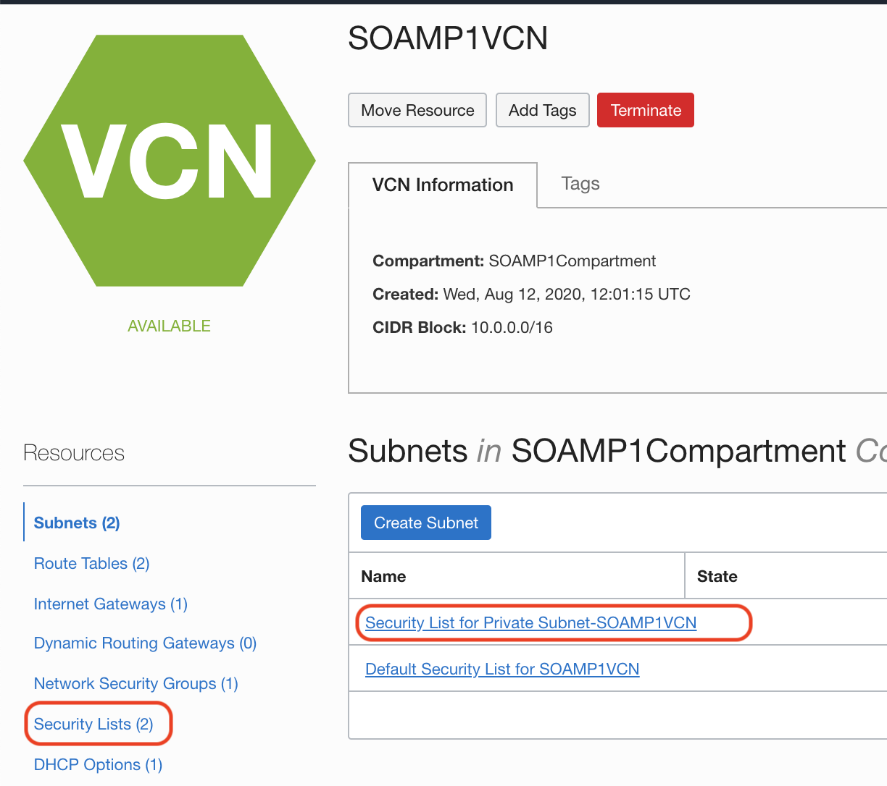

2. Click **Security List for Private Subnet-SOAMP1VCN**.

    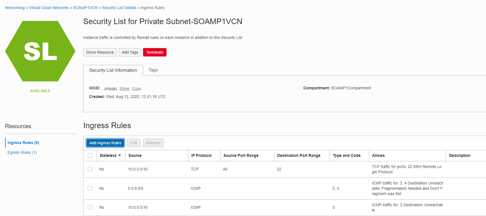

3. Click **Add Ingress Rules**.

4. Add an ingress rule to open the DB port to the VCN CIDR.

    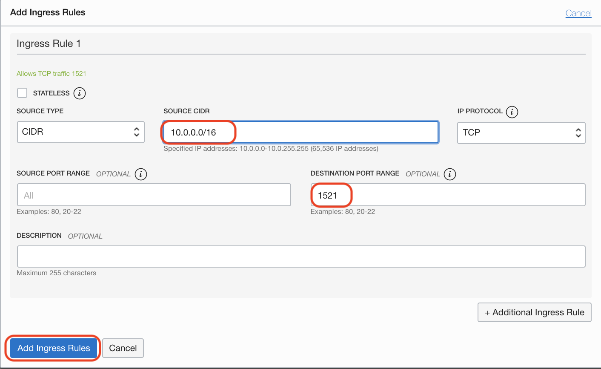

5. Add an ingress rule to open the 7001-7004 ports to the VCN CIDR (10.0.0.0/16).

    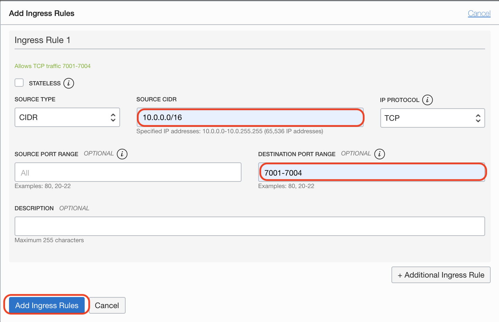

6. Add an ingress rule to open the 9071-9074 ports to the VCN CIDR (10.0.0.0/16).

    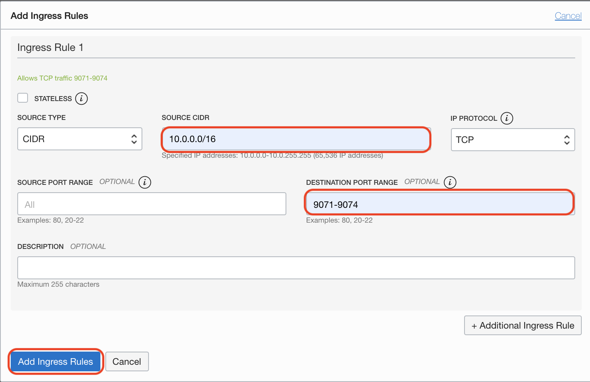


You may proceed to the next lab.

## Acknowledgements

 - **Author** - Akshay Saxena, September 2020
 - **Last Updated By/Date** - Akshay Saxena, Septemebr 2020
