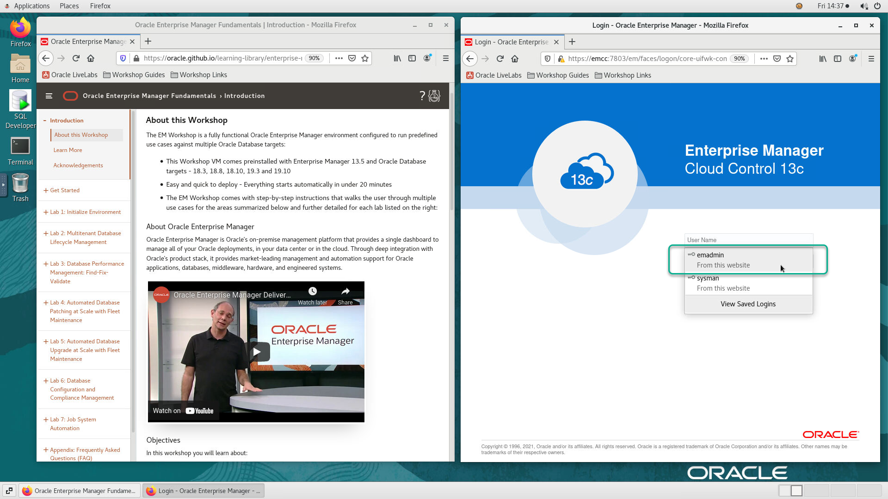
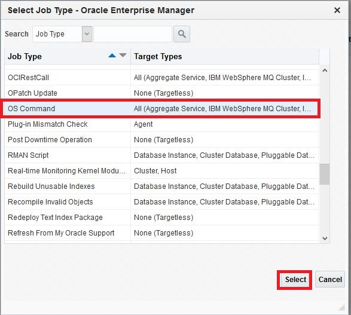
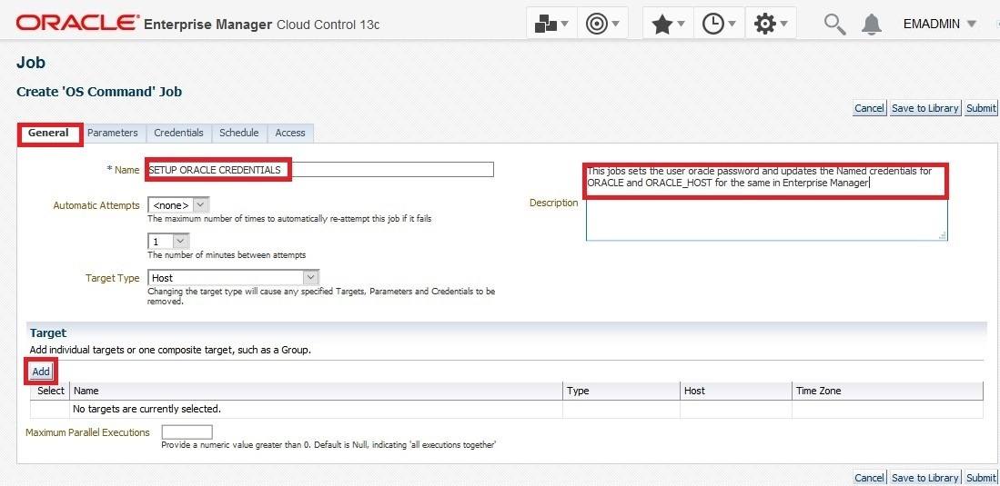
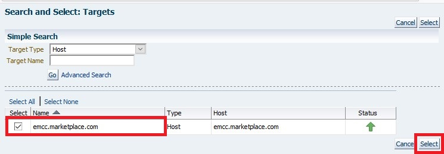
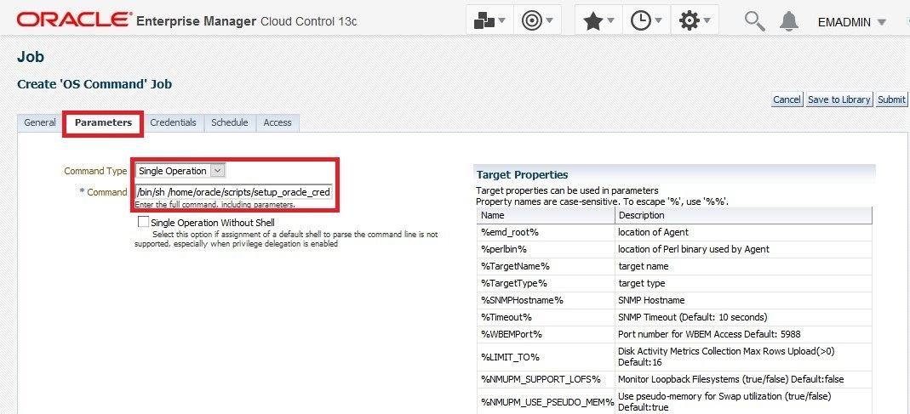
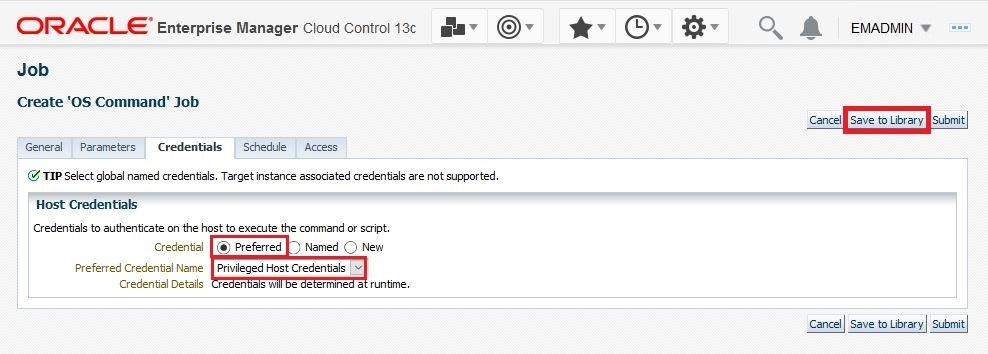
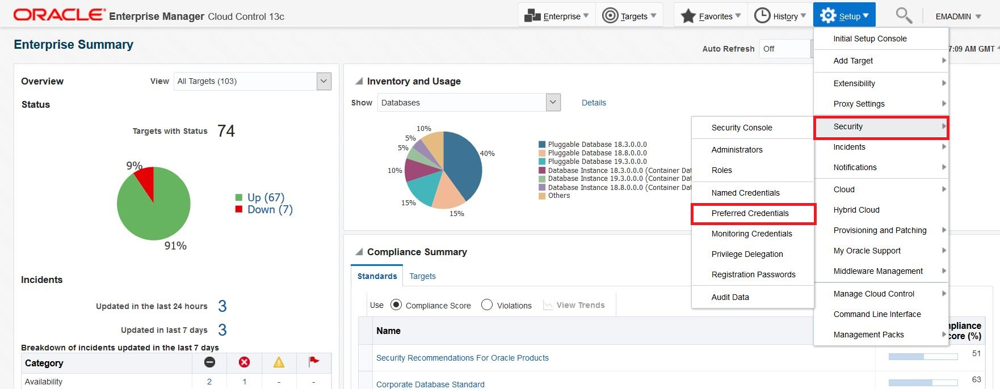
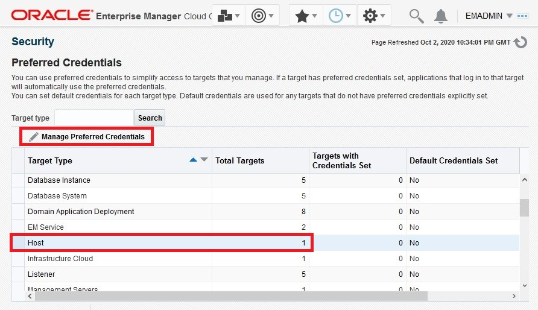
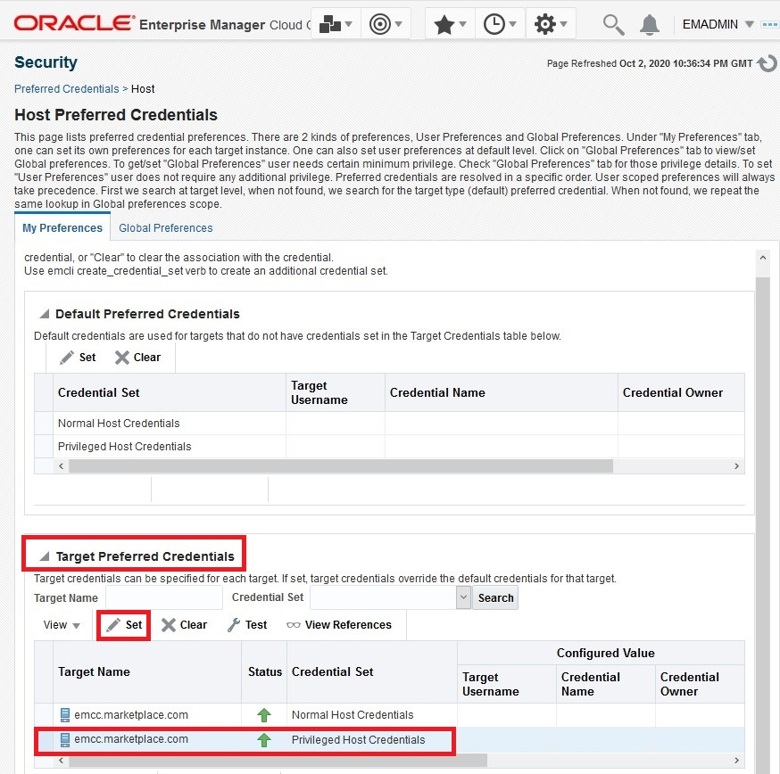
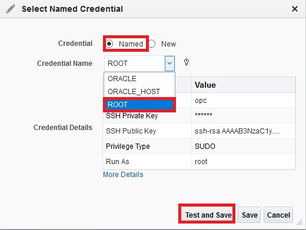

# Automation with Enterprise Manager Job System

## Introduction

In this lab you will learn how to use the Enterprise Manager Job System to automate routine administrative tasks such as backup, SQL scripts and OS jobs etc., in your environment so you can manage them more efficiently.

*Estimated Lab Time*: 60 minutes

### About the Enterprise Manager Job System

A job is a unit of work that you define to automate commonly-run tasks. Scheduling flexibility is one of the advantages of jobs. You can schedule a job to start immediately or start at a later date and time. You can also run the job once or at a specific interval, such as three times every month. The Enterprise Manager Job System serves these purposes:
- Automates many administrative tasks; for example: backup, cloning, and patching
- Enables you to create your own jobs using your own custom OS and SQL scripts
- Enables you to create your own multi-task jobs comprised of multiple tasks
- Centralizes environment job scheduling into one robust tool

### Objectives

In this lab you will learn:

| **Step No.** | **Feature**                                                                | **Approx. Time** | **Details**                                                                                                                                                                      | **Value proposition**                                                                                                                                                                                                                   |
|--------|----------------------------------------------------------------------------|------------------------|----------------------------------------------------------------------------------------------------------------------------------------------------------------------------------|-----------------------------------------------------------------------------------------------------------------------------------------------------------------------------------------------------------------------------------------|
| 1    | Understand how to create an OS Command Job                                      | 5min                     | Understand a simple OS Command Job to update user oracle's password and update name credentials using a script                                                                                   | Learn how to create your own custom jobs to automate using scripts or cronjobs.                                                                                                           |
| 2    | Create a SQL command Job | 10min                     |         Run a SQL query to **determine number of targets down** OR **modify an initialization parameter of a database**                                                                                                              | Access and run your databases queries and tasks on a regular basis using sql commands                                                                                                                  |
| 3    | Create Database Backup Job using Wizard                               | 15min                      |   Use Customized Wizard to back up a database using various options to customize your RMAN script.                                                                                                                     |Create and schedule regular backups of your database to safeguard against data loss and application errors                                                                                       |

### Prerequisites
- A Free Tier, Paid or LiveLabs Oracle Cloud account
- SSH Private Key to access the host via SSH
- You have completed:
    - Lab: Generate SSH Keys (*Free-tier* and *Paid Tenants* only)
    - Lab: Prepare Setup (*Free-tier* and *Paid Tenants* only)
    - Lab: Environment Setup
    - Lab: Initialize Environment

*Note*: This lab environment is setup with Enterprise Manager Cloud Control Release 13.5 and Database 19.10 as Oracle Management Repository. Workshop activities included in this lab will be executed on the Enterprise Manager console (browser)

## **STEP 1:** Understand how to create an OS Command Job

In this workshop we will first review the Job you ran in STEP 0 to set user *oracle*'s Named Credentials. This is a Read-Only exercise to explain how that Library job was created.

1.  On the *Firefox* window on the right preloaded with *Enterprise Manager*, click on the *Username* field and select the saved credentials to login. These credentials have been saved within *Firefox* and are provided below for reference

  ```
  Username: <copy>emadmin</copy>
  ```

  ```
  Password: <copy>welcome1</copy>
  ```

  

2.  Navigate to the “***Enterprise menu >> Job >> Activity***”.
  

3.  In the Job Activity page, on the top of the Activity table, click **Create Job**
  

4. In the **Select Job Type** pop-up, select **OS command**; Click **Select**
  

5. In the Create 'OS Command Job' page, General Tab, enter a **Name and Description** of Job as shown; Click **Add** to add a Target on which the Job will be run
  

6. Check **emcc.marketplace.com** and click **Select**
  

7. In the Create 'OS Command Job' page, **Parameters Tab**, select **Single Operation** and enter the OS Command for the script that needs to be run
  

8. In the Create 'OS Command Job' page, Credentials Tab, select **Preferred** and **Privileged Host Credentials** from the Preferred Credential Name dropdown. Click **Save to Library** to finish creating your Library job for later use/schedule.
  
  

9. In order to submit this job we need to Set the Preferred Credentials on the Host. Given   that the user **emadmin** has already been granted access to pre-set Named Credentials on this system such as ORACLE, ROOT, SYSMAN etc. we now need to set the privileged credentials on the host  this job has to be run. Click on ***Setup->Security->Preferred Credentials***
  

10. Select **Host** Target Type and Click on **Manage Preferred Credentials**
  

11. Under **Target Preferred Credentials** Select the Credential Set **Privileged Host Credentials** and Click **Set**
  

12. In the **Select Named Credentials** Window, Select Named Credential **ROOT**. Click **Test and Save**
  

Now the Library job created is ready to be used.

## **STEP 2:** Create a SQL command Job

In this workshop we will create and run a SQL Command Job to determine how many targets are down from the Enterprise Manager Repository

1.  Still connected to your Enterprise Manager as user **emadmin**, Navigate to ***Enterprise >> Job >> Activity***.
  

2.  In the Job Activity page, on the top of the Activity table, click **Create Job**.
  

3. In the **Select Job Type** pop-up, select **SQL Script** and Click **Select**.
  

4. On the General Tab, Enter **TARGET_DOWN** as Name of the job and Click on **Add** to add Target Instance.
  

5. Check **emrep.us.oracle.com** (the EM repository) and click **Select**.
  

6. On the Parameters tab enter the following SQL command to be executed

    ```
    <copy> SELECT COUNT(*) FROM mgmt$availability_current WHERE availability_status='Target Down'; </copy>

    ```
    

7. On the **Credentials** tab, Select Database Named Credential **SYSMAN** and Host Named Credential **ORACLE** and Click on **Submit** to submit the SQl Script job.
  

8. You will get a confirmation dialog at the top of the screen. CLick on **TARGET_DOWN** to view your job run.
  

9. This will show you the sql command job's successful run with the value of number of targets that are Down.
  

Now let us see how we can run a sql job to alter the initialization parameters of a database

10. First, let us see the original value of the parameter. From the main menu, Click on ***Targets >> Databases*** and Click on **finance.subnet.vcn.oraclevcn.com**.
  

11. Under **Administration** drop down Click **Initialization Parameters**.
  

12. This will pop up the credentials screen. Select Named Credential **OEM_SYS**; Click **Login**.
  

13. Scroll down and you will see the **open\_cursors** initialization parameter set to 300 as shown.
  

14. Navigate to the ***Enterprise menu >> Job >> Activity***.
    

15. In the Job Activity page, on the top of the Activity table, click **Create Job**.
    

16. In the **Select Job Type** pop-up, select "**SQL Script**"; Click **Select**.
    

17.  On the General Tab, Enter **FIX_OPEN_CURSOR** as Name of the job and Click on **Add** to add Target Instance.
    

18. Check **finance.subnet.vcn.oraclevcn.com**  and click **Select**.
    

19. On the Parameters tab enter the following SQL command to be executed

    ```
    <copy>alter system set open_cursors = 400 scope=both;</copy>

    ```
    

20. On the Credentials tab, Select Database Named Credential OEM_SYS and Host Named Credential ORACLE.
    

21. On the **Schedule** Tab you can specify whether you want to run the job immediately or at a later time by specifying date, time etc. Click on **One Time (Immediately)**. Click on **Submit** to submit the SQL Script job.     
    

21. You will get a confirmation dialog at the top of the screen. Click on **FIX_OPEN_CURSOR** to view your job run.
    

22. This will show you the sql command job's successful run.
    

23. You can go back to the finance database by repeating steps 11-14 to verify the new value of the open_cursors initialization parameter.
  

<!-- This workshop shows how you can use the Job System to automate SQL commands on databases including the Enterprise Manager Repository and schedule them as needed.   -->

## **STEP 3:** Create Database Backup Job using Wizard

Jobs can be accessed from the Jobs menu or from within the context of a target. Let us look at it from a Database target perspective.

1. Navigate to the ***Targets >> Databases***.
  

2. Click on **finance.subnet.vcn.oraclevcn.com**, the database for which you want to schedule a backup job
  

3. The home page for the database is displayed. Click on ***Availability >> Backup & Recovery >> Schedule Backup..***
  

4. Select **OEM_SYS** Named Credential and Click **Login**
  

5. From the Schedule Backup Wizard, you can select either Oracle-suggested backup or Customized backup. Oracle-suggested backup is based on your disk, tape, or disk and tape configuration. Using Customized backup, you can schedule your own backup jobs with more flexibility. Customized backup jobs are influenced by the database configuration.
In the Customized Backup section, the **Whole Database** option is selected by   default. Select **ORACLE** Host Credentials (default). Click on **Schedule Customized Backup**
  

6. You can use the **Options** page of the Schedule Customized Backup Wizard to:
      * Choose a full backup
      * Choose an incremental backup
      * Delete obsolete backups
      * Use a proxy copy supported by media management software to perform the backup

      Click the **Full Backup** option (default) to back up all the blocks into the backup set. It takes a backup of archived redo log files and control files. Click Next.

      

7. You can use the **Settings** page of the Schedule Customized Backup Wizard to specify the media type on which to take the backup of the database. You can select either Disk or Tape here. Select **Disk** as the media on which the backup is to be taken. You can change the default path by clicking the Override Default Settings button. Click **Next**.
  

8. Specify a name for the job (default selected). Also, in the Job Description field, you can specify the purpose of this job. Specify when you want to run this job. The **One Time (Immediately)** option is selected by default. Click **Next**.
  

9. On the Review page, you get one last chance to change the job settings. It gives you the summary of the job. You can review the RMAN script and change it if you want. Click **Submit Job** to create the job.
  

10. You have successfully created the job. Click on Ok or View Job to see details of the job with credentials as needed.
  
  

This completes this lab.

You may now [proceed to the next lab](#next).

## Learn More
- [Oracle Enterprise Manager](https://www.oracle.com/enterprise-manager/)
- [Enterprise Manager Documentation Library](https://docs.oracle.com/en/enterprise-manager/index.html)
- [Utilizing the Job System](https://docs.oracle.com/en/enterprise-manager/cloud-control/enterprise-manager-cloud-control/13.5/emadm/utilizing-job-system-and-corrective-actions.html#GUID-3F8CCFFA-4290-4AA9-A093-1E1659C8784D)

## Acknowledgements
  - **Author** - Shefali Bhargava, Oracle Enterprise Manager Product Management
  - **Contributors** -  Rene Fontcha
  - **Last Updated By/Date** - Rene Fontcha, LiveLabs Platform Lead, NA Technology, July 2021
