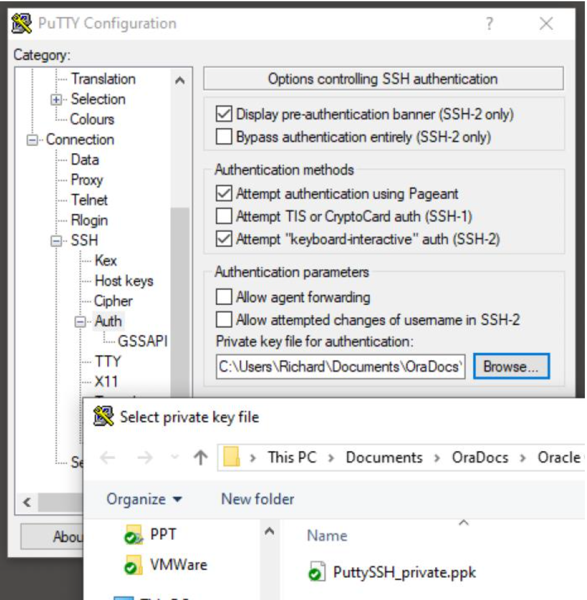

# Create Linux based Compute VM with Web Server

## Introduction
In this lab, you wil learn how to provision a compute instance. Furthermore, you will install a web server on the provisioned VM.
You will also learn how to update the Network Security Lists in order to allow incoming traffic.

Estimated time: 45 minutes

### Objectives
* Install compute instance with Ubuntu 18.04
* Install web server 
* Update Network Security List

### Prerequisites
* You must have a VCN provisioned

## **Step 1**: Create the VM

### Create a Standard2.1 Virtual Machine

Using the top _Hamburger menu_ navigate to the _Compute -> Instances section_. Again, ensure that the Compartment Scope in the left toolbar is selected to your compartment.
Use the _Create Instance_ button to create a new Virtual Machine Instance.
In the top section you can select / change the image you want to use for this instance. We want to use an **Ubuntu 18.04** instance, so click on the [Change Image] button and find the Ubuntu 18.04 image.


Next we have to select the correct shape for the instance. There are different Shapes in OCI based on different CPUs (Intel Xeon and AMD Epic Processors) and each Shape has a different number of CPUs and Memory footprint.
For this exercise you need to select a _VMstandard2.1_ shape. Scroll down until you see the shape selection box.


Click on the _Change Shape_ button and find the _VMstandard2.1_ shape. You can find this in the _Intel Skylake_ section.


Check that the network configuration for this instance is set to your VCN and the **PUBLIC SUBNET!**.

## **Step 2**: Working with SSH Keys

### Using SSH Keys

For the next selection _Add SSH keys_ - **please follow these directions carefully depending on your desktop OS**.
Access to Linux based instances is done using SSH Keys. You can create these keys yourself or you can use the automatically generated key by OCI. For this workshop you can use the generated keys if you are using a Mac or Windows and do NOT need to use PuTTY (i.e. you can use a Linux command line system within Windows). If you do need to use PuTTY, follow the below instructions.

For Mac Users and Windows Users using the SSH command, you can use the OCI console generated keys.

**IMPORTANT:** Before you click on the [create] button, make sure you have downloaded the generated private key file!


---

**Note for Windows users wanting to use Putty:**
If you want to use Putty instead of the windows build-in SSH client, you need to have a different key format (Putty SSH key format). This format is not created by the OCI Console. You can go to _http://www.oci-workshop.com/keys_ to download a generated key file that contains both formats. For this lab, use these keys for creating your instance and logging into your instance.

---

It usually takes a minute for the Instance to be created and to be up and running and it will then also display the Public IP address you can use to connect to this Instance.


### Connecting to your instance using SSH

To connect to your instance, open up a Terminal if you are using a Mac (or a Linux shell environment on Windows – make sure you put the key file in your shell home directory). Go to the directory where the private key was downloaded.

Type the command:

`ssh -i [your_private_keyfile] ubuntu@[public_ipaddress_of_your_instance]`

---

#### Windows Example


#### Mac Example


---

If you get an error that your key is unprotected, change the permission on the file.

```
@@@@@@@@@@@@@@@@@@@@@@@@@@@@@@@@@@@@@@@@@@@@@@@@@@@@@@@@@@@  WARNING: UNPROTECTED PRIVATE KEY FILE! @ @@@@@@@@@@@@@@@@@@@@@@@@@@@@@@@@@@@@@@@@@@@@@@@@@@@@@@@@@@@
```

Run the command: `chmod 600 [your_key_file]`

<br>

---

**Note for Windows users using PuTTY:**
To use PuTTY – you will need to use the PuTTY SSH key format. This format is not created by the OCI Console, so as advised for this workshop, download and use the PuTTY format keys (_you must have specified the PuTTY format Public key when you created the Ubuntu Instance_). The following screenshot shows the configuration within PuTTY for using the Private key.



---


## **Step 3**: Installing the Webserver components

Now that you are logged in to your Ubuntu Instance, issue the following 3 commands:

```
wget http://www.oci-workshop.com/installweb.sh
chmod 755 installweb.sh
./installweb.sh
```

This will automatically install all the web server (Apache) components and setup a default webpage.

If you try to open your local web browser to the public ip address of your instance, you will notice that it does not connect yet. This is because by **default no traffic other than ssh is allowed**.


## **Step 4**: Configure the Network Security List

Using the _hamburger menu_, navigate to your Virtual Cloud Network via _Networking -> Virtual Cloud Networks_ and then click on the name of your Virtual Cloud Network.
In the left toolbar menu, you will see the option _Security Lists_. Click on that to navigate to the Security Lists for your VCN.

* Click on the _Default Security List for MyNetwork_, this is the security list for your Public Subnet.
Click on the _Add Ingress Rules_ button.
* You can now create a new Ingress (incoming traffic) rule.
* Set Source CIDR to: **0.0.0.0/0**
(This will allow incoming traffic from all internet addresses)
* Set Destination port to: **80**
(This allows traffic to port 80, for the HTTP protocol)
* Give the rule a Description name.
* Click on the _Add Ingress Rules_


Now incoming traffic is allowed to port 80 and as this is a stateful rule (the Stateless button in unchecked), it means that automatically the reverse traffic is allowed as well,

Now try to use your local web browser and ‘surf’ to the public IP Address of your Ubuntu Instance. You should be seeing the default webpage as below:


