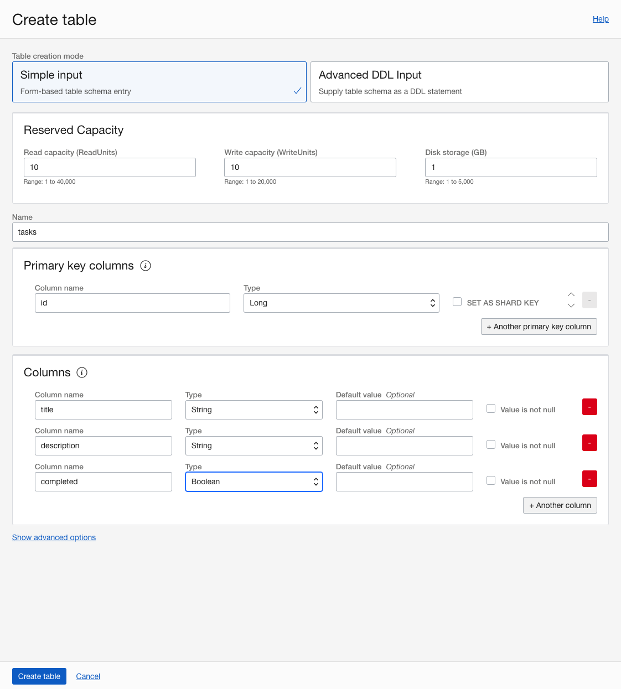

## Introduction

In this lab, you learn how to create a NoSQL database.

## **STEP 1:** Create a NoSSQL database table

To create a NoSQL database table, sign in to the OCI Console, and follow these steps:

1. Open the navigation menu, and click **NoSQL Database**.
2. From the **Compartment** list, select your compartment.
3. Click **Create table**.
4. Select **Simple input**.
5. Under **Reserved Capacity**, enter the following values:
  1. For **Read capacity**, enter **10**.
  2. For **Write capacity**, enter **10**.
  3. For **Disk storage**, enter **1**.

>Note: Read and write units are defined as throughput for up to 1 KB of data per second. Multiple factors impact the read and write capacity units - record size, data consistency, secondary indexes, and so on. You can read more about it in [Estimating Capacity](https://docs.oracle.com/en/cloud/paas/nosql-cloud/csnsd/estimating-capacity.html).

6. For **Name**, enter **tasks**.
7. Under **Primary key columns**, enter the following values:
  1. For **Column name**, enter **id**.
  2. For **Type**, select **Long**.
8. Under **Columns**, add the **title** column:
  1. For **Column name**, enter **title**.
  2. For **Type**, select **String**.
9. Click **Another column**, and add the **description** column:
  1. For **Column name**, enter **description**.
  2. For **Type**, select **String**.
10. Click **Another column**, and add the **completed** column:
  1. For **Column name**, enter **completed**.
  2. For **Type**, select **Boolean**.
11. Click **Create table**.

