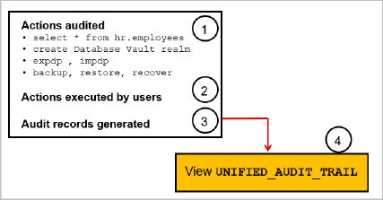

# Introduction

Get hands-on learning with training labs about Oracle cloud solutions. The workshops featured cover various solutions, skill levels, and categories based on Oracle Cloud Infrastructure (OCI).

Estimated time: 20 minutes

## Auditing in an Autonomous Database

Auditing is the monitoring and recording of configured database actions, from both database users and non-database users.
You can base auditing on individual actions, such as the type of SQL statement executed, or on combinations of data that can include the user name, application, time, and so on.

Unified Auditing is enabled by default. You can audit the several types of activities, using unified audit policies and the AUDIT SQL statement. All audit records are written to the unified audit trail in a uniform format and are made available through the UNIFIED\_AUDIT\_TRAIL view. The unified audit trail captures audit information from many types of object, from SQL statements to other Oracle Database Components, such as Recovery Manager, Oracle Data Pump, SQL*Loader.

### Benefits of the Unified Audit Trail

* The audit records are placed in one location and in one format, rather than your having to look in different places to find audit trails in varying formats.
* This consolidated view enables auditors to co-relate audit information from different components.
* The management and security of the audit trail is also improved by having it in single audit trail.
* Overall auditing performance is greatly improved. By default, the audit records are automatically written to an internal relational table.
* You can create named audit policies that enable you to audit the supported components. Furthermore, you can build conditions and exclusions into your policies.

## Additional Recommended Resources

1. [OCI Training](https://cloud.oracle.com/en_US/iaas/training)
2. [Familiarity with OCI console](https://docs.us-phoenix-1.oraclecloud.com/Content/GSG/Concepts/console.htm)
3. [Overview of Networking](https://docs.us-phoenix-1.oraclecloud.com/Content/Network/Concepts/overview.htm)
4. [Familiarity with Compartments](https://docs.us-phoenix-1.oraclecloud.com/Content/GSG/Concepts/concepts.htm)

*Please proceed to the next lab*

## Acknowledgements

- **Author** - Flavio Pereira, Larry Beausoleil
- **Adapted by** -  Yaisah Granillo, Cloud Solution Engineer
- **Last Updated By/Date** - Tom McGinn, August 2020

