# Lab: ML for Busines Users (Oracle Analytics Cloud)

## Introduction

In this lab we will take the perspective of a **business user** (as opposed to the expert data scientist).

Oracle Analytics lets business users build and apply ML models in a visual and intuitive way. Oracle Analytics provides algorithms in all major ML categories, e.g. Regression, Classification, Clustering and Association Rule Mining.

In addition, there's a set of featured called "Augmented analytics" in this platform that uses ML "under the hood" to automate a lot of the common tasks in the analytics process, think about Data Preparation and Data Exploration.

In this lab you will use Oracle Analytics Cloud to build a ML model that assess Credit Risk. In this particular case, this task was performed by an employee before. Our aim is to automates the credit assessment using a ML model.

Estimated lab time: 80 minutes (video 10 minutes, provisioning 30 minutes, exercise 40 minutes)

This video will cover Oracle Analytics.

### Objectives

In this lab you will:
- Become familiar with Oracle Analytics and self service analysis.
- Learn how Oracle Analytics can be used to do Data Preparation and Exploration in a way, as an alternative to coding.
- Learn about the potential impact that ML can have in the hands of business users!

### Prerequisites

* An Oracle Free Tier, Always Free, Paid or LiveLabs Cloud Account (see prerequisites in workshop menu)

## **STEP 1:** Provision and Start Oracle Analytics Cloud

You will provision Oracle Analytics Cloud.

1. Open the provisioning screen

   Click the "hamburger" menu on the top left.

   

   Select Analytics from the menu.

   

   Choose a compartment.

   

2. Configure OAC

    Choose to create a new OAC instance.

    In the configuration screen, do the following:

    - Instance name: Any name you choose
    - Feature Set: Enterprise Analytics
    - OCPU: 2
    - Network access: Public
    - License type: "License included..."

3. Start provisioning

   Click Next.

   Click "Create". The status changes to "Creating...". Provisioning can take up to 30min.

   

4. Go to the Oracle Analytics Cloud homepage

    When the provisioning is completed, the status for the instance will change to "Active".

    Click on "Analytics Homepage".

    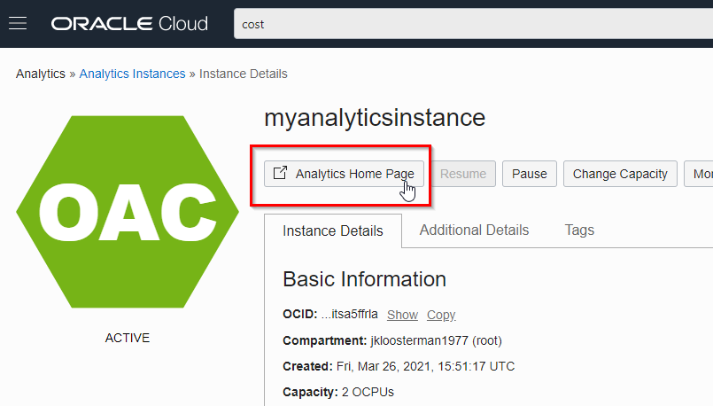

      It's useful to add a Bookmark in your browser to this URL.

## **STEP 2:** Data preparation

   First we have to upload the data that's required for our model. In this case, the dataset with historical credit assessments is mostly ready to go, without requiring any changes.

1. Download the training dataset

    Download [The training dataset](files//MLTD2-german-credit-applications.csv) with historical credit information.

    The original dataset contains 1000 entries with 20 categorical and numerical attributes prepared by Professor Hofmann and each entry in the dataset represents a PERSON who took a credit and classified as good or bad credit risk.

    The dataset provided to you as part of the material was obtained from the following location: https://archive.ics.uci.edu/ml/datasets/Statlog+(German+Credit+Data)

    We will try to capture the knowledge that this person applies to assessing credits in a ML model.

2. Upload the dataset into Oracle Analytics Cloud

   The first task to do is to upload the MLTD2-german-credit-applicants.csv dataset provided to you into Oracle Analytics Cloud. In OAC, on the top left corner click on the menu icon and Click on "Data".

   

   To import the dataset click on "Create", "Data Set", and drag over the file that you downloaded earlier.

   
   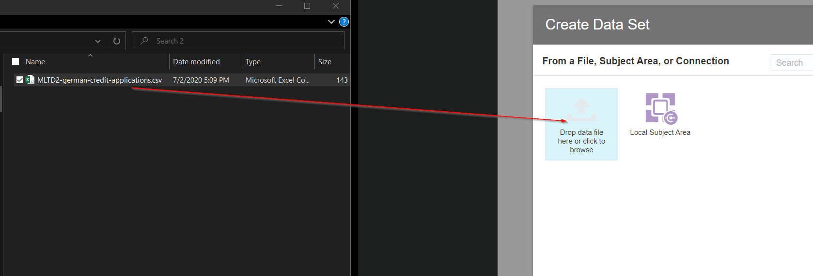

   You see a preview of the dataset. Complete the process by clicking "Add"

3. Change column type of recid

   By default Oracle Analytics incorrectly treats the "recid" column as a measure. Change it to "Attribute" by clicking on "recid", then "treated as", then "attribute".
   

   Oracle Analytics records all changes you make in a script. This allows it to easily repeat the process in case data is reloaded. For now, apply the script that has been created by clicking "Apply Script". This makes the change to recid effective.
   

## **STEP 3:** Data exploration

   As you know, this phase in the Data Science process is for us to get to know our data, identify which columns are useful, detect any problems with the data, et cetera.

   First of all, let's imagine you want to know how many credit applications have been Accepted vs Denied in the past. We can use Oracle Analytics' visualization capabilities for this.

1. Create a project

   Create a project in order to investigate the dataset using visualizations. If you stil have the Dataset open, then you'll find a button "Create Project" on the top right.
   If you closed the dataset, then you can create a project by clicking on the burger menu associated with our dataset and then selecting "Create Project".
   

2. Add a calculation

   First we need a way to count the credit card applications. We do this as follows: Right-click on ‘My calculation’ folder of the dataset and select "Add Calculation".
   

   The name of the field can be anything, e.g. "# Count". Then add a counter by Double-clicking on ‘Count’ in the ‘Aggregation’ list of options.
   

   Select the * and drag the "recid" column over it to replace it.
   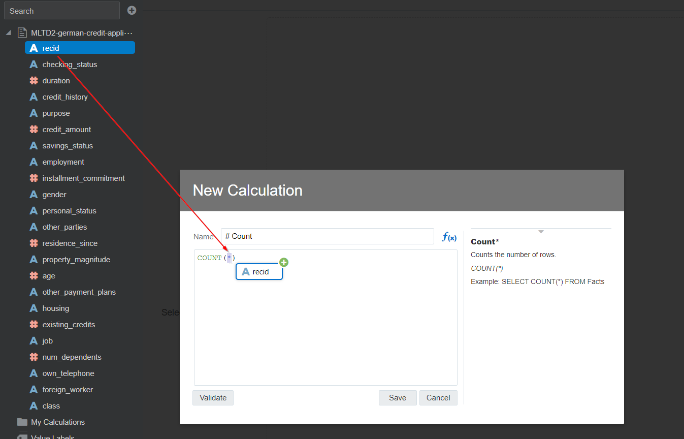
   

     Then click "Save".

3. Create a new visualization

   Now we can find an answer to our questions. Select both the "class" and the "# Count" fields (use Control to select multiple fields). Then ‘Right-Click’ on the blue part and select "Pick Visualization".
   

   Select the ‘donut’ visualization
   

4. Review the visualization

   You see that 70% out of 1000 credit applications were good and 30% were bad for the target called ‘class’.
   

5. Review colinearity

    Colinearity is the effect of multiple attributes that supply similar information. When we train our model, we should try to only supply attributes that provide unique pieces of information. To investigate this issue, we will create a correlation diagram between the input features. Do this by selecting all the fields from "duration" until "num_dependants". Choose "Pick Visualization" and select "Correlation Matrix".
    
    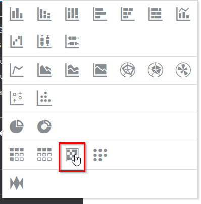

    Now you see the correlation matrix visualization. Although there is some correlation between the fields, the correlation does not appear to be too high in any place. Therefore there's no colinearity and no action to be taken.
    

    Save the results of the Data Exploration. Give it a logical name.
    

    At the is point you are doing with the investigation of the dataset and move on the next task

## **STEP 4:** Train the model

   Our goal is to build a model that can correctly assess the credit of an application for a loan with either "Good" or "Bad".
   In Oracle Analytics, this is done by creating a so-called "Data Flow". A "Data Flow" specifies the source of the data for the training, any data transformations, and a step for the actual model training.

1. Create Data Flow

   Create a new Data Flow by going to the "Data" menu, then select "Create" and "Data Flow".
   
   

2. Add dataset

   Every Data Flow starts with a dataset. Select the dataset that we uploaded earlier (‘MLTD2-german-credit-applicants’) and select "Add".
   

3. Remove recid column

   During Data Exploration we found that we want to keep all attributes for training. However, the identifier "recid" does not have any values, so let's remove it.  Use "remove selected" next to this column to remove it.
   
   

4. Add Binary Classifier

   In this case we need a Binary Classifier algorithm. The reason is that our output are two possible classes: "Good" and "Bad". Add a "Train Binary Classifier" step at the end of the process (see "+" symbol").
   

   There are different algorithms available to do binary classification. In this case we will select "Logistic Regression for model training".
   

   There are a few hyperparameters for this algorithm. Most importantly, we have to select what the target column is. In this case, select "class". "class" is the column that was set by the credit assessment expert historically. The other hyperparameters are "Positive Class in Target", set this to "bad" (all lowercase), this means that for us it's important to predict "bad" credit. Set the value for "Predict Value Threshold Value" to 30%. Set "Standardization" to True.
   
   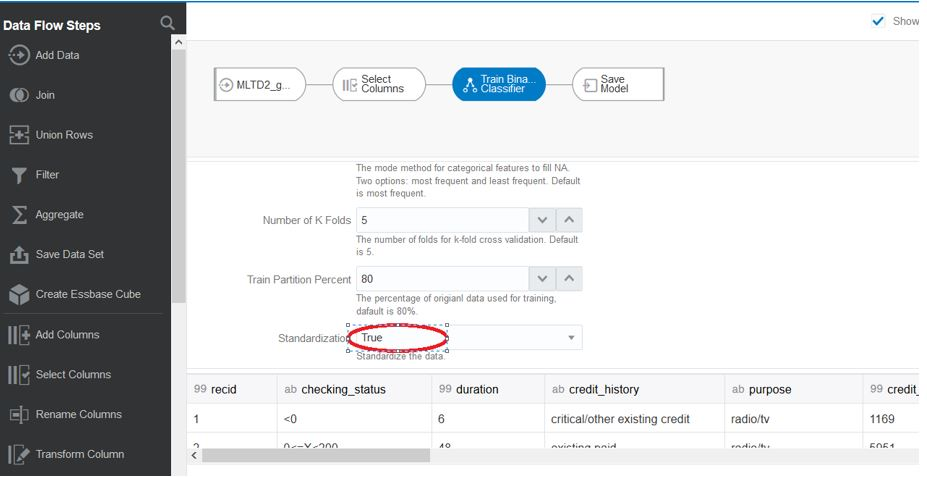

5. Configure the model name and save the Data Flow

   You see that a "Save Model" node was automatically created. Click it and set ""MLTD2-trained-german-credit-LR30" as the model name. Now, save the Data Flow. Click on ‘Save’ and choose "MLTD2-train-german-credit-DF".
   

6. Execute the Data Flow to train the model

   Next, we can finally execute the Data Flow. Effectively this will train the model. Click on "Run Data Flow" (top right). This could take a few minutes. A message will appear saying that the data flow was run successfully.
   

## **STEP 5:** Evaluate the model

   Now that you have built the model, you need to assess how good it is and decide if you are happy with it. Oracle Analytics Cloud machine learning provides quality metrics to allow you to evaluate how good the trained models are.

1. Open the model for inspection

   First, locate the trained machine model by going to the "Machine Learning" menu and selecting our model. Then select "Inspect".
   
   

2. Review model metrics

   Go to "Quality" tab to see the quality metrics associated with your model. You can see that the model doesn't predict all cases correctly. You can play with the hyperparameters to improve these results and find the best trade off for your case.
   

## **STEP 6:** Make predictions (apply the model)

   We have a file with new credit applications that we would like to assess. Instead of doing this the manual (HUMAN) way, we'll use our freshly trained model.

1. Download new dataset to score

    Download [new applications](files//MLTD2-german-credit-new-applications.csv), these are the additional records that we want to score.

2. Create new dataset

   Again, create a new dataset by uploading it. Similarly as before, set the "Treat As" for attribute "recid" to "attribute". The dataset should be named "MLTD2-german-credit-NEW-applications".
   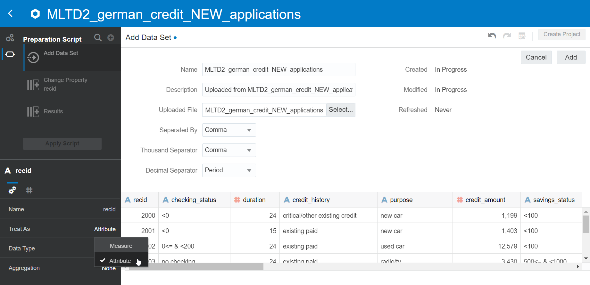

3. Create new Data Flow to score the dataset

    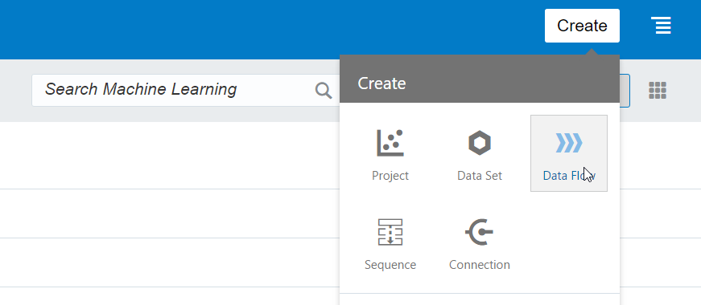

    Upon creating the dataflow, you'll be asked for a dataset. Make sure to select the *new* dataset.

    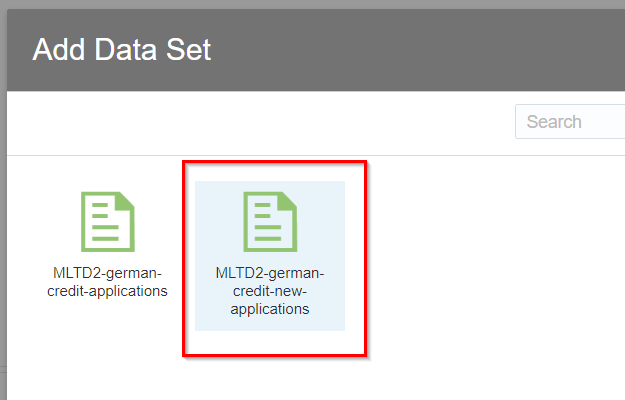

    You'll notice that this dataset does -not- have the class column yet. In fact, that is what we will predict now. Create a new Data Flow to score the new dataset.

4. Remove "recid"

   Deselect the "recid" column, as this does not have any predicted value.
   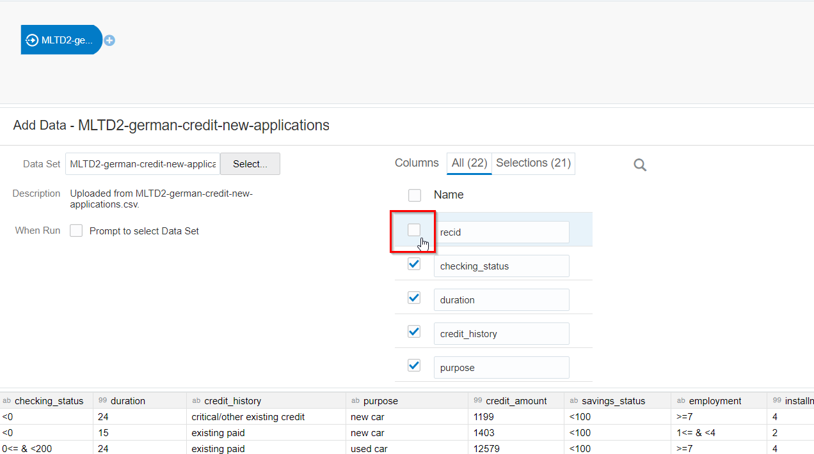

5. Add Apply Model to perform the scoring

   Add a "Apply Model" step in the dataflow.
   

   Select the model that we trained earlier.
   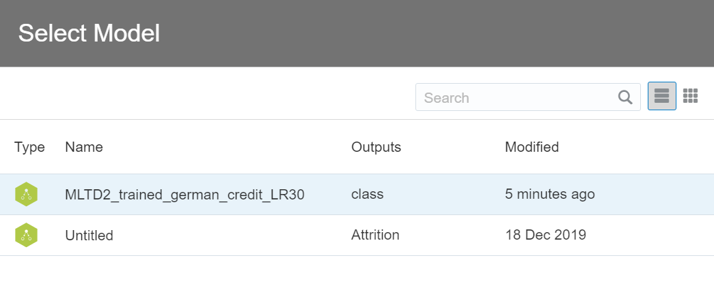

   Verify the next dialog. You see that the Apply Model step will create two new columns: PredictedValue and PredictionConfidence. You also see that the columns of our NEW dataset are automatically aligned with the input features of the model.
   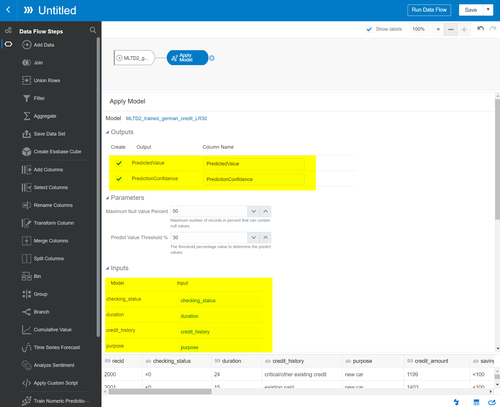

6. Add a final step to Save the Data

   Add a "Save Data" step.
   

   Name the new dataset "Scored New Applications".
   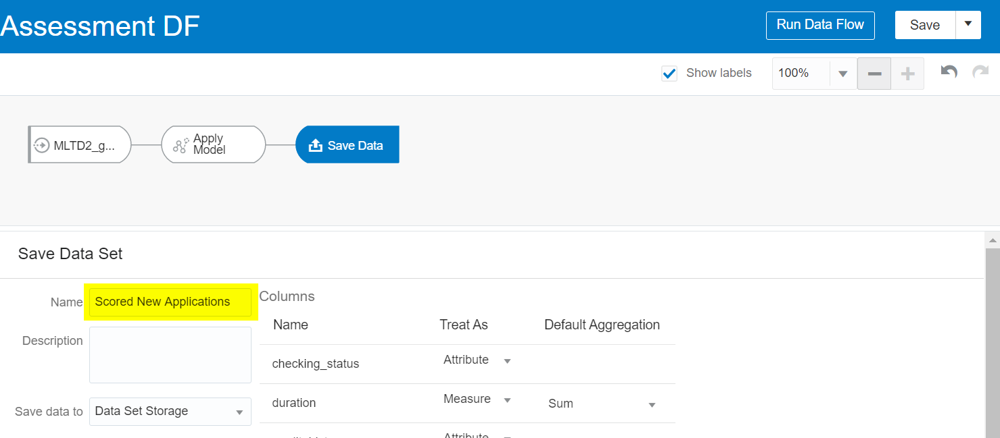

7. Save the Data Flow

   Save the Data Flow. Name it "Apply Credit Assessment DF".
   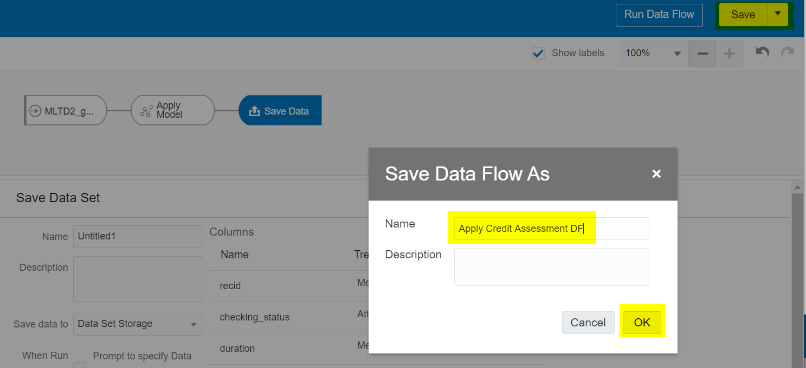

8. Run the Data Flow

   Run the new Data Flow. This typically takes a few minutes.
   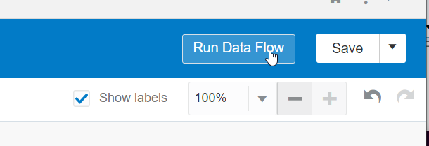

## **STEP 7:** Verify the predictions

   Our goal is to visualize the results of the prediction. The prediction Data Flow will have created a new dataset called "Scored New Applications", as we specified.

1. Create a new project

   Let's create a new project on that dataset by going back to the "Data" menu, and selecting "Create Project" on this new dataset.
   

2. Create new visualization

   Imagine we want to see all applications that the model has assessed with a "bad" credit scoring. We want to simply display all the results in a table. Select all columns (use Shift), then right click "Pick Visualization", and choose the Table visualization.
   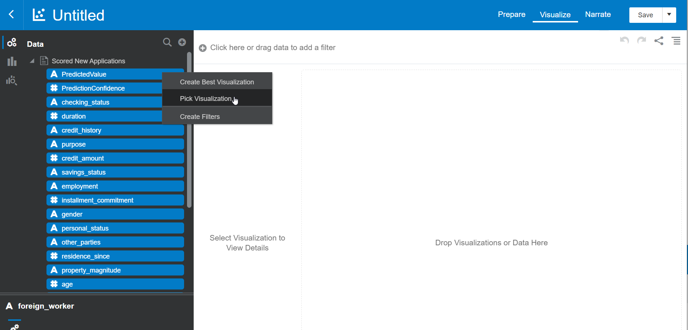
   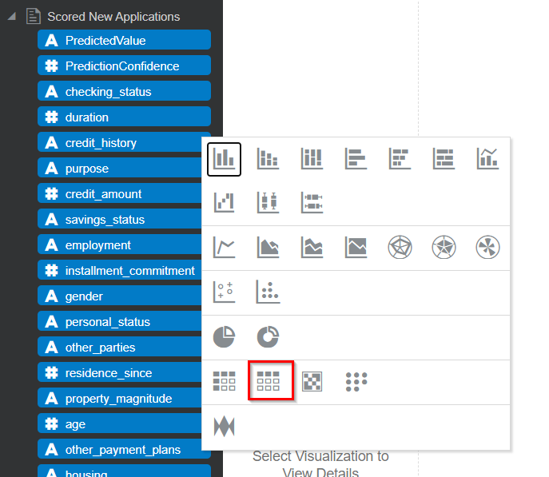

3. Show only bad credit rating using a filter

   Now apply a filter to only show the bad credit ratings, by dragging "Predicted Value" to the filter area and choosing "bad".
   
   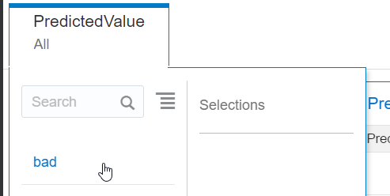

4. Evaluating the results

   We see that there are a handful of applications (of the 20+ that we provided) that have been assessed as "bad".
   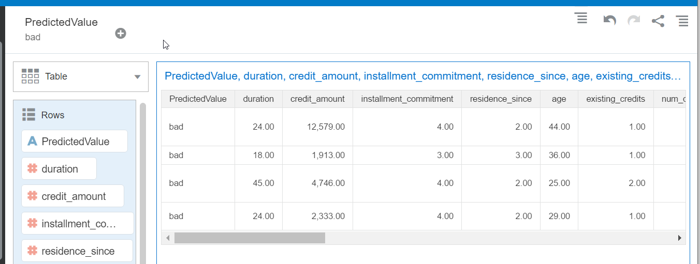

Because machine learning is available in an easy way through Oracle Analytics, it means the power of predictions become available to a very wide audience of users.

Congratulations on completing this lab!

[Proceed to the next section](#next).

## Acknowledgements
* **Authors** - Jeroen Kloosterman - Product Strategy Manager - Oracle Digital, Lyudmil Pelov - Senior Principal Product Manager - A-Team Cloud Solution Architects, Fredrick Bergstrand - Sales Engineer Analytics - Oracle Digital, Hans Viehmann - Group Manager - Spatial and Graph Product Management
* **Last Updated By/Date** - Jeroen Kloosterman, Oracle Digital, Jan 2021

