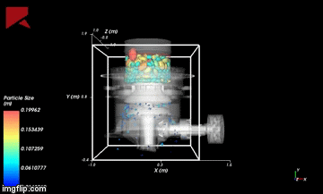

# Rocky DEM Introduction

## Introduction

This Runbook will take you through the process of deploying a GPU machine on Oracle Cloud Infrastructure, installing Rocky DEM, configuring the license, and then running a model.

Rocky DEM simulates particles and can be coupled with Computational Fluid Dynamic or Finite Element Method. It adds another layer of complexity which results in increased simulation time. To help speed up the run, Rocky DEM provides the option to parallelize to a high number of CPU. For even more speed, it can unleash the full power of one or multiple GPUs.

Running Rocky on Oracle Cloud Infrastructure, there is no special setup needed and no driver headache. Import your model, choose the number of CPUs or GPUs and off you go. This removes the wait time for resources that you may have on your on-premise cluster. It avoids having people battling for high-end GPUs at peak times and having them idle for the rest of the week.

### Objectives

In this lab, we provide: 
* A Brief introduction to the Rocky DEM Software, along with an overview about the entire runbook.

### Prerequisites

* Some understanding of cloud and database terms is helpful
* Familiarity with Oracle Cloud Infrastructure (OCI) is helpful
* Familiarity with networking is helpful

## Acknowledgements

* **Author** - High Performance Compute Team
* **Contributors** -  Chris Iwicki, Harrison Dvoor, Gloria Lee, Selene Song, Bre Mendonca, Samrat Khosla
* **Last Updated By/Date** - Samrat Khosla, January 2021

