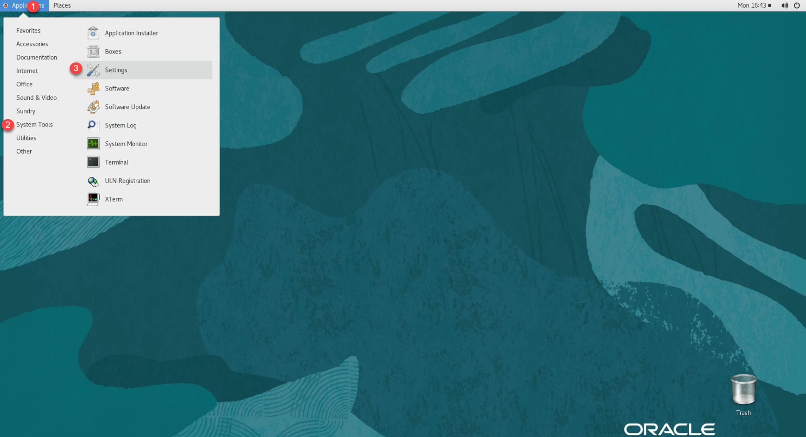
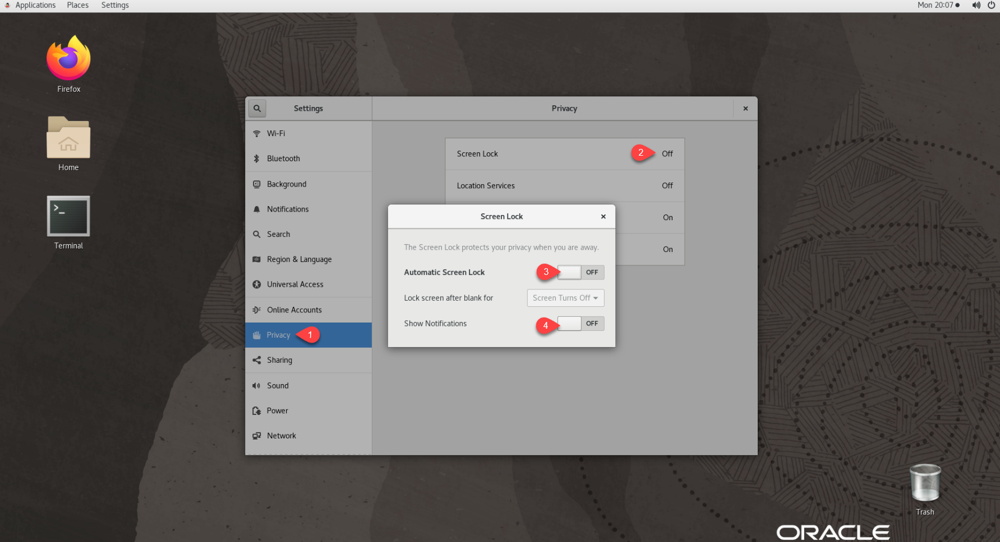
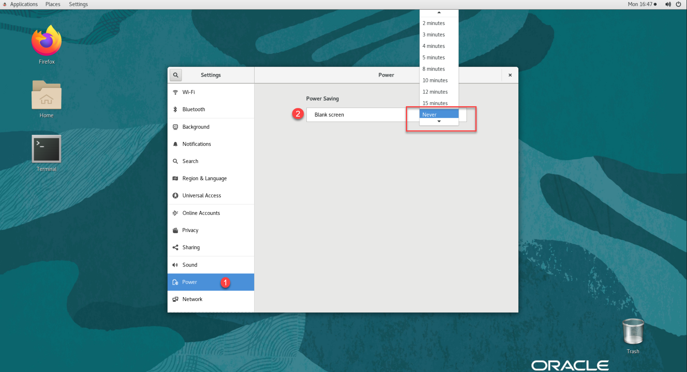
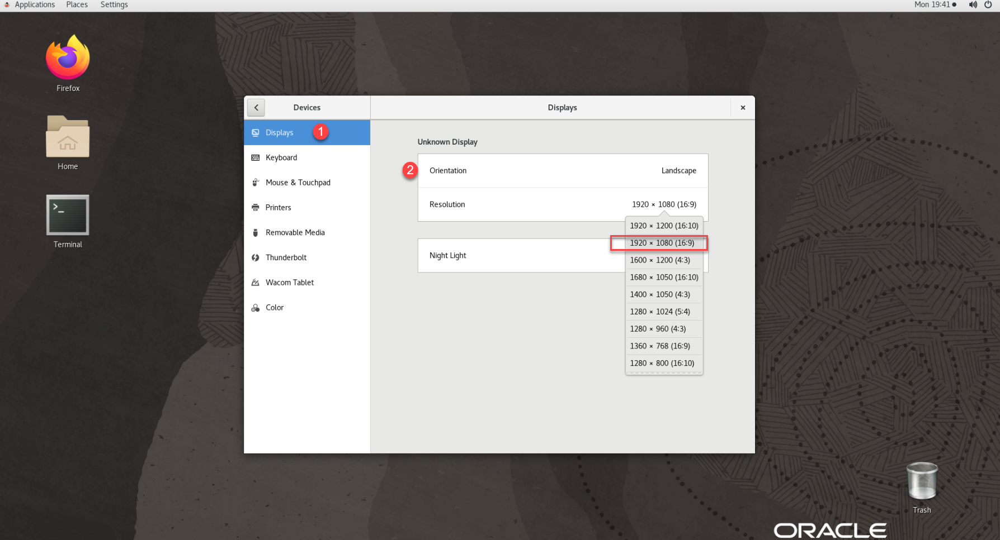
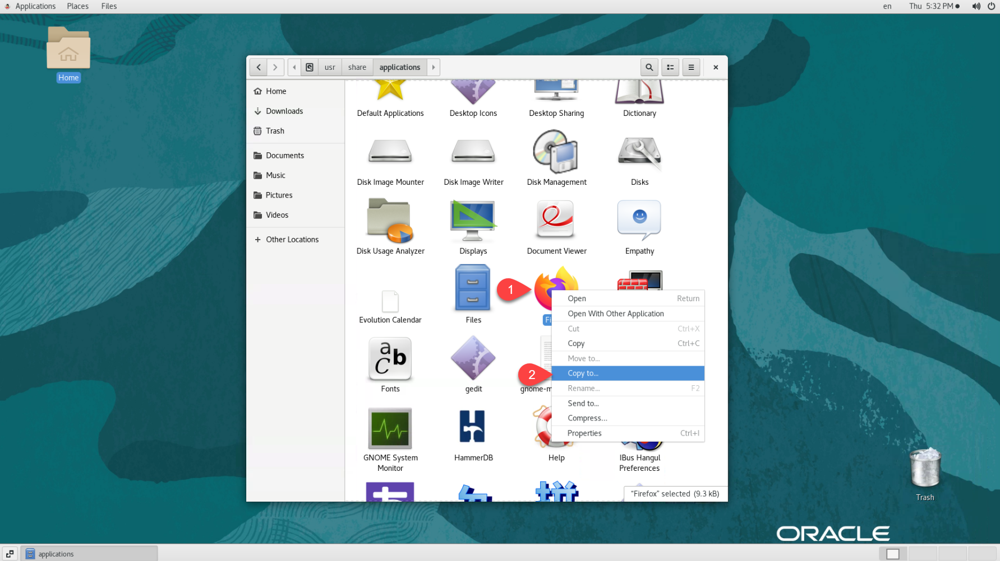
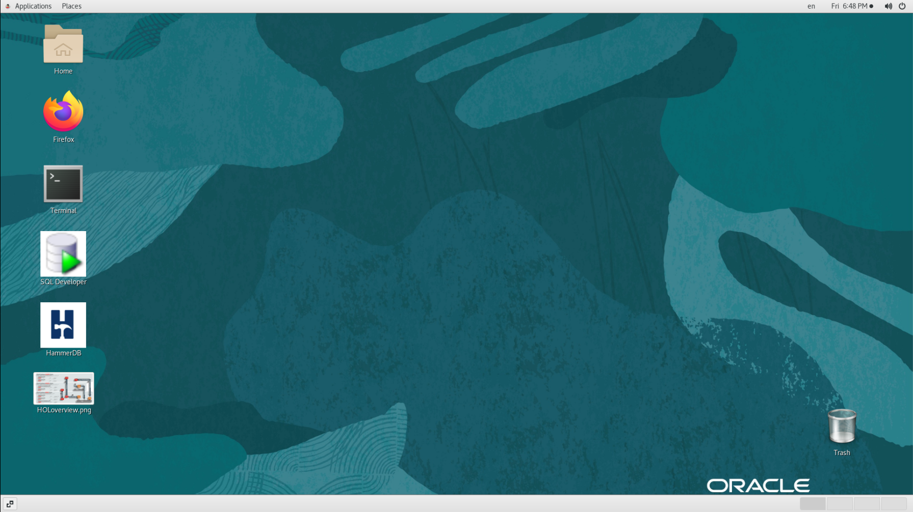
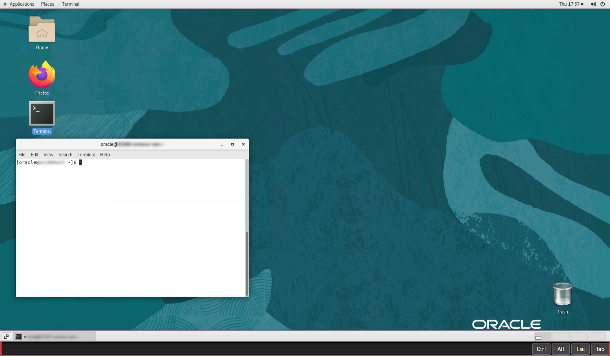
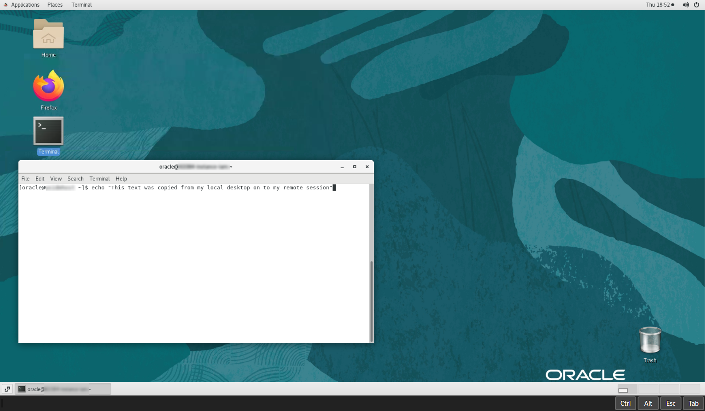

# Setup Guacamole Remote Desktop

## Introduction
This lab will show you how to deploy and Configure a self-contained Guacamole Instance with VNC on the same host for remote desktop access.

### Objectives
- Deploy Guacamole
- Configure Desktop
- Add Applications Shortcuts to Desktop

### Prerequisites
This lab assumes you have:
- An Oracle Enterprise Linux (OEL) that meets requirement for marketplace publishing

## **STEP 1**: Deploy Guacamole
1.  As opc, run *sudo su -* to login as root

    ```
    <copy>
    sudo su - || sudo sed -i -e 's|root:x:0:0:root:/root:.*$|root:x:0:0:root:/root:/bin/bash|g' /etc/passwd; sudo su -

    </copy>
    ```

2.  As root, create script */tmp/guac-1.sh* to perform the first set of tasks.

    ```
    <copy>
    cat > /tmp/guac-1.sh <<EOF
    #!/bin/bash
    export appuser=\$1

    echo "Updating the image to the latest"
    yum -y update

    echo "Installing X-Server required packages ..."
    yum -y groupinstall "Server with GUI"

    echo "Installing other required packages ..."
    yum -y install \
    cairo-devel \
    ffmpeg-devel \
    freerdp-devel \
    guacd \
    lame-libs \
    libguac-client-ssh \
    libguac-client-vnc \
    libjpeg-devel \
    libjpeg-turbo-devel \
    libpng-devel \
    libssh2-devel \
    libtelnet-devel \
    libtheora \
    libtool \
    libuv-devel  \
    libvncserver-devel \
    libvorbis-devel \
    libwebp-devel \
    libwebsockets-devel \
    openssl-devel \
    opus \
    pango-devel \
    tigervnc-server \
    tomcat \
    tomcat-admin-webapps \
    tomcat-webapps \
    uuid-devel \
    numpy \
    mailcap \
    nginx

    echo "Updating VNC Service ..."
    cp /lib/systemd/system/vncserver@.service /etc/systemd/system/vncserver_\${appuser}@:1.service
    sed -i "s/<USER>/\${appuser}/g" /etc/systemd/system/vncserver_\${appuser}@:1.service

    firewall-cmd --zone=public --permanent --add-service=vnc-server
    firewall-cmd --zone=public --permanent --add-port=5901/tcp
    firewall-cmd --zone=public --permanent --add-port=80/tcp
    firewall-cmd  --reload
    systemctl daemon-reload
    systemctl enable vncserver_\${appuser}@:1.service
    setsebool -P httpd_can_network_connect 1
    systemctl enable nginx
    systemctl daemon-reload

    echo "End of guac-1.sh"
    EOF
    chmod +x /tmp/guac-*.sh
    </copy>
    ```

3. Create script */tmp/guac-2.sh* to perform the second set of tasks.

    ```
    <copy>
    cat > /tmp/guac-2.sh <<EOF
    #!/bin/bash
    cd /opt/
    wget https://downloads.apache.org/guacamole/1.3.0/source/guacamole-server-1.3.0.tar.gz
    tar -xvf guacamole-server-1.3.0.tar.gz
    rm -f /opt/guacamole-server-1.3.0.tar.gz
    cd guacamole-server-1.3.0
    ./configure --with-init-dir=/etc/init.d
    make
    make install
    ldconfig

    systemctl enable tomcat
    systemctl restart tomcat
    systemctl status tomcat
    systemctl enable guacd
    systemctl start guacd
    systemctl status guacd

    mkdir /etc/guacamole
    ln -s /etc/guacamole/ /usr/share/tomcat/.guacamole

    wget https://downloads.apache.org/guacamole/1.3.0/binary/guacamole-1.3.0.war -O /etc/guacamole/guacamole.war
    ln -s /etc/guacamole/guacamole.war /usr/share/tomcat/webapps/
    EOF
    chmod +x /tmp/guac-*.sh
    </copy>
    ```

4. Create script */tmp/guac-3.sh* to perform the second set of tasks.

    ```
    <copy>
    cat > /tmp/guac-3.sh <<EOF
    #!/bin/bash
    chmod 600 /etc/guacamole/user-mapping.xml
    chown -R tomcat:tomcat /etc/guacamole
    systemctl restart tomcat guacd
    firewall-cmd --permanent --add-port={4822,8080}/tcp
    firewall-cmd --reload
    EOF
    chmod +x /tmp/guac-*.sh
    </copy>
    ```

5. Verify that the *EPEL* Yum Repo is configured and enabled. i.e. contains the entry *enabled=1*. If not update it accordingly before proceeding with the next step

    ```
    <copy>
    sed -i -e 's|enabled=.*$|enabled=1|g' /etc/yum.repos.d/oracle-epel-ol7.repo;grep enabled /etc/yum.repos.d/oracle-epel-ol7.repo
    </copy>
    ```

    

6. Run script *guac-1.sh* with the desired VNC user as the sole input parameter. e.g. *oracle*

    ```
    <copy>
    export appuser=oracle
    /tmp/guac-1.sh ${appuser}
    </copy>
    ```

7.  Set password for VNC user.

    ```
    <copy>
    vncpasswd ${appuser}
    </copy>
    ```

8. Provide password as prompted. e.g. "*LiveLabs.Rocks_99*". When prompted with *Would you like to enter a view-only password (y/n)?*, enter **N**

    ```
    <copy>
    LiveLabs.Rocks_99
    </copy>
    ```

9. Su over to the VNC user account and enforce the password.  when prompted

    ```
    <copy>
    sudo su - ${appuser}
    vncserver
    </copy>
    ```

10. Provide the same password as you did above. e.g. "*LiveLabs.Rocks_99*". When prompted with *Would you like to enter a view-only password (y/n)?*, enter **N**

    ```
    <copy>
    LiveLabs.Rocks_99
    </copy>
    ```

11. Stop the newly started VNC Server running on "**:1**" and exit (or *CTRL+D*) the session as vnc user to go back to *root*

    ```
    <copy>
    vncserver -kill :1
    exit
    </copy>
    ```

12. Start VNC Server using *systemctl*

    ```
    <copy>
    systemctl start vncserver_${appuser}@:1.service
    systemctl status vncserver_${appuser}@:1.service
    </copy>
    ```

13. Run script *guac-2.sh*

    ```
    <copy>
    /tmp/guac-2.sh
    </copy>
    ```

14. Create guacamole properties file *"/etc/guacamole/guacamole.properties"*

    ```
    <copy>
    cat > /etc/guacamole/guacamole.properties <<EOF
    guacd-hostname: localhost
    guacd-port:    4822
    user-mapping:    /etc/guacamole/user-mapping.xml
    auth-provider:    net.sourceforge.guacamole.net.basic.BasicFileAuthenticationProvider
    basic-user-mapping:    /etc/guacamole/user-mapping.xml
    EOF
    </copy>
    ```

15. Create guacamole user mapping file *"/etc/guacamole/user-mapping.xml"*

    ```
    <copy>
    cat > /etc/guacamole/user-mapping.xml <<EOF
    <user-mapping>
       <authorize username="oracle" password="33e3cc7ec32572a99ce33db0b2f08643" encoding="md5">
        <connection name="My LiveLabs Host">
          <protocol>vnc</protocol>
          <param name="hostname">localhost</param>
          <param name="port">5901</param>
          <param name="password">LiveLabs.Rocks_99</param>
        </connection>
       </authorize>
    </user-mapping>
    EOF
    </copy>
    ```

    *Note:* The password provided above is encrypted with MD5 algorithm and the value obtained by running the following:

    ```
    echo -n [plain text password] | openssl md5
    e.g.
    <copy>
    echo -n Guac.LiveLabs_ | openssl md5
    </copy>
    ```

16.  Run script *guac-3.sh* to finalize

    ```
    <copy>
    /tmp/guac-3.sh
    </copy>
    ```

17.  Create */etc/nginx/conf.d/guacamole.conf* file

    ```
    <copy>
    pub_ip=`curl -s ident.me`
    cat > /etc/nginx/conf.d/guacamole.conf <<EOF
    server {
            listen 80;
            listen [::]:80;
            server_name $pub_ip;

            access_log  /var/log/nginx/guac_access.log;
            error_log  /var/log/nginx/guac_error.log;

            location / {
                        proxy_pass http://127.0.0.1:8080/guacamole/;
                        proxy_buffering off;
                        proxy_http_version 1.1;
                        proxy_set_header X-Forwarded-For \$proxy_add_x_forwarded_for;
                        proxy_set_header Upgrade \$http_upgrade;
                        proxy_set_header Connection \$http_connection;
                        proxy_cookie_path /guacamole/ /;
            }

    }
    EOF
    </copy>
    ```

18. Create and run */tmp/guac-nginx.sh*

    ```
    <copy>
    cat > /tmp/guac-nginx.sh <<EOF
    #!/bin/bash
    pub_ip=`curl -s ident.me`
    nginx -s reload
    systemctl restart nginx

    echo ""
    echo "--------------------------------------"
    echo "Guacamole Remote Desktop Setup Completed. Open the browser and navigate to:"
    echo "http://$pub_ip"
    echo "--------------------------------------"
    echo ""
    EOF
    chmod +x /tmp/guac-nginx.sh
    sh /tmp/guac-nginx.sh
    </copy>
    ```

19. After validating successful setup from URL displayed by above script, remove all setup scripts from "*/tmp*"

    ```
    <copy>
    rm -rf /tmp/guac-*.sh
    </copy>
    ```

## **STEP 2**: Configure Desktop   
LiveLabs compute instance are password-less and only accessible via SSH keys. As result it's important to adjust session settings some settings to ensure a better user experience.

1. Launch your browser to the following URL

    ```
    URL: <copy>http://[your instance public-ip address]:8080/guacamole</copy>
    ```

2. Provide login credentials

    ```
    Username: <copy>oracle</copy>
    ```
    ```
    Password: <copy>Guac.LiveLabs_</copy>
    ```


    
  *Note:* There is an underscore `_` character at the end of the password.

3. Navigate to "*Applications >> System Tools >> Settings*"

    

4. Click on "*Privacy*" and set **Screen Lock** to *Off*

    

5. Click on "*Power*" and set **Blank Screen** under Power Saving to *Never*

    

6. Click on "*Notifications*" and set **Notifications Popups** and **Lock Screen Notifications** to *Off*

    

7. Scroll-down, Click on "*Devices >> Resolution*" and select **1920 x 1080 (16:9)**

    
    

## **STEP 3**: Add Applications to Desktop   
For ease of access to desktop applications provided on the instance and needed to perform the labs, follow the steps below to add shortcuts to the desktop. In the example below, we will be adding a shortcut of *FireFox* browser.

1. On the desktop from the previous setup, click on *Home > Other Locations*, then navigate to *`/usr/share/applications`* and scroll-down to find *FireFox*

    

2. Right-click on *FireFox* and select *Copy to...*

    

3. Navigate to *Home > Desktop* and Click on *Select*

    

4. Double-click on the newly added icon on the desktop and click on *Trust and Launch*

    
    

5. Repeat steps above to add any other required Application the workshop may need to the Desktop (e.g. Terminal, SQL Developer, etc...)

    

## **STEP 4**: Enable Copy/Paste from Local to Remote Desktop (Guacamole clipboard)
Perform the tasks below and Add them to any workshop guide to instruct users on how to enable clipboard on the remote desktop for local-to-remote copy/paste.

During the execution of your labs you may need to copy text from your local PC/Mac to the remote desktop, such as commands from the lab guide. While such direct copy/paste isn't supported as you will realize, you may proceed as indicated below to enable an alternative local-to-remote clipboard with Input Text Field.

1. From your remote desktop session, enter CTRL+ALT+SHIFT (*Windows*) or CTRL+CMD+SHIFT (*Mac*)

2. Select *Text Input*

    

3. Notice the black Text Input field added at the bottom of your screen after you made the selection in the previous step. This is the field to paste any text copied from your local environment.

    

4. Test copy/pasting the text below. Prior to pasting ensure that the cursor has been placed at the location where the intended text is to be pasted, then right-click inside the black *Text Input* field and paste it

    ```
    <copy>echo "This text was copied from my local desktop on to my remote session"</copy>
    ```

    

You may now [proceed to the next lab](#next).

## Acknowledgements
* **Author** - Rene Fontcha, LiveLabs Platform Lead, NA Technology, September 2020
* **Contributors** - - -
* **Last Updated By/Date** - Rene Fontcha, LiveLabs Platform Lead, NA Technology, February 2021
