# Configure Federation – External Identity Provider (Okta)

## Introduction

An *identity provider*, known as an *Identity Assertion provider*, provides identifiers for users who want to interact with Oracle Identity Cloud Service using a website that's external to Oracle Identity Cloud Service. A *service provider* is a website such as Oracle Identity Cloud Service that hosts applications. You can enable an identity provider and define one or more service providers. Your users can then access the applications hosted by the service providers directly from the identity provider.

For this exercise, a website can allow users to log in to Oracle Identity Cloud Service with Okta credentials.  Okta acts as the identity provider and Oracle Identity Cloud Service functions as the service provider.  Okta verifies that the user is an authorized user and returns information to Oracle Identity Cloud Service.  


Estimated Lab Time: 30 minutes


### Objectives

In this lab, you will:
*	configure federation in Okta
*	configure federation in IDCS
*	login in to IdP


### Prerequisites

* An Oracle Free Tier or Paid Account
* A Google Account
* An Okta Integrator Account


## **STEP 1**: Configure Okta

* *Personas*:
    - Administrator

1.	1.	Go to Okta and signup for a  [developer account](https://www.okta.com/integrate/signup/). This part was covered in the prerequisites section.

2.	Once you have your trial account credential, then login using the URL you’ve received after requesting the trial (the custom one, ex: https://oracleworkshop.oktareview.com) and go to *Applications*.  In upper left menu select *Classic UI*.
    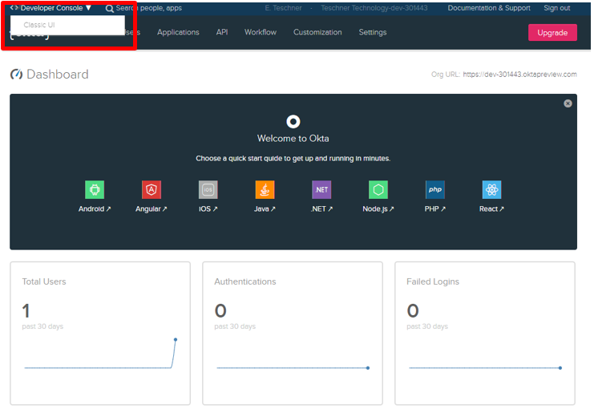

3.	In the upper tab, select *Applications* and then *Applications*
    

4.	Select the *Add Application* button.
    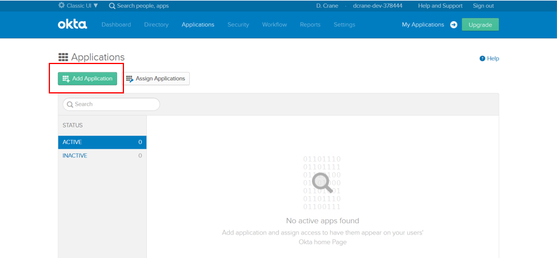

5.	Select *Create New App* button.
    

6.	Select *SAML2.0* and click *Create*.
    

7.	Provide an application name, for example: **IDCS_SP** and click *Next*.
    

8.	For the *Configure SAML* section, you need to enter values from the IDCS metadata

    ```
    https://<your tenant>.identity.oraclecloud.com/fed/v1/metadata
    ```

9. Enter the following values from the metadata in Okta’s SAML setup:
    * In the IDCS metadata, search for *AssertionConsumerService* at the bottom. Copy the highlighted URL in *Location* as shown below. Enter the URL as *Single sign on URL* in Okta
    
    * In the IDCS metadata, search for *entityID* at the top. Copy the highlighted URL as shown below. Enter the URL as *Audience URI (SP Entity ID)* in Okta
    
    * When you’re done, the general settings in Okta should look something like the example below. Leave the rest of the fields with their default values
    

10.	Scroll down to the end of the page and click *Next*.
    

11.	Provide the obligatory feedback and select *Finish*.
    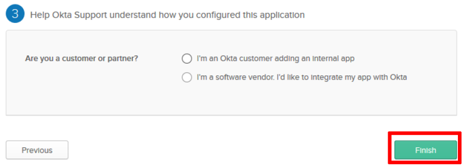

12.	Click on *Identity Provider metadata* under *Settings* in order to export the IDP metadata file.
    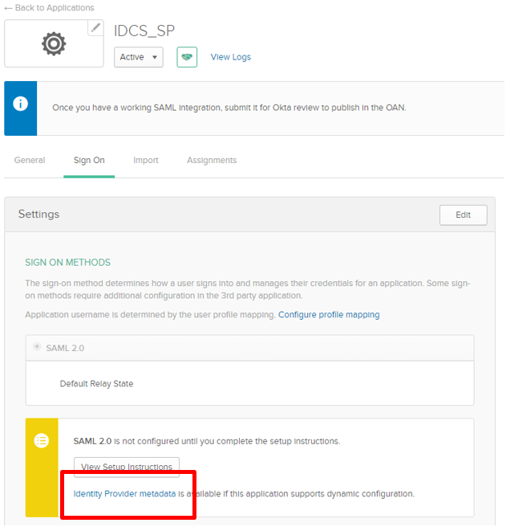

13.	The metadata will be displayed in another browser window.  Save it to an xml file by right click and choose “Save as”, as you will need this in a few minutes inside of IDCS.
    

14.	Go back to *Okta* and select the *Assignments* tab of your newly created application in order to assign users to the application.
    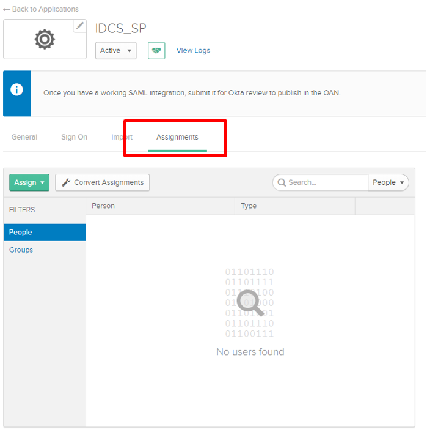

15.	Click on *Assign* and select *Assign to People*
    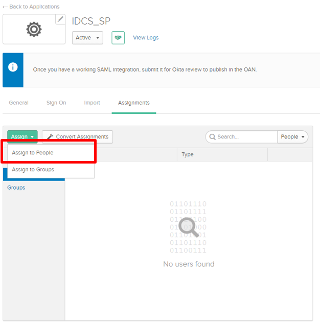

16.	Select a user on the list and lick *Assign*. Enter the User Name of your corresponding IDCS user and select *Save and Go Back*. When the user is assigned, click *Done*.

    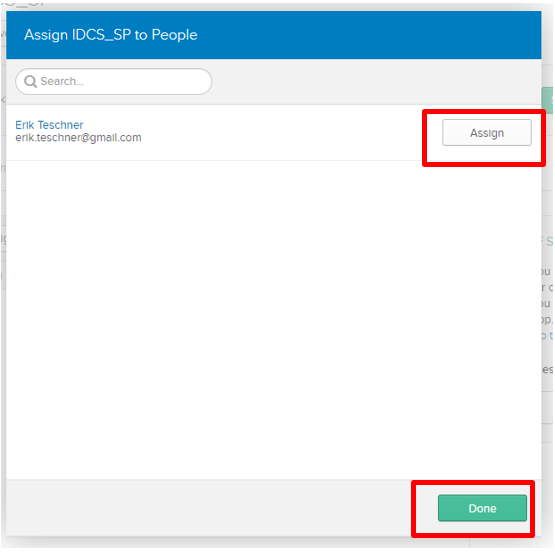

    Note: This is not the user name that you provide when logging in to Okta. That remains unchanged. What you’re entering here is the user name of the corresponding user in IDCS. This enables a link between accounts with different user names in IDCS and Okta. The accounts might have different user names e.g. because Okta requires them in an email format while IDCS doesn’t.

17.	IDCS is now configured as a Service Provider in Okta. Open IDCS to configure Okta as an Identity Provider.


## **STEP 2**: Configure IDCS

* *Personas*:
    - Administrator

1. Login to IDCS Admin console and go to *Security* and then click on *Identity Providers*. Click on *Add SAML IDP*.  Enter the name of the provider  (e.g “Okta-<<student name>>”) and description and click next.
    

2. Upload Okta metadata xml file that was exported previously and click *Next*.
    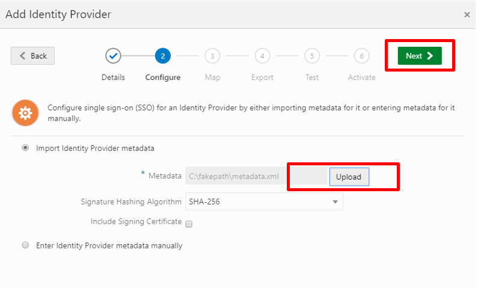

3.	Set the following parameters:

    * Identity Provider User Attribute = **Name ID**
    * Oracle Identity Cloud Service User Attribute = **Username**
    * Requested NameID Format = **Unspecified**
    

4.	On the export screen there is nothing to do as we had already retrieved the IDCS metadata from the URL and is no need to download them again. Click *Next*.
    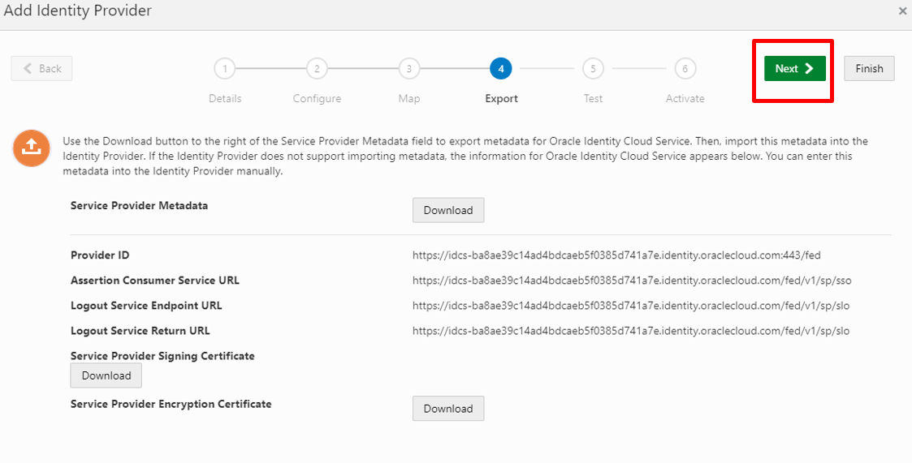

5.	Select *Test Login* to check the connection between IDCS and Okta.
    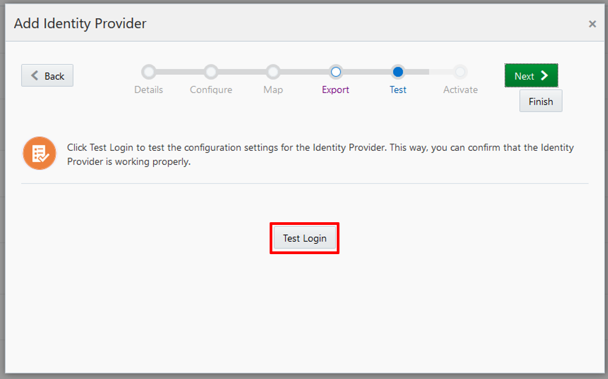

6.	Enter your Okta credentials.
    

7.	If everything works, you will see the message shown below. Otherwise, check your configurations for the IDCS application in Okta and/or the Okta SAML IDP in IDCS.
    

8.	Back at the SAML IDP set-up flow, select *Next*.
    

9.	Select *Activate* and then *Finish*. You’ve now added Okta as an external identity provider and successfully established a connection with IDCS.
    

10.	After successfully finishing the Okta application setup, you’ll be returned to the *Identity Providers* screen. Select the menu to *Show on Login Page*.
    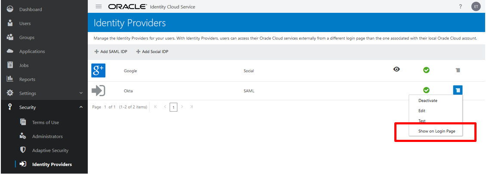

11.	Go to *Security*, select *IDP Policies* and click *Default Identity Provide Policy*.
    

12.	Select the *+ Assign* menu option and add the Okta Provider.
    

13.	 Select *Okta* and click *OK*.
    

14.	 *Okta* will show up in the list
    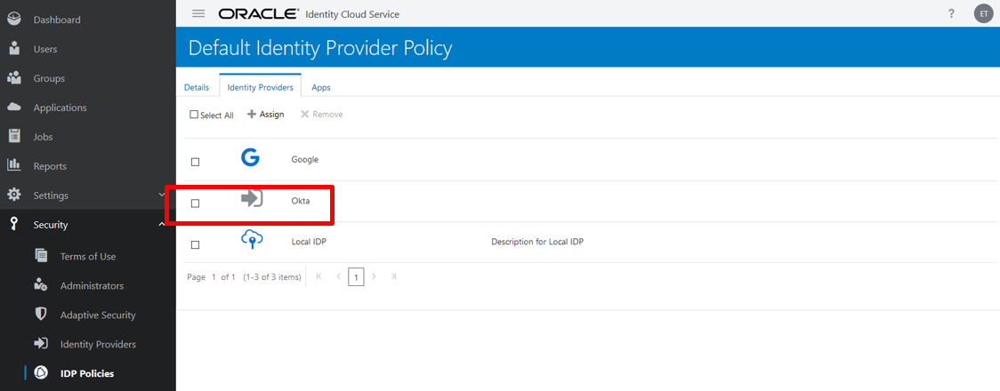

15.	 *Sign out* of IDCS.
    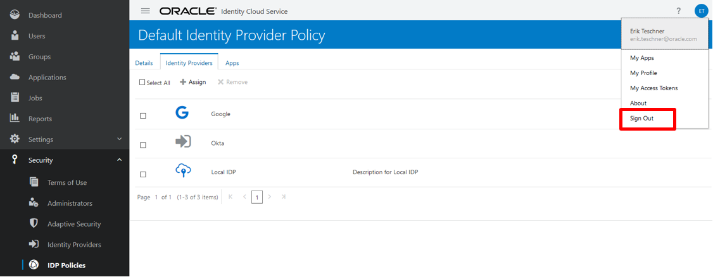


## **STEP 3**: Verify External IDP Login  

* *Personas*:
    - Administrator

1. Access the IDCS admin console and Okta will be displayed as a sign-in option. Select *Okta*.
    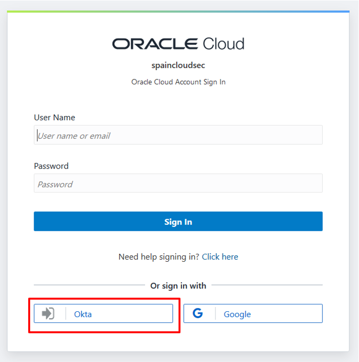

2. Type in your Okta login credentials.
    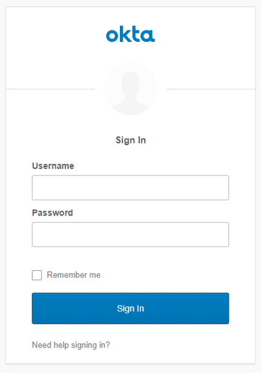

3. When successfully authenticated the request will be sent to the IDCS My Apps screen.
    

    Note: for federation to work, you need to login with an account that is defined in both IDCS and Okta.

You may now proceed to the next lab

## Acknowledgements
* **Author** - SEHub Security and Manageability Team
* **Last Updated By/Date** - Lucian Ionescu, Principal Solution Engineer, 15.09.2020


