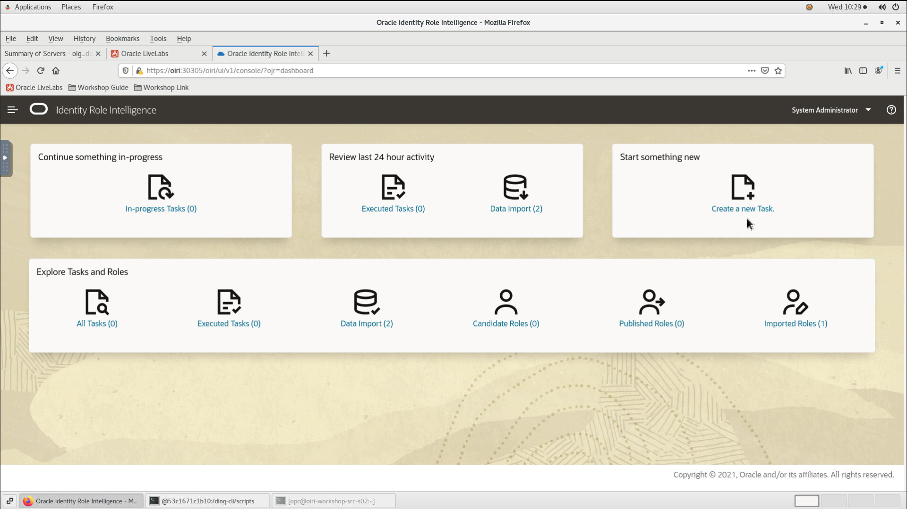
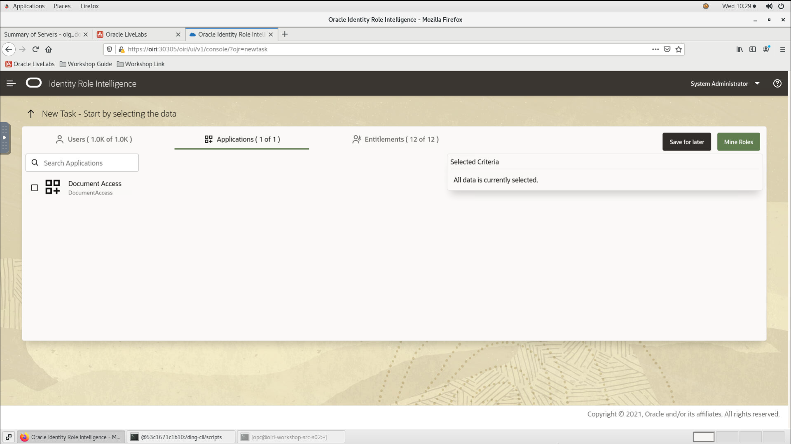
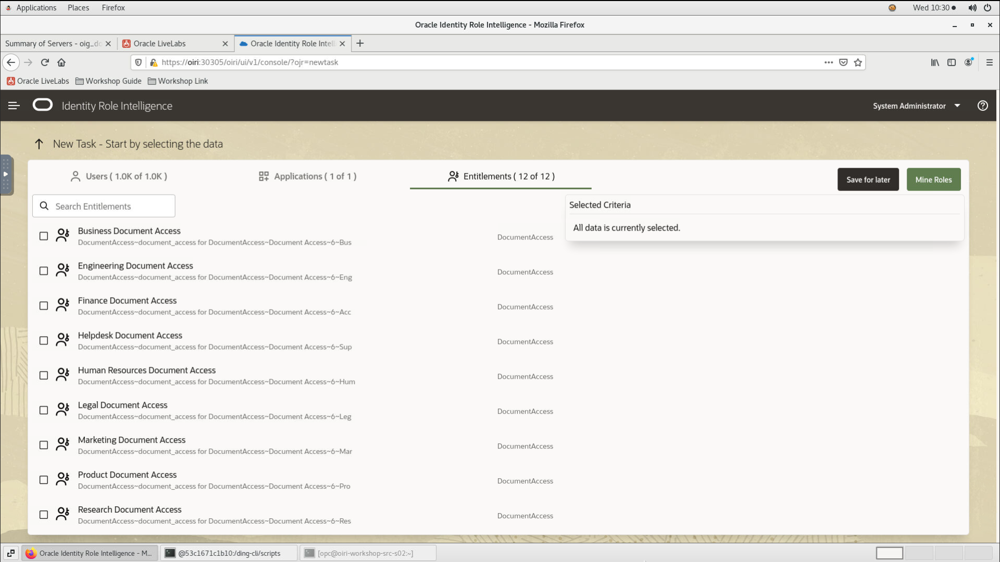
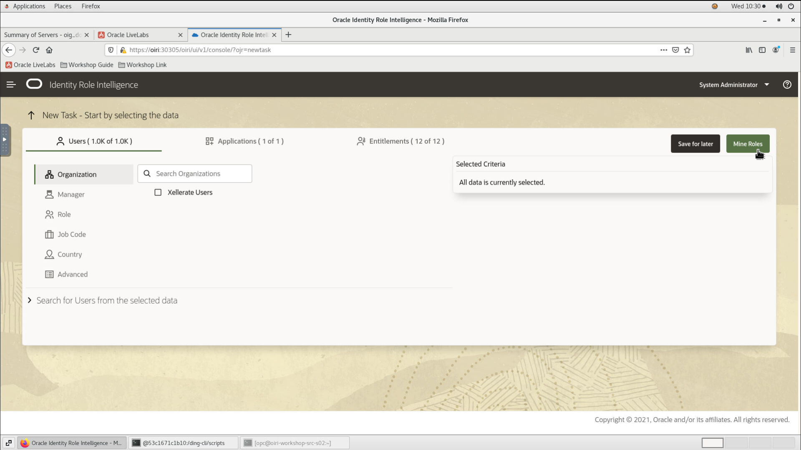
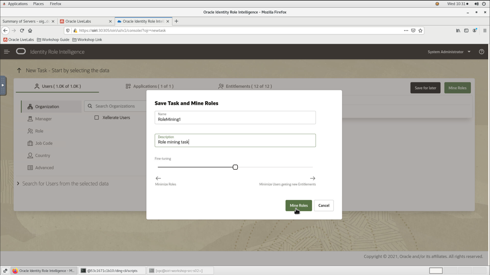
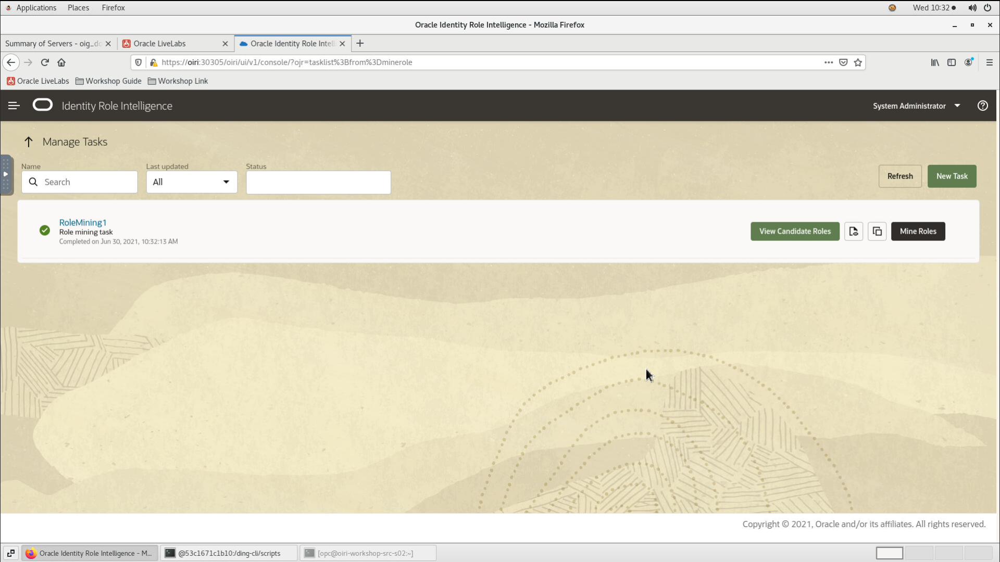
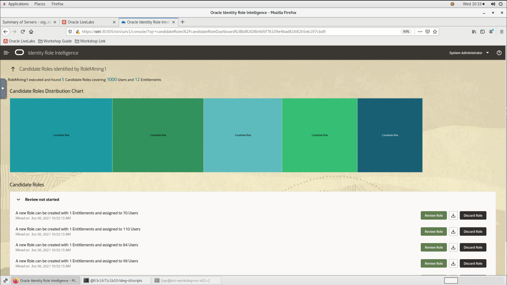
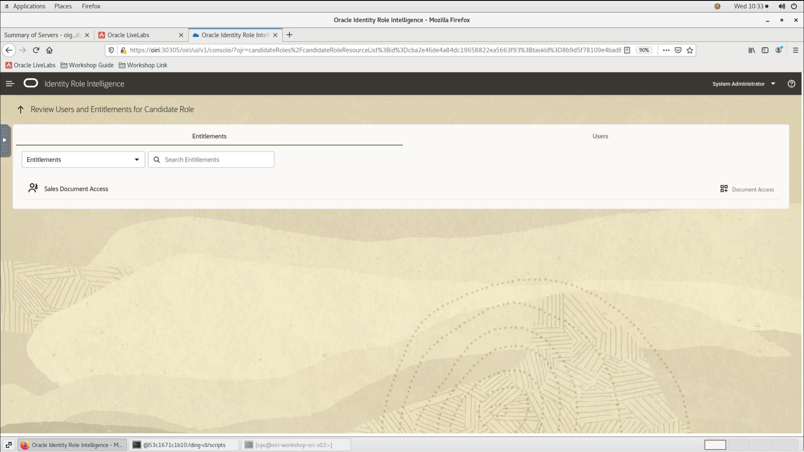
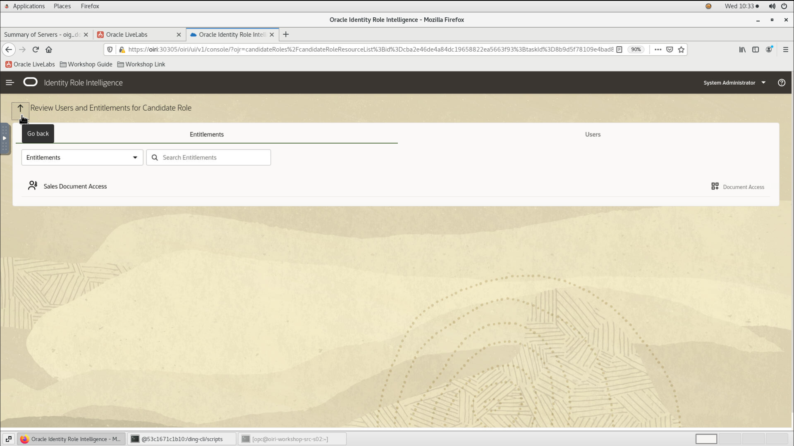
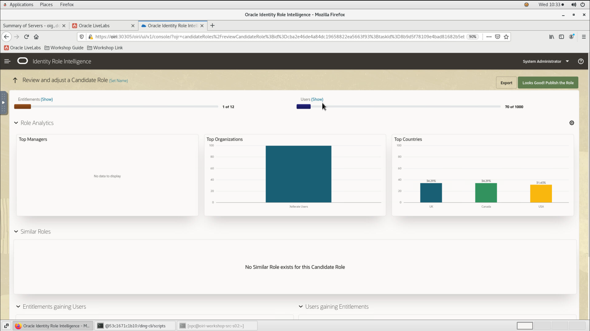

# Role Mining and Analyzing Candidate roles

## Introduction

This lab walks you through the steps involved in performing Role Mining and analyzing candidate roles in OIRI.

*Estimated Lab Time*: 15 minutes

### Objectives

In this lab, you will:
* Perform Role Mining
* Review and Analyze Candidate Roles

### Prerequisites

* A Free Tier, Paid or LiveLabs Oracle Cloud account
* SSH Private Key to access the host via SSH
* You have completed:
      - Lab 1: Initialize the workshop Environment
      - Lab 2: Deploy OIRI in the local Kubernetes node
      - Lab 3: Import data into OIRI from OIG

## **STEP 1:** Create a Role mining task

1. On the Identity Role Intelligence home page, in the Start something new tile, click *Create a new Task*. Alternatively, you can click the Application Navigation menu icon, and click *All Tasks*, and then click New Task on the top right of the page.
The New Task page to select the data for creating a new role mining task appears.

    

2. In the Users tab you can optionally apply a number of filters and select a group of users that you want to include in the role mining task.
Let us include all users for this workshop.

    

3. Click the Applications tab. The applications are listed in this tab based on the user selection on the Users tab. We can observe that we have an Application called *Document Access*.

    

4. Click the Entitlements tab. The entitlements are listed in this tab based on the user and application selection on the Users and Applications tabs.
The Entitlements tab lists the entitlements that have been assigned to users. This tab does not list all the entitlements in the OIRI database.

    

5. Click *Mine Roles* to mine the roles based on the user, application, and entitlement selection in the role mining task.
The *Save Task and Mine Roles* dialog box appears with the following options:
  - Name: Enter a name for the role mining task. This is a required field.
  - Description: Enter a description for the role mining task.
  - Fine-tuning slider: Drag to minimize or maximize the number of candidate roles. Dragging the slider to the left minimizes the number of candidate roles. In other words, more users will get the permissions provided by the roles. Whereas, dragging the slider to the right maximizes the number of candidate roles. In other words, more users will get new entitlements provided by the roles.

    

    Click on *Mine Roles* to run the role mining task and discover candidate roles. A message appears stating that a request for running the task has been submitted.

      

## **STEP 2:** Review candidate roles

1. In the Manage Tasks page, search for the role mining task that you submitted.

2. If the task status shows that it has been completed, then click *View Candidate Roles*.
The Results for role mining task page appears. In this page, the line at the top provides a summary of the role mining task run. It indicates the number of users and entitlements for which the task has been run, and how many candidate roles have been identified

    

3. The candidate roles are listed in the Candidate Roles section. Notice the roles listed under *Review not started*.

4. For any candidate role listed, Click *Review Role* to open the Review and Adjust a Candidate Role page that lets you review and modify the candidate role before exporting and publishing.
For example, Click on the first candidate role with 70 users and 1 entitlement.

    

5. The *Review and adjust a Candidate Role* page appears.

6. The Entitlements horizontal bar shows the number of entitlements that are part of the candidate role out of the total number of entitlements included in the role mining task. To view the entitlements, click *Show*.
Notice that the Entitlement (Sales Document Access in this example) is displayed.

    

    

7. Click the Go Back icon to navigate back to the Review and Adjust Candidate Role page.

    

8. The Users horizontal bar shows the number of users that are part of the candidate role out of the total number of users included in the role mining task. To view the users, click *Show*. Review the users included in the role mining task. Click the Go Back icon to navigate back to the Review and Adjust Candidate Role page.

    

You may now [proceed to the next lab](#next).

## Acknowledgements
* **Author** - Keerti R, Brijith TG, Anuj Tripathi, NATD Solution Engineering
* **Contributors** -  Keerti R, Brijith TG, Anuj Tripathi
* **Last Updated By/Date** - Keerti R, NATD Solution Engineering, June 2021
