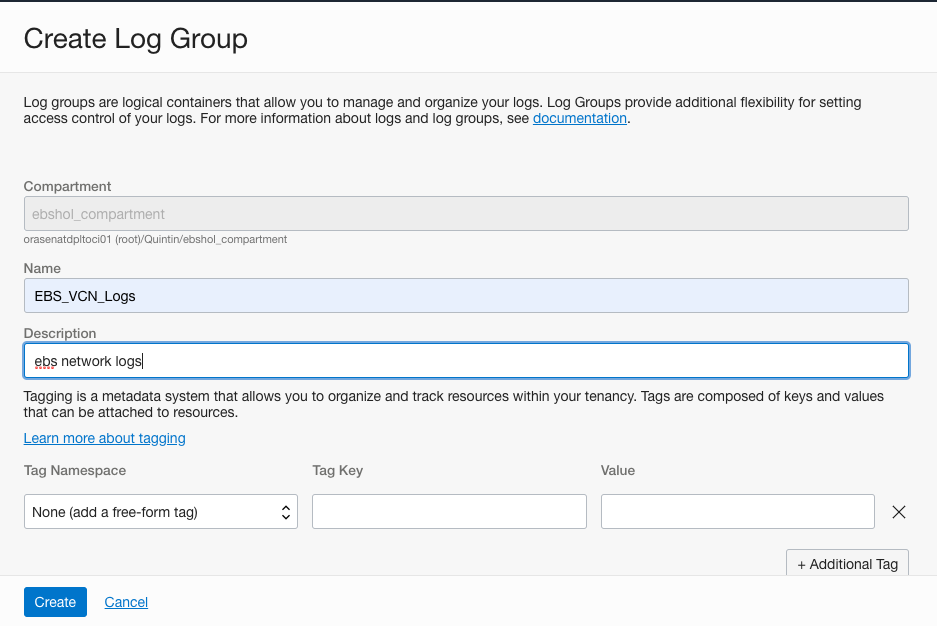
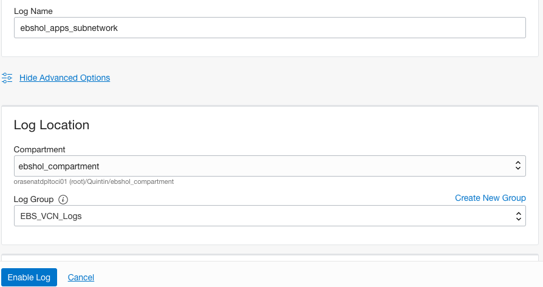
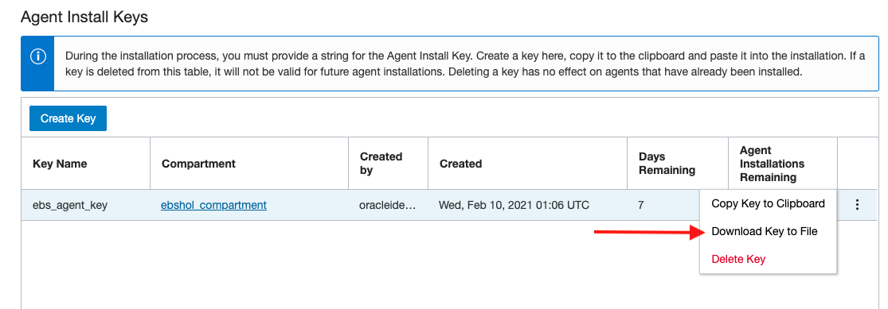
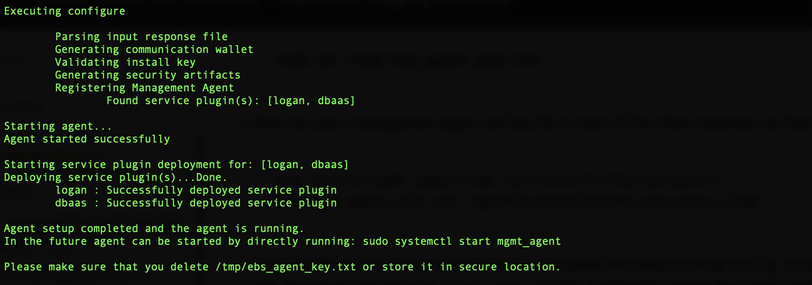

# Ingest Logs into Logging Analytics

## Introduction

This lab will ingest network, audit, server and application logs into OCI Logging Analytics Service

Estimated Lab Time: 1 hour

### Objectives

In this lab, you will:
* Pull data from Logging Entities: Servers, EBS Application and Database, Network and Audit Flow logs
* At the end of this lab you will have your log data in Logging Analytics

### Prerequisites

* Lab 1 of this workshop completed
* An Oracle Cloud Environment
* EBS Cloud Manager, EBS 1-Click and Advanced Provisioned Instance, Network - All done in the previous workshop

## **STEP 1:** Setup Logging to Ingest Audit and Network Logs

1. Navigate to Logging - Log Groups from the OCI Console (verify you are in your ebshol_compartment)

  a. Click Create Log Group

  b. Name it `EBS_VCN_Logs` and add a description

  

  c. Click **Create**

2. Now navigate to Logging - Logs

  a. Click **Enable Service Log**

  b. For service select: `Virtural Cloud Network (subnets)`

  c. Resource select a subnet

  d. Log Category: `Flow Logs(All records)`

  e. Log Name: `<subnetprefix>_subnetwork_logs`

  f. Click Advanced and verify the log is being added to your `EBS_VCN_Logs`

  g. You can change your log retention as well. For now leave as Default

  
    
  

3. Repeat Step B for the rest of your subnets

4. Once complete your Logs should look like this:

  

## **STEP 2:** Create Service Connectors for Audit and Network Logs
    
1. Now navigate to Logging - Service Connectors

  a. Click **Create Connector**

  b. For name Enter: `EBS_VCN_Flow_Service_Connector` and add a description

  c. For Source select **Logging** and Target select **Logging Analytics**

  d. Under **Configure source connection** for **Log Group** select `EBS_VCN_Logs` and for **Logs** select one of your subnet logs.

  e. Click **+ Another Log** and add each of your subnet logs for this log group 

  f. Once you have added all your subnet logs scroll to **Configure target connection**

  g. Make sure the Compartment is our `ebshol_compartment` and Log Group `EBS_VCN_Logs` that we created in part 5) of Step 1

  h. An ask to `Create default policy allowing this service connector to write to Logging Analytics in compartment ebshol_compartment.` will show, click **Create** and then **Create** again.

  
    
2. Click **Create Connector** again

  a. For name Enter: `Audit_Flow_Service_Connector` and add a description

  b. For Source select **Logging** and Target select **Logging Analytics**

  c. Under **Configure source connection** for **Log Group** select `_Audit_` and for **Logs** leave empty.

  d. Make sure the Compartment is our `ebshol_compartment` and Log Group `Audit_Logs` that we created in part 5) of Step 1

  e. An ask to `Create default policy allowing this service connector to write to Logging Analytics in compartment ebshol_compartment.` will show, click **Create** and then **Create** again.

  

3. You can now go to Logging Analytics - Administration

  **You will now see entities have been automatically created.**

  **You can also go to Logging Analytics - Log Explorer and should see a pie with data similar to what is shown below**
      
  

## **STEP 3:** Install Management Agents on your Hosts

Now we will walk through installing management agents on our hosts. Because we are using linux servers in this lab we will stick to steps for those servers. For further documentation on installing agents and specifically on Windows servers refer to [Install Management Agents Documentation](https://docs.oracle.com/en-us/iaas/management-agents/doc/install-management-agent-chapter.html#GUID-5F2A1CEF-1185-469C-AF2E-8A94BC95DC35)

1. In the OCI Console navigate to Management Agents - Downloads and Keys

2. Click and download **Agent for LINUX** 

3. Click **Create Key** below 
  
  a. Name the key `ebs_agent_key`

  b. Select our `ebshol_compartment`

  c. Click **Create**

  d. on the right click the three dots in the row of our agent key we just created.

  e. Click `Download Key to File`

  

  f. Once you have Downloaded the key file, we need to edit it

  g. open the `ebs_agent_key.txt` file

      Add agent name
        - AgentDisplayName

      Add Password
        - CredentialWalletPassword

      Uncomment the Service Plugins
        - Service.plugin.dbaas.download=true
        - Service.plugin.dbaas.download=true

    

4. We now need to copy our `oracle.mgmt_agent.rpm` and `ebs_agent_key.txt` to our Cloud Manager Instance.

5. Verify an SSH connection to our `ebshol_ebscm` instance

  a. Navigate to Compute and find your `ebshol_ebscm` and note the Public IP

  b. From your terminal SSH to the Cloud Manager

    ```
    ssh opc@<public_ip_of_cloud_manager>
    ```

  c. After verifying you can connect via ssh exit

  

6. Secure Copy your management agent and .txt file to cloud manager

    ```
    scp ~/Downloads/oracle.mgmt_agent.rpm opc@<public_ip_of_cloud_manager>:~
    scp ~/Downloads/ebs_agent_key.txt opc@<public_ip_of_cloud_manager>:/tmp
    ssh opc@<public_ip_of_cloud_manager>
    ```

  a. Type ls to verify your .txt and .rpm file are in your home directory

7. Install Java
  
    ```
    <copy>
    sudo yum install java
    </copy>
    ```

8. Edit permissions on the `ebs_agent_key.txt` file

    ```
    <copy>
    cd /tmp
    sudo chmod 755 ebs_agent_key.txt
    </copy>
    ```

  a. Go back to home directory and run management agent

    ```
    <copy>
    cd ~
    sudo rpm -ivh oracle.mgmt_agent.rpm
    </copy>
    ```

  Note: If successful your terminal should see this response ending with Agent install successful

  

9. Setup and the management agent with info from Install Key

    ```
    <copy>
    sudo /opt/oracle/mgmt_agent/agent_inst/bin/setup.sh opts=/tmp/ebs_agent_key.txt
    </copy>
    ```

  

10. Now to install our agent on the other instances built with our cloud manager we will move the `ebs_agent_key.txt` and oracle mgmt agent to our Oracle Home Directory

    ```
    <copy>
    sudo mv /tmp/ebs_agent_key.txt /u01/install/APPS
    sudo mv oracle.mgmt_agent.rpm /u01/install/APPS
    sudo su - oracle
    </copy>
    ```

11. From the Oracle user on the cloud manager you can connect to your other instances using ssh. Now scp your management agent and key file to each of the other instances via their private IP address.

    ```
    scp oracle.mgmt_agent.rpm opc@<privateIPofebsinstance>:~
    scp ebs_agent_key.txt opc@<privateIPofebsinstance>:/tmp
    ssh opc@<privateIPofebsinstance>
    ```

12. Go to the /tmp folder and using vi, edit the `ebs_agent_key.txt` file and change the name to refer to the server. We will use the same .txt file. 
  
13. Once you edited the `ebs_agent_key.txt` file you can repeat the steps for install starting from `6.` to `9.` on each instance you want to monitor then exit to repeat. 

Note: You can also follow the recommended procedure of deleting your key file from your instance one the agent has been installed and is configured properly 
    
  ```
  $ rm /tmp/ebs_agent_key.txt
  ```

**Note:** If you have other instances not created with the cloud manager follow the same steps to add the agent and key file to those instances and install.

This will now complete the Ingest Logs to Logging Analytics Lab for this workshop.

You may now proceed to the next lab.

## Acknowledgements
* **Author** - Quintin Hill, Cloud Engineering, Packaged Applications
* **Contributors** -  Kumar Varun, Logging Analytics Product Management
* **Last Updated By/Date** - Quintin Hill, Cloud Engineering, Mar 8 2021


