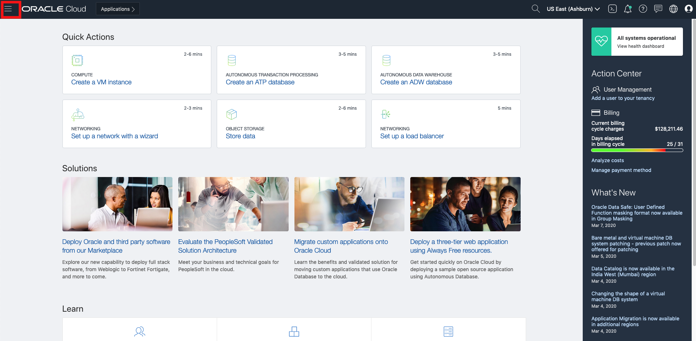
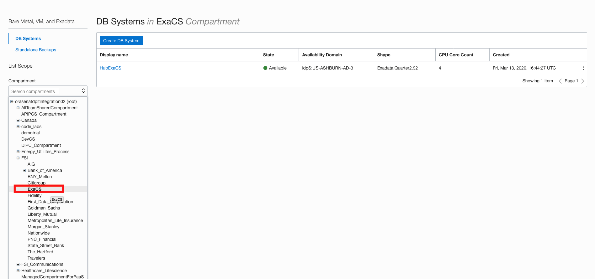
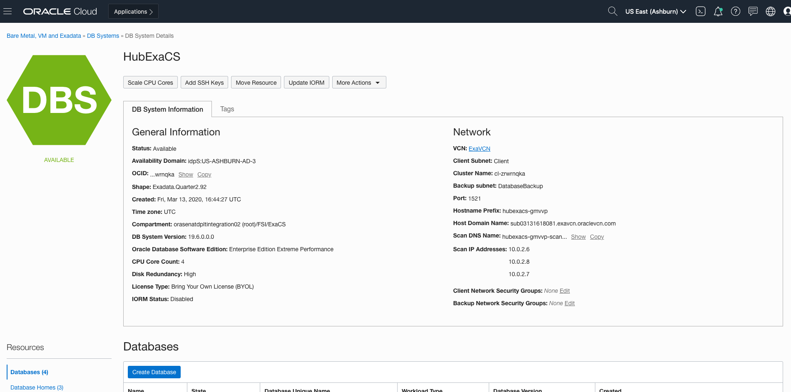
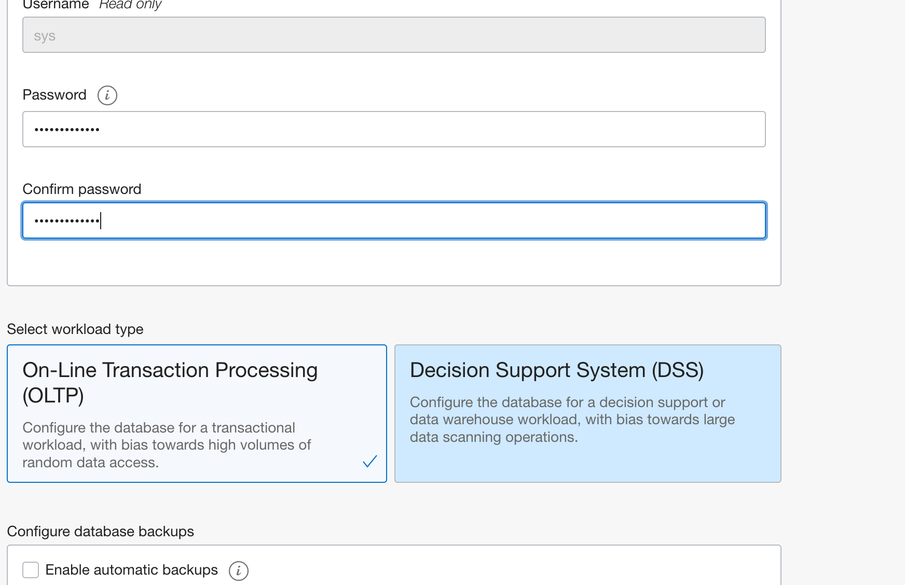
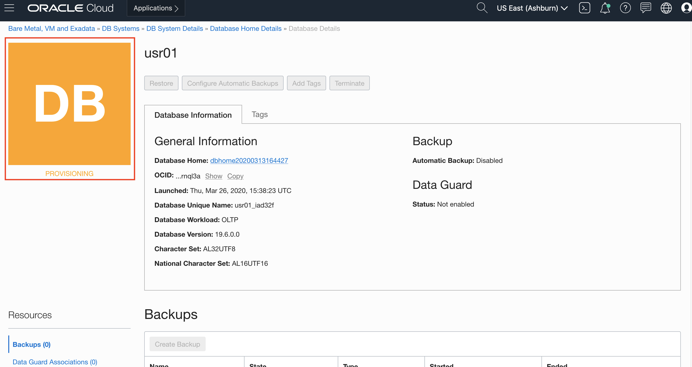

# Provision Databases

## Introduction

This lab walks you through the steps to get started using the Oracle Exadata Cloud Service Database on Oracle Exadata Cloud Service. In this lab, you will provision a new database.

Estimated Lab Time: 30 minutes.

### Objectives

As a database user, DBA or application developer,

* Rapidly deploy databases on exadata cloud service
* Manage your database backups

### Prerequisites

* An Oracle Cloud Infrastructure account with a pre-provisioned Exadata Infrastructure

## **STEP 1:** Create an Exadata Cloud Service Database

1. Login to your OCI account as a database user.

2. Click on the hamburger menu icon on the top left of the screen.

    

3. Click the **Navigation Menu** in the upper left, navigate to **Oracle Database**, and select **Bare Metal, VM, and Exadata**.

	

4. Select **ExaCS Compartment**. Note: Oracle Cloud Infrastructure allows logical isolation of users within a tenancy through Compartments. This allows multiple users and business units to share an OCI tenancy while being isolated from each other.

    

5. If you have chosen the compartment you do not have privileges on, such as a root compartment, you will not be able to provision a Database instance in it.

6. More information about Compartments and Policies is provided in the OCI Identity and Access Management documentation [here](https://docs.cloud.oracle.com/iaas/Content/Identity/Tasks/managingcompartments.htm?tocpath=Services%7CIAM%7C_____13).

7. Click on **Exadata Infrastructure** that is already provisioned.

    

8. This will bring you the Exadata Console page

    

9. On the Display page, when you scroll down there is a section called **Databases**, under that section, click on **Create Database** option

    

10. Upon clicking a pop-up will appear that will enable you to create a database. Fill in the required details as shown below


    a. Database name : usrXX

    b. Database version : 19c

    c. PDB Name : usr_XX

    d. Database Home : Select an existing Database Home

    e. Database Home display name : User-XX-db

    f. Create administrator credentials (Password : create password)

    g. Select workload type: On-Line Transaction Processing (Choose this), Decision Support System (DSS)

    h. Configure database backups : do not check this</copy>

    

    

11. Password must be 9 to 30 characters and contain at least 2 uppercase, 2 lowercase, 2 special, and 2 numeric characters. The special characters must be _ or # or -**

12. For this lab, we will be using the following as password

    ```
    <copy>
    WE#lcome_1234
    </copy>
    ```

13. After filling all the required details, click on **Create Database**.

    

14. Your Exadata cloud service database instance should be up and running in a few minutes.

    


All Done! You have successfully deployed your first Exadata cloud service database instance and it should be ready for use in a few minutes.

You may proceed to the next lab.

## Acknowledgements

- **Author** - Tejus Subrahmanya, Phani Turlapati, Abdul Rafae, Sathis Muniyasamy, Sravya Ganugapati, Padma Natarajan, Aubrey Patsika, Jacob Harless
- **Last Updated By/Date** - Jess Rein - Cloud Engineer, November 2020


